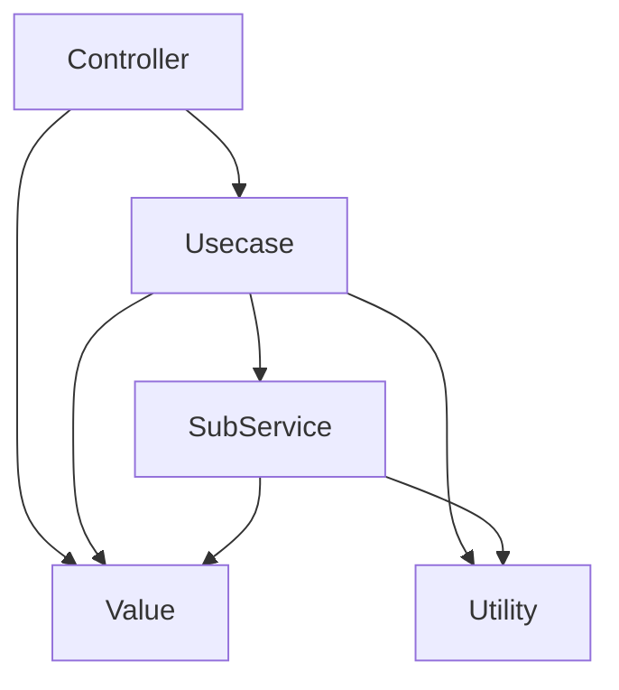

# Coding guide (opinionated)

## Goals

- Readability: Code should be easy for others (or your future self) to understand.
- Predictability: The behavior of the code should be easy to anticipate.
- Independence: Modules should have low coupling.
    - This makes reuse, extension, testing, and maintenance easier.
    - Creating dependencies between modules solely to increase code reusability can actually be undesirable.

## Immutability and side effect management

- Avoid modifying function arguments inside the function whenever possible.
    - If a function only needs to compute a result, it should return a new object or array without altering the input.
        - Example: `normalize_depth_map()` returns a new array instead of modifying the original `depth`.
- If you must modify an argument, make it clear through the module structure or function name.
    - Examples:
        - `scene.apply_transform()` clearly implies that the `scene` object will be changed.
        - `normalize_depth_map_inplace()`, `update_camera_intrinsics()` indicate modification in their names.
- There should be no side effects when importing a module.

## Naming

- Name things based on their role, not their type.
    - Bad: `data`, `info`, `polygon`
    - Good: `road_boundary_polygon`, `camera_intrinsics`, `object_metadata`
- Use short names (`i`, `j`, `x`) only in local contexts like loops or comprehensions.
- Avoid vague names like `util`, `helper`, `manager`, `common`. Use names that reflect the domain and functionality.
    - Bad: `utils.py`
    - Good: `geometry_ops.py`, `image_io.py`
    - Bad: `SceneManager`
    - Good: `SceneGraph`, `SceneUpdater`
- Function names should reflect the result or action.
    - Bad: `process_data()`
    - Good: `generate_panoptic_bev()`, `merge_depth_and_color()`

## Simplifying control flow

- Use early returns to avoid nested conditionals.
- Extract long conditional expressions into separate functions (e.g., `is_static_background(frame)`) to make their meaning clear.
- If a loop does too much, split its contents into functions for readability.

## File and directory structure

- It's okay for a `.py` file to be small.
    - If a 50-line file does five different things, split it into five files.
    - Long files are fine if they are cohesive.
        - However, very long files can hurt readability.
    - Files like `utils.py` or `common.py` usually have low cohesion and should be split.
- Organize primarily by domain.
    - Examples:
        - `compose_scene`
        - `compose_scene/road`
        - `img2vid/`
- Within a domain, you can further organize by layer.
    - Examples:
        - `compose_scene/libs`
        - `compose_scene/values/`
        - `compose_scene/road/functions/`
        - `compose_scene/road/values/`

## Layers

### Types

#### Layers with hierarchical structure

- (controllers / scripts)
    - Top-level layers that define experiments or control the execution order/method of lower-level services.
        - Example:
            - `generate_scene.py`
    - Controllers can also provide various ways to invoke services.
    - If another controller uses this controller, it can be considered a kind of service.
- (service layer / use cases)
    - High-level steps/modules/functions that perform specific business logic.
    - Can be reused across different project goals.
    - Examples:
        - `place_objects()`
        - `render_objects()`
- (data access layer)
    - The lowest layer that provides consistent data access for services.
        - If the resource location or access library changes, only this layer needs to be updated.
    - Examples:
        - Accessing the network:
            - `download_model()`
        - Accessing a database:
            - `db.add_user()`

#### Layers used across multiple levels

- (values)
    - Classes used as arguments/return values between layers.
    - May include methods to process or provide information about their values.
    - Constants.

#### Layer-independent layers

- (utilities/libraries)
    - No dependencies on other layers.
    - Can be used anywhere.

### Layer dependency direction

- Code structure should flow one-way from top to bottom.
    - Dependencies should form an acyclic graph.
    - Example:

- Higher layers should not know the concrete implementation details of lower layers.
    - Example: A use case calls a "depth estimation service" without knowing if it's implemented with MiDaS or DPT.

### Mixed layers (?)

- Sometimes, layers may appear mixed.
- Especially in monorepos, it's hard to enforce a single layer structure due to multiple projects/programs.
- The important points:
    - Do not reverse the direction of layer calls.
    - Layers should be easily separable if needed.
    - If an implementation grows large, split it into layers.

## Composable structure

- Each function should do only one thing.
    - Split "load → process → save" into three steps.
- Minimize strong abstractions that create tight coupling.
    - OOP inheritance can cause excessive coupling, making experimentation and modification difficult.
        - Bad: PyTorch Lightning uses inheritance, making it hard to freely experiment with GAN structures.
        - Good: Diffusers allows flexible composition of Pipelines, Models, Schedulers, etc., for training and inference.
- Reduce coupling, but keep explicit connections.
    - Prefer passing or returning arguments explicitly over using global state or context.

## Value Classes: pydantic vs dataclass

- pydantic
    - Advantages
        - More flexible than dataclass when using inheritance.
        - Convenient for loading/saving as json or yaml.
- dataclass
    - Advantages
        - Simple and easy to use when inheritance/load/save is not needed.

## Exception Handling

- Only handle exceptions when necessary.
    - Letting the program crash without catching raised exceptions can actually help with faster debugging.
    - Example:
        - If a network communication error occurs with the database server and data cannot be received, it is better not to catch the exception so the cause can be quickly identified and resolved.
- If you must catch an exception, catch it in the narrowest possible scope.
    - Example: Catch `ValueError` instead of `Exception`.
- Rather than using assert statements, it is better to check conditions and raise errors explicitly.

## Unnecessary Code

- Delete unnecessary code.
    - It is extremely rare that code which is unnecessary now will be needed again later.
    - Keeping such code only increases the amount of code to manage.
- If you want to keep it for history, create a branch in git or similar.
- Only add comments where necessary.
    - Do not add comments for things that are easily understood from variable or function names.

## Unresolved Issues

- Leave a `FIXME:` tag for such items.
- If necessary, create an issue for it.
