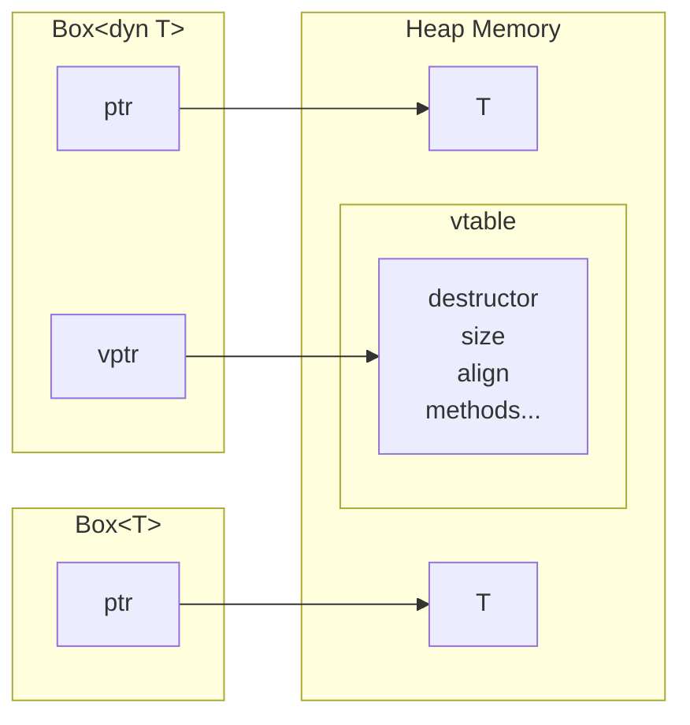

# Rust by exmple

Study guide:

- Summarize things in the structure of "Rust By Example 🔎"
    - https://doc.rust-lang.org/rust-by-example/
- Try "Rust By Practice 💪" with the help of any AI chatbot.
    - https://practice.course.rs/
    - https://youtu.be/BpPEoZW5IiY?si=pArhPWoSP5vxLP-Z
- Also refer to "Tour of Rust 🎒" if needed
    - https://tourofrust.com

TODO/WIP:

- Watch video
    - https://practice.course.rs/generics-traits/traits.html
    - https://youtu.be/BpPEoZW5IiY?si=pArhPWoSP5vxLP-Z
    -

## 1 Hello World

https://doc.rust-lang.org/rust-by-example/hello.html

```rust
#[derive(Debug)]
struct Point { x: i32, y: i32, }

fn main() {
    let p = Point { x: 10, y: 20 };
    println!("{:#?}", p);
}
```

- `#[derive(Debug)]`
    - Debug
        - the name of `trait` to implement methods for.
            - (`fmt()` in this case)
    - `#[...]`
        - represents for an attribute
    - `derive`
        - a built-in macro only used within `#[...]`
- `println!`
    - `!`
        - indicates `println` is a macro
    - `{}`
        - requires `Display` trait
    - `{:?}`
        - requires `Debug` trait
    - `{:#?}`
        - requires `Debug` trait
        - for pretty print
    - `p` or `&p`
        - either of them is allowed
        - the results will be the same
        - it's because `println!` is a special built-in Rust macro.
            - users cannot make the same.

## 2 Primitives

### 2.1 Literals and operators

https://doc.rust-lang.org/rust-by-example/primitives/literals.html

### 2.2 Tuples

- https://doc.rust-lang.org/rust-by-example/primitives/tuples.html
- https://practice.course.rs/compound-types/tuple.html

### 2.3 Arrays and slices

https://doc.rust-lang.org/rust-by-example/primitives/array.html

## 3 Custom types

### 3.1 Structures

- https://doc.rust-lang.org/rust-by-example/custom_types/structs.html
- https://practice.course.rs/compound-types/struct.html
- It's not allowed to mark only certain fields as mutable.

(struct update syntax)

```rust

// Fill the blank to make the code work
struct User {
    active: bool,
    username: String,
    email: String,
    sign_in_count: u64,
}
fn main() {
    let u1 = User {
        email: String::from("someone@example.com"),
        username: String::from("sunface"),
        active: true,
        sign_in_count: 1,
    };

    let u2 = set_email(u1);

    println!("Success!");
}

fn set_email(u: User) -> User {
    User {
        email: String::from("contact@im.dev"),
        ..u  // struct update syntax
    }
}
```
- tuple structure
    - e.g. `struct Color(i32, i32, i32)`
- unit structure
    - used to implement some trait

### 3.2 Enums

- https://tourofrust.com/29_en.html
- https://tourofrust.com/30_en.html
- https://practice.course.rs/compound-types/enum.html
- glossary
    - discriminator
        - an integer value
    - data
        - held by the `enum` variant instance

#### 3.2.1 use

```rust
#![allow(dead_code)]

enum Stage {
    Beginner,
    Advanced,
}

enum Role {
    Student,
    Teacher,
}

fn main() {
    use Stage::{Beginner, Advanced};
    use Role::*;

    let stage = Beginner;
    let role = Student;

    match stage {
        Beginner => println!("Beginners are starting their learning journey!"),
        Advanced => println!("Advanced learners are mastering their subjects..."),
    }

    match role {
        Student => println!("Students are acquiring knowledge!"),
        Teacher => println!("Teachers are spreading knowledge!"),
    }
}
```

```rust
enum Number {
    Zero,
    One,
    Two,
}

fn main() {
    println!("The descriminator of One is {}.", Number::One as i32);
}
```

- can be converted with `as`
- an integer number is assigned as a discriminator

```rust
enum Message {
    Quit,
    Move { x: i32, y: i32 },
    Write(String),
    ChangeColor(i32, i32, i32),
}

fn main() {
    let msg1 = Message::Move{x:1, y:2};
    let msg2 = Message::Write(String::from("hello, world!"));

    println!("Success!");
}
```

- `enum` variant can have data

```rust
#[derive(Debug)]
enum Message {
    Quit,
    Move { x: i32, y: i32 },
    Write(String),
    ChangeColor(i32, i32, i32),
}

fn main() {
    let msgs: [Message; 3] = [
        Message::Quit,
        Message::Move{x:1, y:3},
        Message::ChangeColor(255,255,0)
    ];

    for msg in msgs {
        show_message(msg)
    }
}

fn show_message(msg: Message) {
    println!("{:?}", msg);
}
```

#### 3.2.2 C-like

#### 3.2.3 Testcase: linked-list

```rust
use crate::List::*;

enum List {
    Cons(u32, Box<List>),
    Nil,
}

impl List {
    fn new() -> List {
        Nil
    }

    fn prepend(self, elem: u32) -> List {
        Cons(elem, Box::new(self))
    }

    fn len(&self) -> u32 {
        match *self {
            Cons(_, ref tail) => 1 + tail.len(),
            Nil => 0
        }
    }

    fn stringify(&self) -> String {
        match *self {
            Cons(head, ref tail) => {
                format!("{}, {}", head, tail.stringify())
            },
            Nil => {
                format!("Nil")
            },
        }
    }
}

fn main() {
    let mut list = List::new();

    list = list.prepend(1);
    list = list.prepend(2);
    list = list.prepend(3);

    println!("linked list has length: {}", list.len());
    println!("{}", list.stringify());
}
```

- `crate`
    - means current crate

### 3.3 Constants

```rust
static LANGUAGE: &str = "Rust";
const THRESHOLD: i32 = 10;
```

- `static`
    - defines a global memory object with `'static` lifetime.
- `const`
    - defines a named compile-time constant value
    - does not occupy a fixed memory location at runtime.

## 4 Variable bindings

### 4.1 Mutability

### 4.2 Scope and shadowing

### 4.3 Declare first

### 4.4 Freezing

## 5 Types

- `u8`
- `i8`
- `i16`
- `f32`
- `char`
- `usize`
    - 8 bytes
            - used for heap variables
        - ptr
        - len
        - capacity

### 5.1 Casting

### 5.2 Literals

### 5.3 Inference

### 5.4 Aliasing

## 6 Conversion

## 7 Expressions

## 8 Flow of control

- https://doc.rust-lang.org/rust-by-example/flow_control.html

### 8.1 if/else

### 8.2 loop

```rust
fn main() {
    let mut count = 0;
    'outer: loop {
        'inner1: loop {
            if count >= 20 {
                break 'inner1;
            }
            count += 2;
        }

        count += 5;

        'inner2: loop {
            if count >= 30 {
                break 'outer;
            }

            continue 'outer;
        }
    }

    assert!(count == 30);
}
```

### 8.3 while

### 8.4 for and range

### 8.5 match

```rust
fn main() {
    let boolean = true;
    let binary = match boolean {
        true => 1,
        false => 0,
    };

    assert_eq!(binary, 1);
}
```

```rust
fn main() {
    let mut v = String::from("hello,");
    let r = &mut v;

    match r {
       value => value.push_str(" world!")
    }
}
```

```rust
fn main() {
    let alphabets = ['a', 'E', 'Z', '0', 'x', '9' , 'Y'];

    // Fill the blank with `matches!` to make the code work
    for ab in alphabets {
        assert!(matches!(ab, 'A'..='Z'|'a'..='z'|'0'..='9'))
    }
}
```

#### 8.5.1 Destructuring

#### 8.5.2 Guards

```rust
fn main() {
    let num = Some(4);
    let split = 5;
    match num {
        Some(x) if x < split => assert!(x < split),
        Some(x) => assert!(x >= split),
        None => (),
    }
}
```

#### 8.5.3 Binding

```rust
fn main() {
    let numbers = (2, 4, 8, 16, 32, 64, 128, 256, 512, 1024, 2048);

    match numbers {
        (first, .., last) => {
           assert_eq!(first, 2);
           assert_eq!(last, 2048);
        }
    }
}
```

### 8.6 if let

### 8.7 let else

### 8.8 while let

## 9 Functions

### 9.1 Methods

### 9.2 Closures

### 9.3 High order functions

### 9.4 Diverging functions

## 10 Modules

## 11 Crates

## 12 Cargo

## 13 Attributes

## 14 Generics

### 14.1 Functions

```rust
struct A;
struct S(A);
struct SGen<T>(T);

fn reg_fn(_s: S) {}
fn gen_spec_t(_s: SGen<A>) {}
fn gen_spec_i32(_s: SGen<i32>) {}
fn gen_spec_any<T>(_s: SGen<T>) {}

fn main() {
    reg_fn(S(A));
    gen_spec_t(SGen(A));
    gen_spec_i32(SGen(5));
    gen_spec_any::<char>(SGen('c'));
    gen_spec_any(SGen('d'));
}
```

- https://practice.course.rs/generics-traits/generics.html
- Note that `let a1 = A;` instantiates `A`.
    - Rust doesn't allow creating different instances of `A` because it has no fields.

```rust
fn sum<T: std::ops::Add<Output = T>>(a: T, b: T) -> T {
    a + b
}

fn main() {
    assert_eq!(5, sum(2i8, 3i8));
    assert_eq!(50, sum(20, 30));
    assert_eq!(2.46, sum(1.23, 1.23));

    println!("Success!");
}
```

### 14.2 Implementation

```rust
struct Val<T> {
    val: T,
}

impl<T> Val<T> {
    fn value(&self) -> &T {
        &self.val
    }
}


fn main() {
    let x = Val{ val: 3.0 };
    let y = Val{ val: "hello".to_string()};
    println!("{}, {}", x.value(), y.value());
}
```

```rust
struct Point<T, U> {
    x: T,
    y: U,
}

impl<T, U> Point<T, U> {
    fn mixup<V, W>(self: Self, another: Point<V, W>) -> Point<T, W> {
        Point {
            x: self.x,
            y: another.y,
        }
    }
}

fn main() {
    let p1 = Point { x: 5, y: 10 };
    let p2 = Point { x: "Hello", y: '中'};

    let p3 = p1.mixup(p2);

    assert_eq!(p3.x, 5);
    assert_eq!(p3.y, '中');

    println!("Success!");
}
```

### 14.3 Traits

- derivable traits
    - `Debug`, `Clone`, `Copy`, `PartialEq`, ...
    - automatically implemented for a `struct` or an `enum` by the Rust compiler

### 14.4 Bounds

- Let's say we have a `Summary` trait.

```rust
pub fn notify(item: &impl Summary) {
    println!("Breaking news! {}", item.summarize());
}
```

```rust
pub fn notify<T: Summary>(item: &T) {
    println!("Breaking news! {}", item.summarize());
}
```

- The two functions above are equivalent.
- The `impl Trait` syntax is just a syntactic sugar for the more verbose generic type parameter syntax.

```rust
fn sum<T: std::ops::Add<Output = T>>(a: T, b: T) -> T {
    a + b
}

fn main() {
    assert_eq!(5, sum(2i8, 3i8));
    assert_eq!(50, sum(20, 30));
    assert_eq!(2.46, sum(1.23, 1.23));

    println!("Success!");
}
```

### 14.5 Multiple bounds

### 14.6 Where clauses

```rust
use std::fmt::{Display, Debug};

fn some_function<T: Display + Clone, U: Clone + Debug>(t: &T, u: &U) {
    println!("{}", t);
    println!("{:?}", u);
}
```

This is equivalent to the code below.

```rust
fn some_function<T, U>(t: &T, u: &U)
where
    T: Display + Clone
    U: Clne + Debug
{
    println!("{}", t);
    println!("{:?}", u);
}
```

### 14.7 New type idiom

- e.g. `Years(i64)`
    - at runtime it's just a i64 variable
- zero-cost abstraction
- types are checked at compile time.

### 14.8 Associated items

#### 14.8.1 The problem

#### 14.8.2 Associated types

```rust
trait Contains {
    type A;
    type B;

    fn contains(&self, _: &Self::A, _: &Self::B) -> bool;
}
```

### 14.9 Phantom type parameters

## 15 Scoping rules

- local scope
- global scope 😮

### 15.1 RAII

(Resource Acquisition Is Initialization)

```rust
fn create_box() {
    let _box1 = Box::new(3i32);

    // `_box1` is destroyed here, and memory gets freed
}

fn main() {
    let _box2 = Box::new(5i32);

    {
        let _box3 = Box::new(4i32);

        // `_box3` is destroyed here, and memory gets freed
    }

    // There's no need to manually free memory!
    for _ in 0u32..1_000 {
        create_box();
    }

    // `_box2` is destroyed here, and memory gets freed
}
```

Destructor:

```rust
struct ToDrop;

impl Drop for ToDrop {
    fn drop(&mut self) {
        println!("ToDrop is being dropped");
    }
}

fn main() {
    let x = ToDrop;
    println!("Made a ToDrop!");
}
```

### 15.2 Ownership and moves

#### 15.2.1 Mutability

```rust
fn main() {
    let immutable_box = Box::new(5u32);

    println!("immutable_box contains {}", immutable_box);

    // Mutability error
    //*immutable_box = 4;

    // *Move* the box, changing the ownership (and mutability)
    let mut mutable_box = immutable_box;

    println!("mutable_box contains {}", mutable_box);

    // Modify the contents of the box
    *mutable_box = 4;

    println!("mutable_box now contains {}", mutable_box);
}
```

#### 15.2.2 Partial moves

"Within the destructuring of a single variable, both by-move and by-reference pattern bindings can be used at the same time. Doing this will result in a partial move of the variable, which means that parts of the variable will be moved while other parts stay. In such a case, the parent variable cannot be used afterwards as a whole, however the parts that are only referenced (and not moved) can still be used."

```rust
fn main() {
    #[derive(Debug)]
    struct Person {
        name: String,
        age: Box<u8>,
    }

    // Error! cannot move out of a type which implements the `Drop` trait
    //impl Drop for Person {
    //    fn drop(&mut self) {
    //        println!("Dropping the person struct {:?}", self)
    //    }
    //}
    // TODO ^ Try uncommenting these lines

    let person = Person {
        name: String::from("Alice"),
        age: Box::new(20),
    };

    // `name` is moved out of person, but `age` is referenced
    let Person { name, ref age } = person;

    println!("The person's age is {}", age);

    println!("The person's name is {}", name);

    // Error! borrow of partially moved value: `person` partial move occurs
    //println!("The person struct is {:?}", person);

    // `person` cannot be used but `person.age` can be used as it is not moved
    println!("The person's age from person struct is {}", person.age);
}
```

- Default destructuring behavior:
    - if a field type implements the `Copy` trait
        - values are copied
        - e.g., `i32`, `bool`, `char`
    - if not
        - ownership is moved
        - e.g., `String`, `Vec`, `Box<T>`
- `ref`
    - only for destructuring
    - changes the ownership/type of the variable created during destructuring
    - Non-Copy types → creates a read-only reference (`&T`) instead of moving
    - Copy types → can create a reference (`&T`) instead of copying the value
- Heap variables (`Box`, `Vec`, `String`, etc.)
    - stack stores a smart pointer containing the address
    - The actual data is on the heap
        - It can be thought of as accessing via its address
- `&`
    - takes the address of a stack or heap value
- `*`
    - dereference to access the actual value

### 15.3 Borrowing

### 15.4 Lifetimes

## 16 Traits

### 16.1 Derive

### 16.2 Returning traits with `dyn`

```rust
struct Sheep;
struct Cow;

trait Animal {
    fn noise(&self) -> String;
}

impl Animal for Sheep {
    fn noise(&self) -> String {
        "baaaaah!".to_string()
    }
}

impl Animal for Cow {
    fn noise(&self) -> String {
        "moooooo!".to_string()
    }
}

fn random_animal(random_number: f64) -> Box<dyn Animal> {
    if random_number < 0.5 {
        Box::new(Sheep)
    } else {
        Box::new(Cow)
    }
}

fn main() {
    let random_number = 0.234;
    let animal = random_animal(random_number);
    println!("You've randomly chosen an animal, and it says {}", animal.noise());
}
```

- `&dyn Animal` is also called a trait object.

(static dispatch vs dynamic dispatch)


- Box
    - Smarter pointer that allows to store data on the heap rather than the stack
    - Use Box when you have a type whose size can't be known at compile time
    - Returns a pointer to the data stored on the heap
- dynamic dispatch uses a fat pointer
- dynamic dispatch is more flexible
- static dispatch is faster

### 16.3 Operator overloading

### 16.4 Drop

### 16.5 Iterators

### 16.6 `impl` trait

### 16.7 Clone

### 16.8 Supertraits

### 16.9 Disambiguating overlapping traits

### Unsorted

(type converting between tuple structs)

```rust
struct Color(i32, i32, i32);
struct Point(i32, i32, i32);

impl From<Point> for Color {
    fn from(p: Point) -> Self {
        Color(p.0, p.1, p.2)
    }
}

fn main() {
    let v = Point(0, 127, 255);
    check_color(v.into());

    println!("Success!");
}

fn check_color(p: Color) {
    let Color(x, y, z) = p;
    assert_eq!(x, 0);
    assert_eq!(p.1, 127);
    assert_eq!(z, 255);
}
```

- Implementing `From<Point>` for `Color` automatically provides `Into<Color>` for `Point` via the blanket implementation of `Into`.

## 17 macro_rules!

## 18 Error handling

## 19 Std library types

### 19.1 Box, stack and heap

### 19.2 Vectors

### 19.3 Strings

### 19.4 Option

```rust
enum Option<T> {
    None,
    Some(T),
}
```

```rust
fn main() {
    let five = Some(5);
    let six = plus_one(five);
    let none = plus_one(None);
}

fn plus_one(x; Option<i32>) -> Option<i32> {
    match x {
        None => None,
        Some(i) ==> Some(i + 1),
    }
}
```

```rust
fn checked_division(dividend: i32, divisor: i32) -> Option<i32> {
    if divisor == 0 {
        None
    } else {
        Some(dividend / divisor)
    }
}

fn try_division(dividend: i32, divisor: i32) {
    match checked_division(dividend, divisor) {
        None => println!("{} / {} failed!", dividend, divisor),
        Some(quotient) => {
            println!("{} / {} = {}", dividend, divisor, quotient)
        },
    }
}

fn main() {
    try_division(4, 2);
    try_division(1, 0);

    let none: Option<i32> = None;
    let _equivalent_none = None::<i32>;
    let optional_float = Some(0f32);

    println!("{:?} unwraps to {:?}", optional_float, optional_float.unwrap());
    println!("{:?}", none);
    // println!("{:?} unwraps to {:?}", none, none);
}
```

```rust
fn main() {
    let five = Some(5);
    let six = plus_one(five);
    let none = plus_one(None);

    if let Some(n) = six {
        println!("{:?}", n);
        println!("Success!");
    } else {
        panic!("NEVER LET THIS RUN！");
    }
}

fn plus_one(x: Option<i32>) -> Option<i32> {
    match x {
        None => None,
        Some(i) => Some(i + 1),
    }
}
```
- `if let` handles one pattern at a time.

### 19.5 Result

### 19.6 panic!

### 19.7 HashMap

### 19.8 Rc

### 19.9 Arc

## 20 Std misc

## 21 Testing

## 22 Unsafe operations

## 23 Compatibility

## 24 Meta
