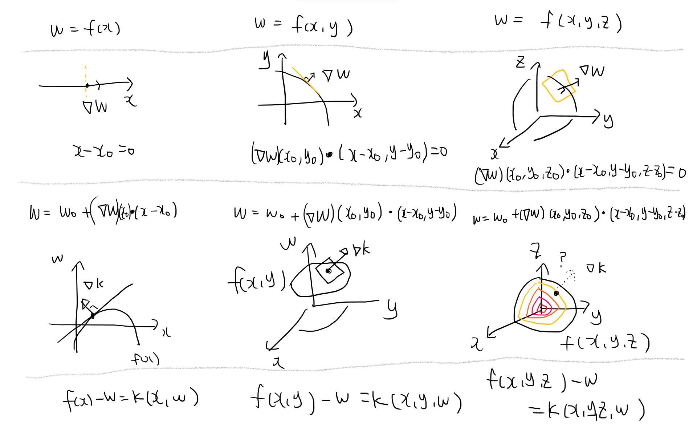

# Calculus
## TODO

- taylor series approximation of a vector function
  - write down the derivation
## Differential equations

- ODE
  - 상미분방정식
    - 변수분리형
    - 완전형
    - 적분인자
    - 1st order linear
    - 1st order nonlinear
    - higher order linear
    - 2nd order
    - nth order with constant coefficents
    - homogeneous
      - 동차
    - nonhomogeneous
      - 비동차
    - system of equations
      - https://en.wikipedia.org/wiki/System_of_differential_equations
      - cramer's method
        - https://en.wikipedia.org/wiki/Cramer%27s_rule
    - cauchy euler equation
      - https://en.wikipedia.org/wiki/Cauchy%E2%80%93Euler_equation
    - series solution
      - https://en.wikipedia.org/wiki/Power_series_solution_of_differential_equations
    - https://en.wikipedia.org/wiki/Frobenius_method
- PDE
  - 편미분방정식
    - lagrange multiplier
    - 변수변환
    - Leibniz's rule
    - 변수 분리
    - Lagrange 1st order
    - Laplace equation
    - Sturm-Louville theorem
    - Legendre eq
      - https://en.wikipedia.org/wiki/Legendre_polynomials
    - Bessel's equation

## terminologies

- order
  - 2 for y''
- degree
  - 2 for y^2, xy, x^2

## Gradient

- Given a level surface with respect to level $w$, which is  $f(x,y,z) = w$

  - $\nabla f$ is the normal direction to the surface
    - it's also the steepest direction to increase $w$
  - Note that the tangent plane at $(x_0, y_0, z_0)$ can be found by $(\nabla f)(x_0, y_0, z_0) \cdot (x-x_0,y - y_0,z - z_0) = 0$

  

## Leibniz integral rule

- https://en.wikipedia.org/wiki/Leibniz_integral_rule

$$
{\frac {d}{dx}}\left(\int _{a(x)}^{b(x)}f(x,t)\,dt\right)=f{\big (}x,b(x){\big )}\cdot {\frac {d}{dx}}b(x)-f{\big (}x,a(x){\big )}\cdot {\frac {d}{dx}}a(x)+\int _{a(x)}^{b(x)}{\frac {\partial }{\partial x}}f(x,t)\,dt
$$

## Fubini's theorem

https://en.wikipedia.org/wiki/Fubini%27s_theorem

$$
\iint_{X \times Y} f(x, y) \mathrm{d}(x, y)=\int_{X}\left(\int_{Y} f(x, y) \mathrm{d} y\right) \mathrm{d} x=\int_{Y}\left(\int_{X} f(x, y) \mathrm{d} x\right) \mathrm{d} y
$$

if

$$
\iint_{X \times Y}|f(x, y)| \mathrm{d}(x, y)<+\infty
$$

## Laplace transform

$$
{\mathcal {L}}\{f(t) \}=\int_{0}^{\infty}f(t)e^{-st}\,dt
$$

- linear operator

### table

| Function | Time domain | Laplace s-domain | Region of convergence |
|----------|-------------|------------------|-----------------------|
|unit impulse|$\delta(t)$|$1$|$\text{all s}$|
|unit step|$1$|$1 \over s$|$s \gt 0$|
|ramp|$t$|$1 \over s^2$|$s \gt 0$|
|$n$-th power|$t^n$|$n! \over s^{n+1}$|$s \gt 0 \text{, } n \gt -1$|
|exponential decay|$e^{-\alpha t}$|$1 \over s + \alpha$|$s \gt \alpha$|
|sine|$sin(\omega t)$|$w \over s^2 + \omega^2$|$s \gt 0$|
|cosine|$cos(\omega t)$|$s \over s^2 + \omega^2$|$s \gt 0$|

### two-sided Laplace transform

- can be considered as generalization of Fourier transformation

$$
{\mathcal {L}}\{f(t) \}=\int_{-\infty}^{\infty}f(t)e^{-st}\,dt
$$

## Fourier series

### Fourier transform
