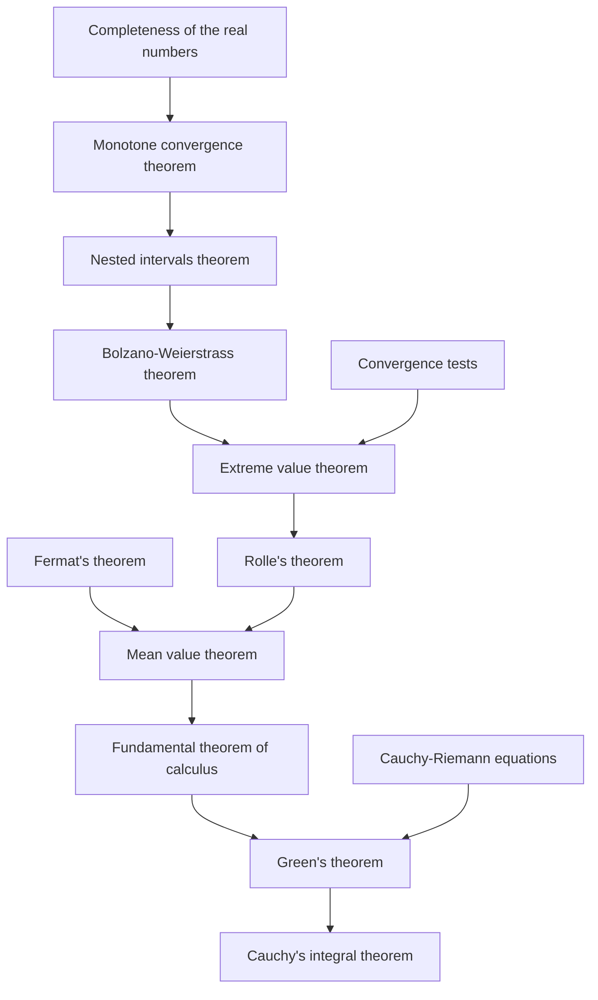

# Real analysis

(playlist)

https://youtube.com/playlist?list=PLbFCr77oqDkEGdjgF9hUZ7Ms-1PmzVvKP&si=2U-6a6UxI-J74oKo

(books)

- Introduction to Real Analysis (2nd edition) by Manfred Stoll

- Real Analysis: Measure Theory, Integration, and Hilbert Spaces (Princeton Lectures in Analysis) by Elias M. Stein

## 1 The Real Number System

## 2 Sequences of Real Numbers

## 3 Structure of Point Sets

## 4 Limits and Continuity

## 5 Differentiation

## 6 The Riemann Integral

## 7 Series of Real Numbers

## 8 Sequences and Series of Functions

## 9 Orthogonal Functions and Fourier Series

## Backlogs

### History of integration

- Riemann Integral
- Lebesgue Integral

### Axioms

https://en.wikipedia.org/wiki/Construction_of_the_real_numbers#Axioms

- $\mathbb{R}$ is a field under addition and multiplication.
  -  체공리
  -  F1~F8
- $\mathbb{R}$ is totally ordered.
  - 순서공리
  - O1
  - O2
- Addition and multiplication are compatible with the order.
  - 정렬성 원리
- The order $\le$ is *complete* in the following sense: every non-empty subset of $\mathbb{R}$ that is "bounded above" has a least upper bound.
  - also refer to
    - [Least-upper-bound property](https://en.wikipedia.org/wiki/Least-upper-bound_property)
      - completeness
      - Dedekind-complete
      - 완비성 공리

### Dependencies between theorems

https://youtu.be/YnRRCxPTWk8?si=oZTI-YZxWwqcdRi4&t=1637

(Complex analysis)

- Cauchy's integral theorem (a.k.a. Cauchy-Goursat theorem)
- Cauchy-Riemann equations
- Green's theorem

(Real analysis)

- 미적분학의 기본정리 (Fundamental theorem of calculus)
- 평균값정리 (Mean value theorem)
- 롤의 정리 (Rolle's theorem)
- 내부극값정리 (Fermat's theorem)
- 최대최소정리 (Extreme value theorem)
- Bolzano-Weierstrass theorem
- 연속의 수열판정법 (Convergence tests)
- 축소구간정리 (Nested intervals theorem)
- 단조 수렴 정리 (Monotone convergence theorem)
- 완비성 공리 (Least-upper-bound property)

- Limit
- Types of continuity
  - Continuous function
    - continuous over all points in $D$
    - note that being continuous at a point $a$ defined as below:
      - $f: D \to \mathbb{R}$
      - $a \in D$
      - $\forall \epsilon \ge 0, \exists \delta \ge 0$
      - s.t. $|x - a| \lt \delta \Rightarrow |f(x) - f(a)| \lt \epsilon$
  - Uniform continuity
    - (definition)
      - $f: D \to \mathbb{R}$
      - $\forall \epsilon \ge 0, \exists \delta \ge 0$
      - s.t.
        - $\forall x, y \in D$,
        - $|x - y| \lt \delta \Rightarrow |f(x) - f(y)| \lt \epsilon$
    - $f(x) = x^2$ or $f(x) = {1 \over x}$ is continuous but not Uniformly continuous
    - $f(x) = \sqrt{x}$ is uniformly continuous
  - α-Hölder continuous
  - Lipschitz continuity
    - α-Hölder continuous when $\alpha = 1$
    - 어떤 상수 K가 존재하고, 정의역에서 임의로 뽑은 두 입력과 그 함수값 들의 거리가 항상 K배 보다 작다.
      - `y = |x|` 같이 미분 값이 bound 되어 있으면 Lipschitz continuous하다.
  - Continuously differentible
    - $f(x) = x^2$ is not continuously differentible since it's no uniformly continuous??
    - (meaning)
      - $f'(x)$ exists
      - $f'(x)$ is continous
- Extrem value theorem
- Intermediate value theorem
- Differentiation
  - differential coefficients
    - differentiation value at a point
  - derivative function
    - differentiation over all domain $D$
- Rolle's theorem
  - $f: [a, b] \to \mathbb{R}$
  - $f$ is continous in $[a, b]$
  - $f$ is differentible in $(a, b)$
  - then,
    - $f(a) = f(b) \Rightarrow \exists c \in (a,b)$ s.t. $f'(c) = 0$
- Mean value theorem
  - generalized Rolle's theorem
  - $f: [a, b] \to \mathbb{R}$
  - $f$ is continous in $[a, b]$
  - $f$ is differentible in $(a, b)$
  - then,
    - $\exists c \in (a,b)$ s.t.
    - $f'(c) = {f(b) - f(a) \over b - a}$
- Cauchy's mean value theorem
  - extended mean value theorem
  - $f: [a, b] \to \mathbb{R}$
  - $f$ is continous in $[a, b]$
  - $f$ is differentible in $(a, b)$
  - then,
    - $\exists c \in (a,b)$ s.t.
    - $(f(b) - f(a))g'(c) = (g(b) - g(a))f'(c)$
  - if $g(a) \neq g(b)$ and $g(c) \neq 0$
    - $\exists c \in (a,b)$ s.t.
    - $f'(c) = {f(b) - f(a) \over g(b) - g(a)} g'(c)$
- L'Hôpital's rule
  - https://en.wikipedia.org/wiki/L%27H%C3%B4pital%27s_rule
  - meaning
    - $f, g$
      - $D \to \mathbb{R}$
      - continuous over $D$
      - differentiable over $D - \{a\}$
    - either
      - $\lim_{x \to a}f(x) = \lim_{x \to a}g(x) = 0$
      - $\lim_{x \to a}|f(x)| = \lim_{x \to a}|g(x)| = \infty$
    - then
      - over $a, L \in \mathbb(R) \cap \{-\infty, \infty\}$
      - $\lim_{x \to a}{f'(x) \over g'(x)} = L \Rightarrow \lim_{x \to a}{f(x) \over g(x)} = L$
  - proof
    - case 1
      - $0 \over 0$
      - $a \in \mathbb{R}$
      - $L \in \mathbb{R}$
    - case 2
      - $0 \over 0$
      - $a \in \mathbb{R}$
      - $L \in \{\infty, -\infty\}$
    - case 3
      - $0 \over 0$
      - $a \in \{\infty, -\infty\}$
      - can be proved by reusing case 1 and 2
    - case 4
      - $\infty \over \infty$
      - $a \in \mathbb{R}$
      - $L \in \mathbb{R}$
    - case 5
      - $\infty \over \infty$
      - $a \in \mathbb{R}$
      - $L \in \{\infty, -\infty\}$
    - case 6
      - $\infty \over \infty$
      - $a \in \{\infty, -\infty\}$
- Numerical integration
  - Riemann integral
    - partition (분할)
    - refinement (세분)
  - Darboux integral
    - equivalent to Rieman Integral
  - Improper integral (특이적분, 이상적분)
  - Riemann–Stieltjes integral
    - generalization of Riemann integral
    - https://en.wikipedia.org/wiki/Riemann%E2%80%93Stieltjes_integral
    - usages
      - Direc delta function
      - Riemann Zeta function
- Integration by substitution
  - $\int_{a}^{b}f(g(x))g'(x)\,dx=\int_{g(a)}^{g(b)}f(u)\,du$
- Integration by parts
  - $\int _{a}^{b}f(x)g'(x)dx = f(b)g(b)-f(a)g(a)-\int_{a}^{b}f'(x)g(x)dx$
