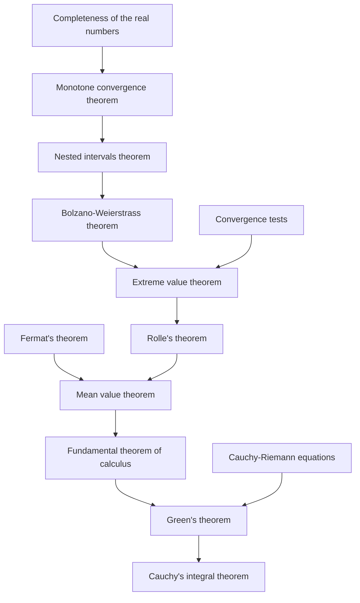

# Real analysis

(playlist)

(books)

- Real Analysis: Measure Theory, Integration, and Hilbert Spaces (Princeton Lectures in Analysis) by Elias M. Stein

## History of integration

- Riemann Integral
- Lebesgue Integral

## Axioms

https://en.wikipedia.org/wiki/Construction_of_the_real_numbers#Axioms

- $\mathbb{R}$ is a field under addition and multiplication.
  -  체공리
- $\mathbb{R}$ is totally ordered.
  - 순서공리
- Addition and multiplication are compatible with the order.
  - 정렬성 원리
- The order $\le$ is *complete* in the following sense: every non-empty subset of $\mathbb{R}$ that is "bounded above" has a least upper bound.
  - also refer to
    - [Least-upper-bound property](https://en.wikipedia.org/wiki/Least-upper-bound_property)
      - completeness
      - Dedekind-complete
      - 완비성 공리

## Dependencies between theorems

https://youtu.be/YnRRCxPTWk8?si=oZTI-YZxWwqcdRi4&t=1637

(Complex analysis)

- Cauchy's integral theorem (a.k.a. Cauchy-Goursat theorem)
- Cauchy-Riemann equations
- Green's theorem

(Real analysis)

- 미적분학의 기본정리 (Fundamental theorem of calculus)
- 평균값정리 (Mean value theorem)
- 롤의 정리 (Rolle's theorem)
- 내부극값정리 (Fermat's theorem)
- 최대최소정리 (Extreme value theorem)
- Bolzano-Weierstrass theorem
- 연속의 수열판정법 (Convergence tests)
- 축소구간정리 (Nested intervals theorem)
- 단조 수렴 정리 (Monotone convergence theorem)
- 완비성 공리 (Least-upper-bound property)
