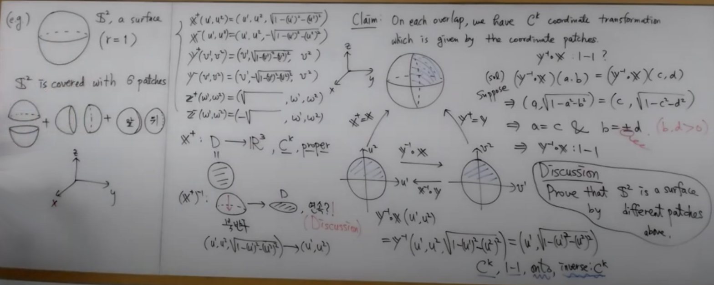

[TOC]

# Differential geometry - elementary

## TODO

- 숙명여대 서검교 교수님: 2학기 - 현대기하학
    - https://youtube.com/playlist?list=PL85AYQZ4ks4JFInW_Zcs5M8PFkI72BAkY
- Elementary Differential Geometry
  - https://play.google.com/books/reader?id=9nT1fOwATf0C&pg=GBS.PA12
  - ex 1.2.4
- [수학아빠sk... 어디교수님?](https://youtube.com/playlist?list=PL0ApUgH_3J1X3HTC9CX3r1dgJCgFy2V4W)

## $C^k$ coordinate patch (simple surface)

https://youtu.be/1_s15Tm_Y1s

- open set
- $C^k$ coordinate patch (simple surface) $\mathbf{X}$
  - $C^k$
    - k-differentiable
  - 1-1
  - regularity condition
    - $\mathbf{X}_1 \times \mathbf{X}_2 \neq \mathbf{0}$
- Monge patch
  - f(u,v) = (u, v, f(u, v))

## $C^k$ coordinate transformation

https://youtu.be/TNvLQppA9Nw?si=7qNUfeJcF1Kd93GF

- $C^k$ coordinate transformation $f$
  - $C^k$
    - k-differentiable
  - 1-1
  - onto

## Tangent spaces

https://youtu.be/megKbySasIQ?si=jPo6mcgDtCBS_d8Y

- Inverse function theorem
- notations
  - $\mathbf{X}_1 = {\partial{X} \over \partial u_1}$ 
  - $\mathbf{X}_2 = {\partial{X} \over \partial u_2}$ 
- tangent plane
  - the plane through $P \in \mathbb{R}^3$ perpendicular to $\mathbf{X}_1 \times \mathbf{X}_2$

## Definition of surfaces ⭐

https://youtu.be/otAbq3K50V4?si=29lylN6IN43X_1W-

- $\epsilon$-neighborhood of $p \in M$
  - $M \in \mathbb{R}^3$
  - $\epsilon \gt 0$
  - $:= \{q \in M \vert d(p, q) \lt \epsilon\} = M \cap B_p(\epsilon)$ 

- $g: M \to \mathbb{R}^2$ is continuous at $P \in M$

  - $M \in \mathbb{R}^3$
  - $:=$
    - for every open set $U \subset \mathbb{R}^2$ with $g(p) \in U$
    - there exists $\epsilon$-neighborhood $V$ of $p$ with $g(V) \subset U$

-  simple surface $\mathbf{X}$ is proper

  - $:=$
    - $\mathbf{X}^{-1}: \mathbf{X}(U) \to U$  is continuous at each point of $\mathbf{X}(U)$
      - where
        - $\mathbf{X}(U) \subset \mathbb{R}^3$
        - $U \subset \mathbb{R}^2$

- $M \in \mathbb{R}^3$ is a $C^k$ surface in $\mathbb{R}^3$

  - $:=$
    - $\forall p \in M$
    - $\exists$ proper $C^k$ coordinate patch
      - whose image is in $M$
      - and which contains an $\epsilon$-neighborhood of $p$ for some $\epsilon \gt 0$

    - moreover,
      - if $\mathbf{X}: U \to \mathbb{R}^3$ and $\mathbf{Y}: V \to \mathbb{R}^3$ are $C^k$ coordinate patches,
      - then $\mathbf{Y}^{-1} \cdot \mathbf{X}: \mathbf{X}^{-1}(U^\prime \cap V^\prime) \to \mathbf{Y}^{-1}(U^\prime \cap V^\prime)$ is a $C^k$ coordinate transformation
        - where
          - $U^\prime = \mathbf{X}(U)$
          - $V^\prime = \mathbf{Y}(V)$

## Examples of surfaces

https://youtu.be/HoGf3eE2gPo?si=Szj85X90rEzeBTN9

How to tell it's a surface

- set patches
- Show that each patch is proper an continuous
- On each overlap show that there is a $C^k$ coordinate transformation
  - s.t.
    - $C^k$
    - one to one
    - onto
    - inverse is $C^k$

### Implicit function theorem

If $f: \mathbb{R}^3 \to \mathbb{R}$ is differentiable s.t. $\nabla f := (f_x, f_y, f_z) \neq 0$ at all points of $M = \{(x,y,z) \vert f = 0\}$, then $M$ is a surface.

In fact, if $f_z \neq 0$ at $p \in M$ then $\exist$ Monge patch in $M$ that contains $p$.

e.g.

Let's say $f(x,y,z) = x^2 + y^2 + z^2 - 1$.

Then $\{f = 0\} = \{(x,y,z) \vert f(x,y,z) = 0\}$ is a surface.

(references)

- https://en.wikipedia.org/wiki/Implicit_function_theorem

## Misc.

- cross ratio
  - ǁa-cǁǁb-dǁ/ǁa-dǁǁb-cǁ
- Manifolds
  - topological space which is locally Euclidean space and metrizable
- Curvature
  - related to absolute value the second order derivative of a function
  - κ
- Torsion
  - How sharply it is twisting
  - τ
  - curve β is planar ⇔ τ = 0
  - curve β is a circle ⇔ τ = 0 and κ > 0 and κ is a constant
- Osculating plane
- Osculating circle
- Gaussian curvature
  - $K=\kappa_{1}\kappa_{2}$
  - $\kappa_{1}$ and $\kappa_{2}$ are principal curvatures.
    - pick a point P
    - there exists tangent space $T_{p}M$ which is $\mathbb{R}^2$ space
    - but it may not be an Euclidean space
      
      - the inner product can be different from the dot product
      
      - P corresponds to the origin in the tangent space
    - consider normal vector N on the P
    - slice the surface with a hyperplane containing the normal vector N
      - there are going to infinitely many curves
    - $\kappa_{1}$ and $\kappa_{2}$ going to be the max and min curvature of those curves
      - these can be found by using the spectral theorem.
  - when Gaussian curvature is a constant over the space
    - Sphere $K \gt 0$
    - Euclidean space $K = 0$
    - Half plane $K \lt 0$
- flatness of $\mathbb{R}^n$ space
  - inner product can be calculated by an identity matrix
- convex
  - the second derivative is positive
- concave
  - the second derivative is negative

## Gauss–Bonnet theorem

$$
\int_M K\;dA+\int_{\partial M}k_g\;ds=2\pi\chi(M)
$$

- $K$: Gaussian curvature
- $M$: compact 2 dimensional Riemannian manifold with boundary $\partial M$
- $k_g$: geodesic curvature of $\partial M$
- $dA$: element of Area
- $ds$: the line element along the boundary of $M$
- $\chi(M)$: Euler characteristic of $M$
  - $\chi = V - E + F$
  - $V$
    - number of vertices (corner)
  - $E$
    - number of edges
  - $F$
    - number of faces

- (sum of inner angles of triangles made from geodesics) = 180° + Surface integral of Gaussian curvature for the triangle

## Gauss's Theorema Egregium

Gauss's remarkable theorem

The theorem is that Gaussian curvature can be determined entirely by measuring angles, distances and their rates on a surface, without reference to the particular manner in which the surface is embedded in the ambient 3-dimensional Euclidean space)

- Thanks to "multiplication" of two principal curvatures when calculating Gaussian curvature
- So Gaussian curvature is "intrinsic".

(notes)

- many second dimensional surfaces can be classified by the number of genera
  - https://en.wikipedia.org/wiki/Genus_(mathematics)
- third dimensional surfaces can be classified/decomposed as 8 elementary types.
  - Geometrization Conjecture
  - related to Poincaré conjecture

## References

(main)

- [Elementary Differential Geometry](https://play.google.com/books/reader?id=9nT1fOwATf0C)

(extra)

- [세종대학교 오장헌 미분기하학 1](http://www.kocw.net/home/cview.do?mty=p&kemId=1197788&ar=relateCourse)

- [Proof of the Gauss-Bonnet theorem](http://www.math.uchicago.edu/~may/VIGRE/VIGRE2008/REUPapers/Halper.pdf)

