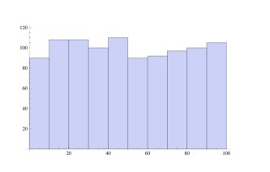
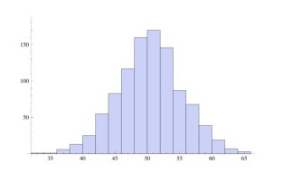

# Dirichlet Process Mixture Model

Questions

- Why H was required?
- How is Pólya urn exchangeable?
- What does $(X(B_{1}),\dots ,X(B_{n})) actually mean?$

TODO

## Beta distribution

- pdf is defined on the interval [0, 1]
  - samples are going to be on the interval [0, 1]
- $\alpha=1, \beta=1$
  - X ~ uniform distribution on the interval [0, 1]
- $\alpha=1, \beta=0.1$
  - X is mostly to be around 1
- $\alpha=1, \beta=10$
  - X is more likely to be around 0 than 1
- $\alpha=2, \beta=2$
  - X is more likely to be around 0.5

Can be used as prior distribution of parameter $\theta$ on [0, 1] for other distribution.

- Bernoulli distribution
- Binomial distribution

## Dirichlet distribution

- X is K-dimensional vector
  - $i$th element $X_i$ is defined on the interval [0, 1]
  - $\sum_i X_i = 1$
- $\alpha=(1,1)$
  - X ~ 2d uniform distribution on the unit square
- $\alpha=1, \beta=0.1$
  - X is mostly to be around (1, 0)
- $\alpha=1, \beta=10$
  - X is more likely to be around (0, 1) than (1, 0)
- $\alpha=2, \beta=2$
  - X is more likely to be around (0.5, 0.5)

Can be used as prior distribution of multi-dimensional parameter $\theta$ for other distribution where $\theta_i$ is on [0, 1] and $\sum_i \theta_i = 1$.

- Multinomial distribution

## Dirichlet process

- rich get richer
- going to generate parameters over time
- using Dirichlet distribution

- Dirichlet distribution is not practically suitable where $k \to \infty$,
  - building pdf
    - Stick-breaking process
  - sampling / realization
    - Pólya urn model
    - Chinese restaurant process
- CDF converges exponentially meaning initial cluster can be too big and later there are much more small clusters only.
  - Sometimes we'd better use another similar algorithm depending on the domain of problem.
    - Pitmat-Yor process which is close to power-low distribution

### Formal definition

- given measurable set $S$
- $B_i$ is partitions of $S$
- if $X \sim DP(H, \alpha)$
- then $(X(B_{1}),\dots ,X(B_{n})) \sim \operatorname {Dir} (\alpha H(B_{1}),\dots ,\alpha H(B_{n}))$
- $P \sim DP(H,\alpha)$
  - $\alpha$
    - sensitivity. a positive real number
  - $H$
    - expected value of $X_1, X_2, X_3, ...$
- $X_1, X_2, X_3, ... \sim P$

### Chinese restaurant process

- Input: base distribution H, $\alpha$
- Draw $X_1$ from H
- for n > 1
  - draw $X_n$ from H with probability $\alpha \over \alpha + n - 1$
  - $X_n = x$ with probability $n_x \over \alpha + n - 1$ where $n_x$ is number of previous observations of $x$.

### Stick-breaking process

- to construct PDF
- sample from base distribution and assign the value with the probability value sampled from $Beta(1,\alpha)$
- break the stick at the probability sampled
- do the same thing for the stick left

### Pólya urn model

- http://success-equation.com/urn.html
- draw a ball out of urn
- put the ball back in along with a new ball with the same color
- richer get richer although the expected value seems even
  - flaky
  - acutely sensitive to the initial state of the system
- results of many runs of the Pólya urn process seems to be flat
  - https://mathenchant.wordpress.com/2015/10/16/polyas-urn/

### Plain DPMM

- 

#### Truncated DPMM

- limit the number of tables

### HDP(Hierarchical DPMM)

- for atom sharing
- when sitting down by a new table, decide once more if new table is picked among tables $G_0$ already picked or brand new table is going to be picked from $H_0$ and added into $G_0$ tables

#### CRF(Chinese Restaurant Franchise)

- dish
- table
- restaurant

- restaurants can share dishes specified by the franchise

## References

- https://en.wikipedia.org/wiki/Latent_Dirichlet_allocation
- https://en.wikipedia.org/wiki/Hierarchical_Dirichlet_process
- https://en.wikipedia.org/wiki/Dirichlet_process
- https://en.wikipedia.org/wiki/De_Finetti%27s_theorem