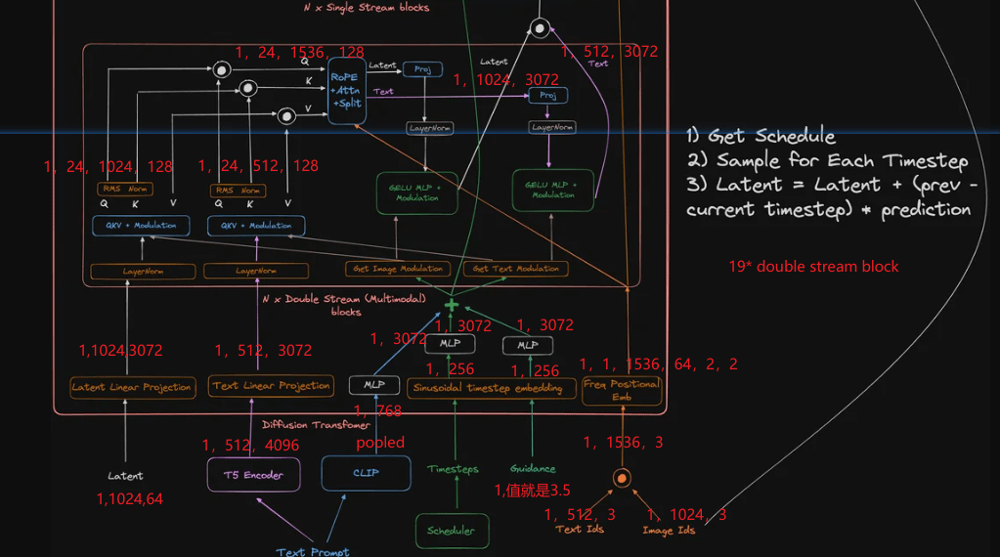

# FLUX.1-schnell

https://huggingface.co/docs/diffusers/main/en/api/pipelines/flux

https://huggingface.co/black-forest-labs/FLUX.1-schnell

- by Black Forest Labs
- Apache 2.0
- 12B parameters
  - Note that SDXL has 3.5B parameters
- DiT based
- T5 Encoder + CLIP
- ROPE
- RMS Norm
- multi modal attention
- FlowMatchEulerDiscreteScheduler
  - introduced in SD3

## References

- https://www.reddit.com/r/LocalLLaMA/comments/1ekr7ji/fluxs_architecture_diagram_dont_think_theres_a/?utm_source=share&utm_medium=web3x&utm_name=web3xcss&utm_term=1&utm_content=share_button
