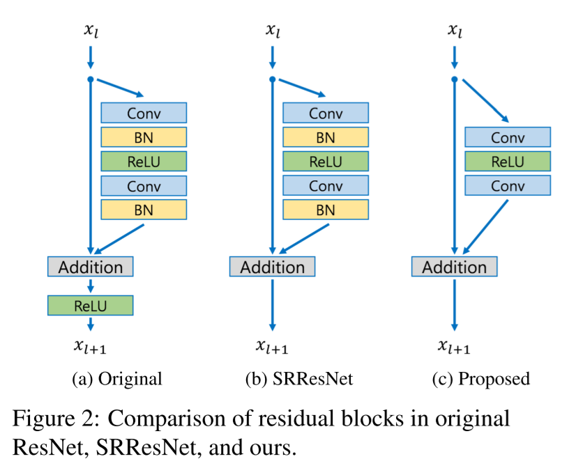
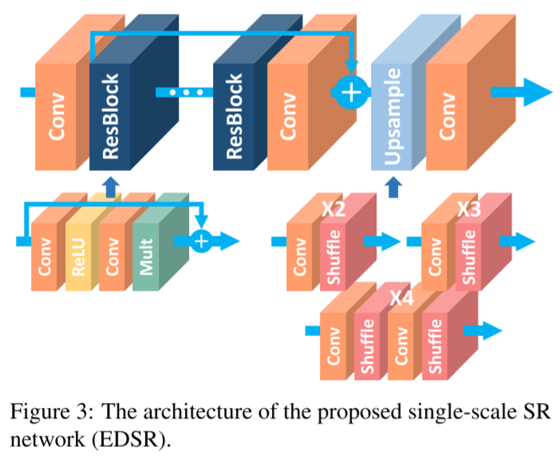
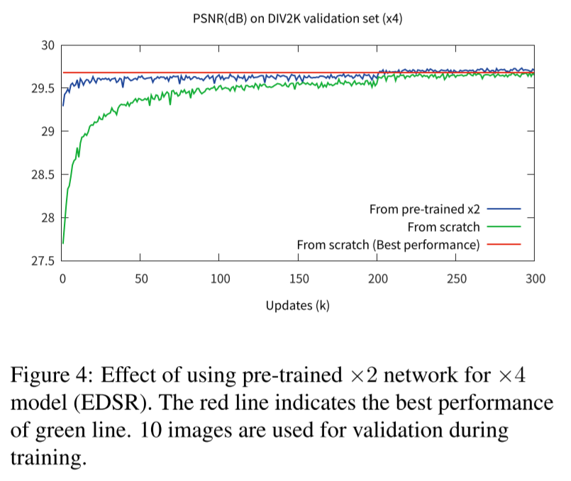
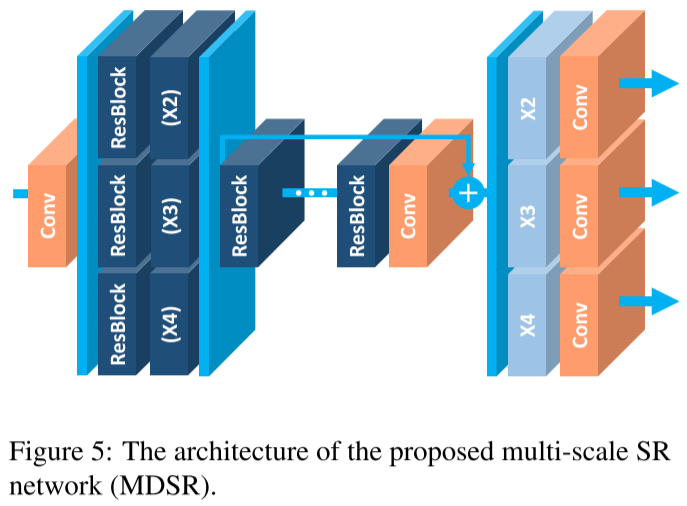

# Enhanced Deep Residual Networks for Single Image Super-Resolution

- https://arxiv.org/abs/1707.02921
- CVPR 2017 Workshop
- TODO
  - read in detail
- additional resources
  - https://youtu.be/OMIqkn2DCUk
  - https://github.com/sanghyun-son/EDSR-PyTorch/

## 1 Introduction

## 2 Related Work

## 3 Proposed methods

### 3.1 Residual blocks

- remove batch normalization
  - assuming the distributions of inputs and outputs are similar

### 3.2 Single-scale model

enhanced deep super-resolution (EDSR) 

- skip connections
  - multiply 0.1 to reduce the gradient of non-skipped parameters for more stable training⭐
- upscaling methods
- (x4) wider
  - increase channels from 64 to 256 channels
- (x2) deeper
  - increase the number of layers from 16 to 32 (x2)
- use L1 loss instead of L2 loss
- No batch normalization
  - batch normalization is expensive
- no ReLU outside residual blocks
- geometric self-ensemble ⭐
  - (EDSR+)
  - rotate the input image in 8 way (including flipping) in test time
  - revert the rotation
  - ensemble the results
    - ensemble methods are expensive

- Using a pretrained x2 model for training a x4 model makes it converge much faster

### 3.3 Multi-scale model

multi-scale deep super-resolution (MDSR)

- very deep
  - 80 ResBlocks
- most parameters are shared in the main branch
- scale specific preprocessing modules and up-samplers
- no batch normalization
- no ReLU outside residual blocks
- L1 loss function
- geometric self-ensemble
  - (MDSR+)

## 4 Experiments

Training details

- 3 channels (RGB)
- dataset
  - DIV2K
  - 800 images
- patch size ⭐
  - (random cropping)
  - 96x96 (x2)
  - 144x144 (x3)
  - 192x192 (x4)
- batch size
  - 16
- learning rate
  - $10^{-4}$
  - halved at every $2 \times 10^{5}$ iterations ⭐
- data augmentation
  - flip and rotate
- optimizer
  - ADAM ($\beta_1 = 0.9$)
- number of iterations
  - $6 \times 10^5$
  - four days

## 5 Discussion

## References

