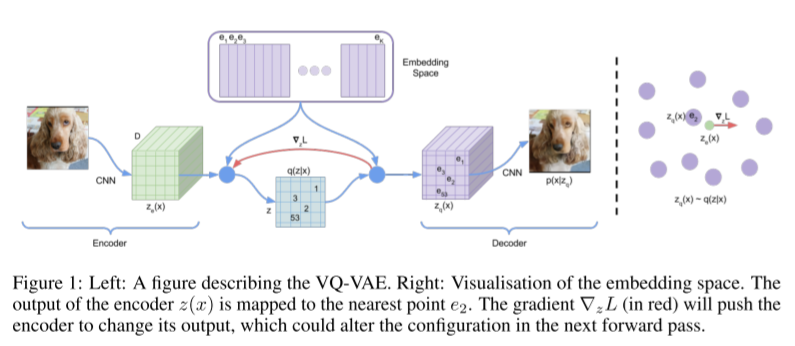

# Neural Discrete Representation Learning

https://arxiv.org/abs/1711.00937

## 1 Introduction

## 2 Related work

## 3 VQ-VAE

### 3.1 Discrete latent variables

### 3.2 Learning

### 3.3 Prior

## 4 Experiments

### 4.1 Comparison with continuous variables

### 4.2 Images

### 4.3 Audio

### 4.4 Video

## Conclusion

