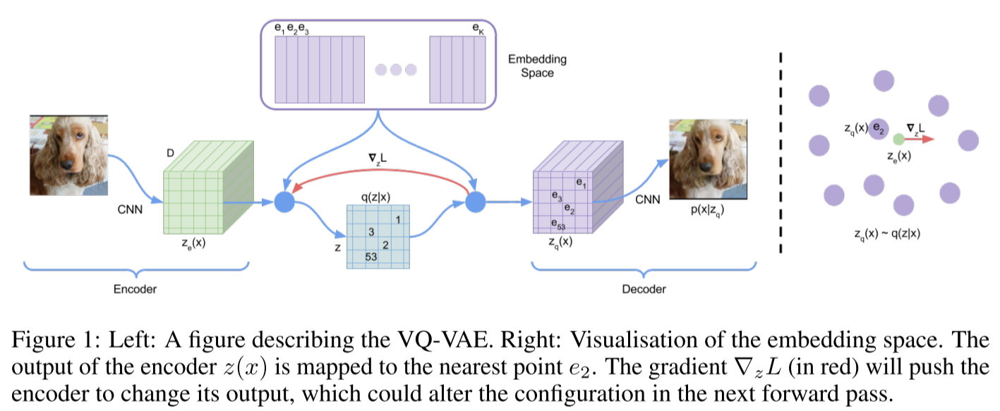

# Neural Discrete Representation Learning

- https://arxiv.org/abs/1711.00937

## 1 Introduction

- discrete representations
  - would be a more natural fit for language models, so also for
    - speech
    - images (described by text)
    - reasoning, planning
  - difficult to learn but many powerful NLP methods are available
- VQ-VAE
  - mainly for learning the discrete latent space, the encoder and the decoder
    - usually a prior model is accompanied but not always. (See the video experiment in 4.4.)
  - does not suffer from large variance or posterior collapse
    - meaning it's not ignoring posterior as decoder's capacity relatively is getting powerful
  - can model features that spans many dimensions in data space
    - opposed to focusing on noise and imperceptible - usually local - details

## 3 VQ-VAE

- embedding table
- $z$
  - discrete random variable
  - possible values are kept in the embedding table
- $q(z|x)$
  - posterior one-hot categorical distribution
    - so it's deterministic once $x$ is given
  - parameterized by an encoder network
- $p(z)$
  - prior categorical distribution
    - with the uniform event probabilities
- $p(x|z)$
  - a distribution over the input data
  - parameterized by a decoder network

### 3.1 Discrete latent variables

- $e \in R^{K \times D}$
  - embedding space
  - so we have $K$ embedding vectors in the table
  - ☝️ Note:
    - a single random variable $z$ is used for the simplicity. To describe an image, for example, we need 2D - which means $N = w \times h$ - latent feature "spaces".
- $e_i \in R^D$
  - an embedding vector
- $z_e(x)$
  - an encoder output
  - continuous
- $z_q(x)$
  - a decoder input
  - discrete

- the posterior distribution is defined as one-hot

$$
q(z=k \mid x)= \begin{cases}1 & \text { for } \mathrm{k}=\operatorname{argmin}_j\left\|z_e(x)-e_j\right\|_2 \\ 0 & \text { otherwise }\end{cases}\tag{1}
$$

- $z_q(x)$ is selected as the nearest embedding vector to $z_e(x)$

$$
z_q(x)=e_k, \quad \text { where } \quad k=\operatorname{argmin}_j\left\|z_e(x)-e_j\right\|_2\tag{2}
$$

### 3.2 Learning

$$
L = \log p(x|z_q(x)) + \Vert \operatorname{sg} [ z_e(x)] - e \Vert_2^2 + \beta \Vert z_e(x) - \operatorname{sg}[e]\Vert_2^2
$$

- $\operatorname{sg}[\cdot]$
  - stands for the stop-gradient operator
  - considers the operand as a constant
- $\log p(x|z_q(x))$
  - reconstruction loss
  - it trains the encoder and the decoder
  - $z_q(x)$ is passed to the decoder
  - the gradient of $L$ with respect to $z_q(x)$ is passed to encoder
    - $z_q(x) = z_e(x) - \operatorname{sg}[z_q(x) - z_e(x)]$
- $\Vert \operatorname{sg} [ z_e(x)] - e \Vert_2^2$
  - it trains embedding vectors
  - (Note that, instead of this term, the Exponential Moving Average (EMA) method can be used. Refer to Appendix A.1 for more details.)
- $\Vert z_e(x) - \operatorname{sg}[e]\Vert_2^2$
  - it trains encoder
- $\beta = 0.25$
  - the model performance was not very sensitive to this value.
  - would depend on the scale of reconstruction loss

### 3.3 Prior

- we train a separate model to generate the prior over the discrete latent distribution $p(z)$

## 4 Experiments

### 4.1 Comparison with continuous variables

- decent but not the best yet

### 4.2 Images

- ImageNet 128
  - params
    - $z: 32 \times 32 \times 1$
    - $K=512$
    - $D=?$
  - tasks
    - reconstruction
    - generation along with PixelCNN
- DeepMind Lab environment 84x84x3
  - 2 staged VQ-VAE
    - PixelCNN-2 generates 3x1 prior
    - stage2 decoder generates 21x21x1 prior
    - stage1 decoder generates 84x84x3 image
  - (stage1)
    - $z: 21 \times 21 \times 1$
    - $K = 512$
    - PixelCNN-1
    - can be used as standalone VQ-VAE
  - (stage2)
    - on top of stage1 latent space
    - $z: 3 \times 1$
    - $K = 512$
    - PixelCNN-2
    - posterior collapse not observed

### 4.3 Audio

- the learnt discrete latent representation seems to have captured high level features
- encoder
  - 6 layers of dilated CNNs
- decoder
  - conditioned on both the latent vectors and the one-hot value identifying the speaker

### 4.4 Video

- encoder
  - input 6 frames
  - latent vectors corresponding to 10 output frames
- decoder
  - output 10 frames

## A Appendix

### A.1 VQ-VAE dictionary update with exponential moving averages

Instead of using
$$
\Vert \operatorname{sg}[z_e(x)] - e\Vert_2^2 \tag{4}
$$
in the equation (3), we can minimize
$$
\sum\limits_j^{n_i} \Vert z_{i,j} - e_i \Vert_2^2 \tag{5}
$$
where $\{ z_{i,1},z_{i,2}, ..., z_{i,n_i}\}$ is the subset of encoder outputs that are closest to dictionary item $e_i$.

Then the optimal $e_i$ value would be like the below.
$$
e_i = {1 \over n_i} \sum\limits_{j}^{n_i} z_{i,j}
$$
Applying the Exponential Moving Averages (EMA) method, we can update $e_i$ with the equations below.
$$
N_i^{(t)}:= N_i^{(t-1)}*\gamma + n_i^{t}(1-\gamma) \tag{6}
$$

$$
m_i^{(t)}:= m_i^{(t-1)}*\gamma + \sum z_{i, j}^{t}(1-\gamma) \tag{7}
$$

$$
e_i^{(t)} := {m_i^{(t)} \over N_i^{(t)}} \tag{8}
$$