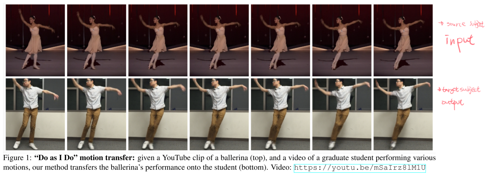
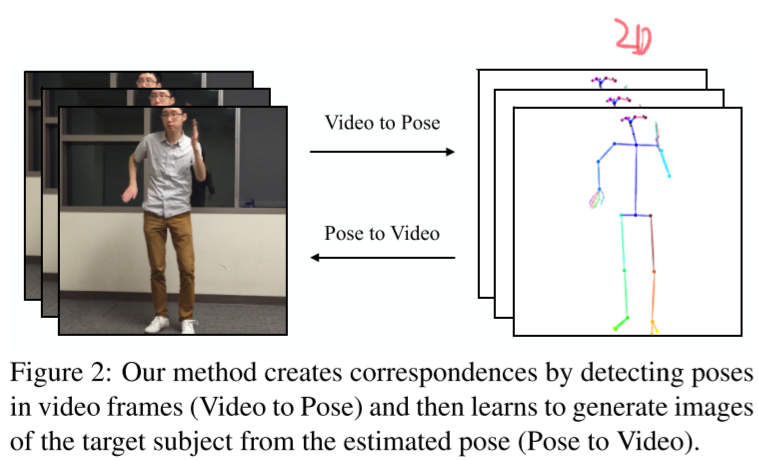
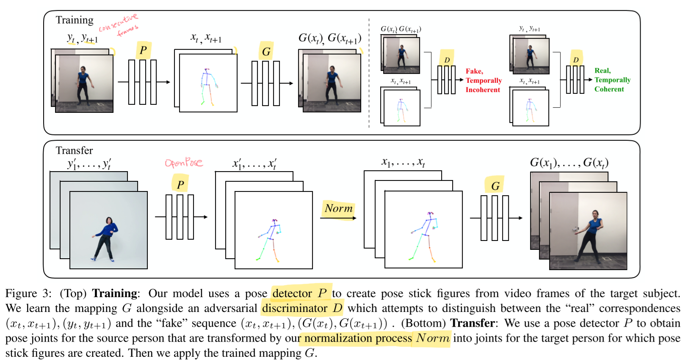
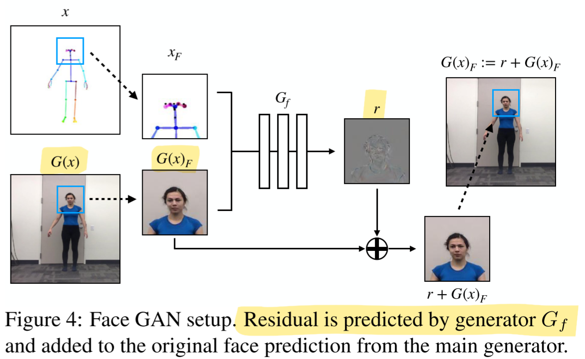

# Everybody Dance Now

- https://arxiv.org/abs/1808.07371
- https://carolineec.github.io/everybody_dance_now/
- The architectures are based on `pix2pixHD`.

## 1 Introduction

- task
  - video-to-video
    - video ➡️ pose ➡️ video
    - "Do as I do"
- model networks
  - $P$
    - pose detector

  - $G$
    - pose generator
    - two staged
      - 512x256
      - 1024x512

  - $D$
    - pose discriminator
    - one or two staged??
      - it's difficult to say since it's just referring to pix2pixHD
      - TODO check the code

  - $G_f$
    - face generator

  - $D_f$
    - face discriminator

- extra model
  - fake-detector

- release datasets
  - 5 long single dancer videos
  - YouTube videos

## 2 Related Work

(skipped)

## 3 Method

### 3.1 Pose encoding and normalization

##### Encoding body pose

- pretrained pose detector `OpenPose`
  - estimates 2D joint coordinates

##### Global  pose normalization

- translation
  - with respect to the distance from the camera
- scale
  - with respect to their height (taking their position into account)
- Refer to appendix 8.5 for more details

### 3.2 Pose to video translation

##### Temporal smoothing

$$
\mathcal{L}_\text{smooth}(G, D) = \mathbb{E}_{(x,y)}\left[ \log D(x_{t-1}, x_t, y_{t-1}, y_t) \right] + \mathbb{E}_x \left[ \log(1 - D(x_{t-1}, x_t, G(x_{t-1}), G(x_t))) \right]
\tag{1}
$$

- where
  - $x_t$
    - pose figure at time $t$
  - $y_t$
    - image at time $t$
  - the first output
    - $G(x _{t-1}) := G(x _{t-1}, z)$
    - $z$ is the zero image
  - the second output
    - $G(x _{t}) := G(x _{t}, G(x _{t-1}))$

##### Face GAN

$$
\mathcal{L}_\text{face}(G_f, D_f) = \mathbb{E}_{(x_F, y_F)}\left [ \log D_f(x_F, y_F)\right] + \mathbb{E}_{x_F} \left[ \log (1 - D_f(x_F, G(x)_F + r)\right]
\tag{2}
$$

- where
  - $G_f$
    - face generator
  - $D_f$
  - $x_F$
    - the face region of the original pose stick figure
    - the 128x128 section around the nose key point
  - $y_F$
    - the face region of the ground truth image of the target person
  - $G(x) _F$
    - the face region of a generated pose image
  - $r = G _f(x _F, G(x) _F)$
    - a residual prediction

### 3.3 Full objective

###### (for training the full image GAN)

$$
\min\limits_G \left(
(\max\limits_{D_i} \sum\limits_{k_i} \mathcal{L}_\text{smooth}(G, D_k) )
+ \lambda_\text{FM} \sum\limits_{k_i} \mathcal{L}_\text{FM}(G, D_k)
+ \lambda_\text{P} \left( \mathcal{L}_\text{P}(G(x_{t-1}), y_{t-1}) + \mathcal{L}_\text{P}(G(x_t), y_t))\right)\right)
\tag{3}
$$

- where 
  - $i \in \{1,2,3\}$
  - $\mathcal{L}_\text{FM}(G, D)$
    - the discriminator feature-matching loss presented in `pix2pixHD`
  - $\mathcal{L}_\text{P}$
    - perceptual reconstruction loss
    - See the section 8.2 for more details on $\mathcal{L} _\text{P}$.

$$
\mathcal{L}_\text{GAN}(G, D) = \mathbb{E}_{(x,y)}\left[ \log D(x,y)\right] + \mathbb{E}_x \left[ \log(1 - D(x, G(x))\right]
\tag{4}
$$

- TODO
  - I need to check the code since $\mathcal{L}_\text{smooth}$ looks like $\mathcal{L}_\text{GAN}$. 🤔

###### (for training the face GAN)

$$
\min\limits_{G_f} \left( \left( \max\limits_{D_f} \mathcal{L}_\text{face}(G_f, D_f)\right) + \lambda_\text{P}\mathcal{L}_\text{P}(r + G(x)_F, y_F)\right)
\tag{5}
$$

- Optimized by this after freezing the full image GAN weights.

- See the section 8.2 for more details on $\mathcal{L} _\text{P}$.

## 4 Experiments

### 4.1 Setup

- See the section 8.3 for more details on datasets.

##### Baseline methods

- Nearest neighbors
  - find nearest frames
  - using the following pose distance metric where $p$ and $p^\prime$ are two poses and  $n$ is the number joints $p _1, ..., p _n$.

$$
d(p, p^\prime) = {1 \over n} \sum\limits_{k=1}^{n} \Vert p_k - p_k^\prime \Vert_2
\tag{6}
$$

- Balakrishnan et al. (`PoseWarp`)
  - single image synthesis

##### Ablation conditions 🤔

- Frame-by-frame (FBF) synthesis 

- Temporal smoothing (FBF + TS)

- Our model (FBF + TS + FG)

##### Evaluation metrics

- SSIM
  - Structural Similarity 
- LPIPS
  - Learned Perceptual Image Patch Similarity

### 4.2 Quantitative evaluation

#### 4.2.1 Comparison to baselines

- using `MTurk`
- by 100 participants

#### 4.2.2 Ablation Study

### 4.3 Qualitative results

## 5 Detecting fake videos

- fake-detector
  - classify two consecutive frames are real or fake
  - trained on 48 subjects
  - tested on 14 held-out subjects

## 6 Potential application

## 7 Limitations and discussion

limitations

- loose clothing/hair
- different lib lengths
- different camera positions
- extrapolating to radically different poses

## References

## 8 Appendix

### 8.1 Video demonstration

### 8.2 Implementation details

### 8.3 Dataset collection

### 8.4 Comparison with vid2vid

Both produced the results of comparable quality.

### 8.5 Global pose normalization details

###### (Translation)

$$
\text{translation} = t_\text{far} + {y - s_\text{far} \over s_\text{close} - s_\text{far}} (t_\text{close} - t_\text{far})
\tag{7}
$$

- where
  - $s _\text{close} > s _\text{far}$ and $t _\text{close} > t _\text{far}$
    - since $y=0$ indicates the top of an image frame
- note that we apply this to $y$ values
  - we don't translate coordinates with respect to $x$ values since we just allow people to move left or right of the frame

###### (Scale)

$$
\text{scale} = c_\text{far} + {y - s_\text{far} \over s_\text{close} - s_\text{far}}(c_\text{close} - c_\text{far})
\tag{8}
$$

- where
  - $c _\text{close} = {h _{\text{t} _\text{close}} \over h _{\text{s} _\text{close}}}$
    - scale when subjects are at the close position
  - $c _\text{far} = {h _{\text{t} _\text{far}} \over h _{\text{s} _\text{far}}}$
    - scale when subjects are at the far position
- note that
  - we apply this to both $x$ and $y$ values
  - The average ankle position in a given frame $S = {s _\text{ankle1} + s _\text{ankle2} \over 2}$ for each frame is not changed due to scaling

###### (The close position)

$$
s_\text{close} = \max\{S\} = \max \left\{ {s_\text{ankle1} + s_\text{ankle2} \over 2}\right\}
$$

###### (The far position)

$$
s_\text{far} = max \{S: ||S - s_\text{med}| \lt \alpha|s_\text{close} - s_\text{med}||\} \cap \{S \lt s_\text{med}\}
\tag{9}
$$

- where
  - $\alpha=0.7$ generally works well
  - It sounds heuristic. 🥲

