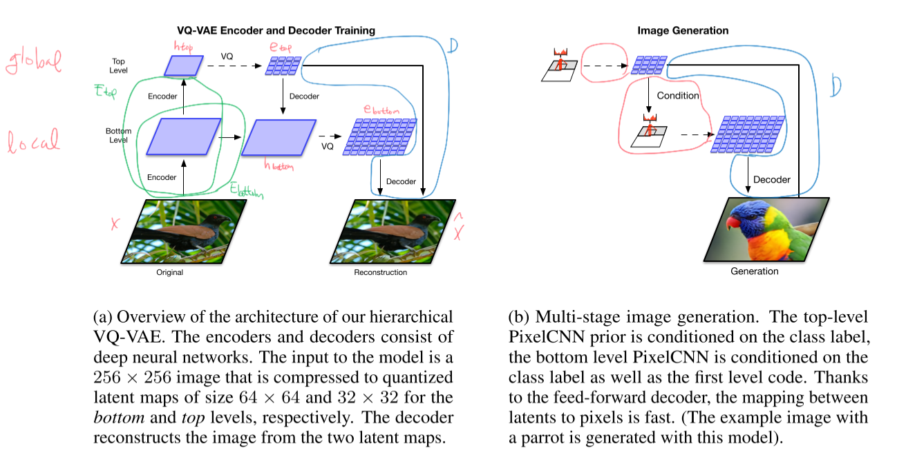
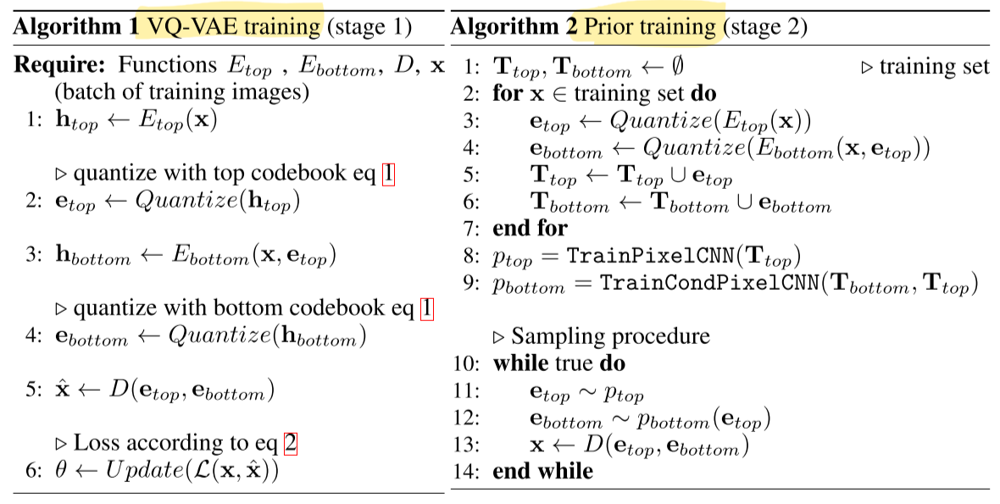

# Generating Diverse High-Fidelity Images with VQ-VAE-2

- https://arxiv.org/abs/1906.00446
- NeurIPS 2019
- A hierarchical variant of VQ-VAE
- Seems better than BigGAN in numbers

## 1 Introduction

- proposed method
  - hierarchical VQ-VAE
  - use PixelSnail to model the prior 
    - PixelCNN
      - with multi-head attention
        - for larger receptive fields
  - achieved performance comparable to GANs
  - also with the diversity of the generated samples

## 2 Background

- VQ-VAE
- PixelCNN family of autoregressive models

## 3 Method

- hierarchical VQ-VAE
  - Encoder generates multi-level latent variables
  - Decoder generates latent variables and samples conditioned on all (?) the other latent variables above
- prior model
  - latent variables are sampled hierarchically

### 3.1 Stage 1: Learning hierarchical latent codes

- global information is represented by top level latent latent variables
- local information  is represented by bottom level latent variables

### 3.2 Stage 2: Learning priors over latent codes

- fitting prior to the learned posterior
  - can be considered as lossless compression
  - to make bit rates closer to Shannon's entropy
  - to lower the gap between true entropy and the negative log likelihood of the learned prior

- PixelCNNs
  - train each prior separately
    - so that we can construct a larger capacity model in total
  - top-level prior network
    - residual gated conv layers
    - multi-head attention
    - drop-out
      - on each activation after each residual block
      - on the logits of each attention matrix
    - 1x1 conv
  - bottom-level conditional prior network
    - without attention layers
    - with deep residual conditioning stack

### 3.3 Trading off diversity with classifier based rejection sampling

- For class-conditional generation
- we can score accept/reject the generated samples
  - using a separately trained classifier
  - to trade off diversity and quality

## 4 Related works

- comparison to vanilla VQ-VAE's hierarchical model
  - previous work
    - (in the wave generation experiment)
    - refine the information encoded by the top level
  - current work
    - extract complementary information at each level
    - simple feed-forward decoders
      - optimizing MSE in the pixels

## 5 Experiments

### 5.1 Modeling high-resolution face images

- FFHQ at 1024 x 1024 resolution

### 5.2 Quantitative evaluation

#### 5.2.1 Negative log-likelihood and reconstruction error

- They argue it's possible to monitor generalization with NLL,
  - but not with FID, IS, Precision-Recall, and Classification Accuracy Scores.
    - Why??
- NLL
  - check for train set and validation set, and see if it overfits

- MSE
  - check for train set and validation set, and see if it overfits

#### 5.2.2 Precision-recall metric

- check coverage and quality

### 5.3 Classification accuracy score

#### 5.3.1 FID and inception score

## 6 Conclusion
