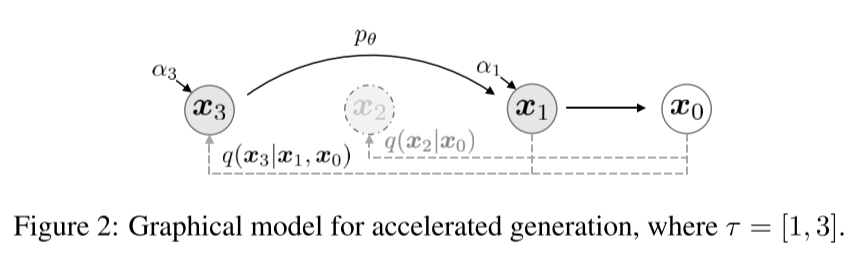

# Denoising Diffusion Implicit Models

- ICLR 2021
- https://arxiv.org/abs/2010.02502
- Jiaming Song, Chenlin Meng, Stefano Ermon
- speeded up diffusion model sampling
  - generates high quality samples with much fewer steps
- introduced a deterministic generative process
  - enables meaningful interpolation in the latent variable
- Questions
  - what does inference mean in this paper?
    - examples
      - inference distributions
      - the inference process
      - inference model

    - it's just the time direction of the reverse diffusion processes as always even though $\boldsymbol{x}_0$ is given as an exceptional condition

## 1 Introduction

- Big picture
  - The sampling speed of DDPM is too slow. How about skip some steps?
  - The reverse step distribution contains $\alpha _t$ and $\beta _t$ that are for moving just a single step.
  - So we replace them with $\bar{\alpha}$ which is not relative to the previous step but to the original image.
  - Then, it's possible to skip steps.
  - Oh, now it seems possible to make it deterministic by setting $\sigma_t = 0$?
  - Yes, it's possible, but then we modify the diffusion process itself and we need to define the forward process more generally in the first place.
  - Still we want to keep the generative process the same and also the marginal distribution $p_t(\boldsymbol{x} _t| \boldsymbol{x} _0)$ the same
    - and it seems to be important to keep the loss function equivalent hopefully.
  - Anyway the resulting processes are a family of non-Markovian processes.
  - (Refer to https://lilianweng.github.io/posts/2021-07-11-diffusion-models/#speed-up-diffusion-model-sampling for more details.)
- DDIM
  - non-Markovian forward diffusion process
  - reverse generative Markovian process 
  - can have a surrogate objective function which is the same as DDPM objective function
  - can generate samples deterministically
  - can generate better samples than DDPMs when compared with the same small number of steps are used

## 2 Background

- $q(\boldsymbol{x}_0)$
  - data distribution
- $p_\theta(\boldsymbol{x}_0)$
  - model to be trained to approximate $q(\boldsymbol{x}_0)$

(DDPM - generative process)
$$
p_\theta(\boldsymbol{x}_0) = \int p_\theta(\boldsymbol{x}_{0:T}) \mathrm{d} \boldsymbol{x}_{1:T}, \quad \text{where} \quad p_\theta(\boldsymbol{x}_{0:T}) := p_\theta(\boldsymbol{x}_T)\prod\limits_{t=1}^T p_\theta^{(t)}(\boldsymbol{x}_{t-1} | \boldsymbol{x}_t) \tag{1}
$$

- It approximates the reverse process $q(\boldsymbol{x} _{t-1}|\boldsymbol{x} _t)$.

(DDPM - variational lower bound)
$$
\max _\theta \mathbb{E}_{q\left(\boldsymbol{x}_0\right)}\left[\log p_\theta\left(\boldsymbol{x}_0\right)\right] \leq \max _\theta \mathbb{E}_{q\left(\boldsymbol{x}_0, \boldsymbol{x}_1, \ldots, \boldsymbol{x}_T\right)}\left[\log p_\theta\left(\boldsymbol{x}_{0: T}\right)-\log q\left(\boldsymbol{x}_{1: T} \mid \boldsymbol{x}_0\right)\right]
\tag{2}
$$

(DDPM - forward process)
$$
q\left(\boldsymbol{x}_{1: T} \mid \boldsymbol{x}_0\right):=\prod_{t=1}^T q\left(\boldsymbol{x}_t \mid \boldsymbol{x}_{t-1}\right), \text { where } q\left(\boldsymbol{x}_t \mid \boldsymbol{x}_{t-1}\right):=\mathcal{N}\left(\sqrt{\frac{\alpha_t}{\alpha_{t-1}}} \boldsymbol{x}_{t-1},\left(1-\frac{\alpha_t}{\alpha_{t-1}}\right) \boldsymbol{I}\right)
\tag{3}
$$
Note a special property:
$$
q\left(\boldsymbol{x}_t \mid \boldsymbol{x}_0\right):=\int q\left(\boldsymbol{x}_{1: t} \mid \boldsymbol{x}_0\right) \mathrm{d} \boldsymbol{x}_{1:(t-1)}=\mathcal{N}\left(\boldsymbol{x}_t ; \sqrt{\alpha_t} \boldsymbol{x}_0,\left(1-\alpha_t\right) \boldsymbol{I}\right)
$$
or equivalently
$$
\boldsymbol{x}_t = \sqrt{\alpha_t} \boldsymbol{x}_0 + \sqrt{1 - \alpha_t} \epsilon, \quad \text{where} \quad \epsilon \sim \mathcal{N}(\boldsymbol{0}, \boldsymbol{I}) \tag{4}
$$
(objective function)
$$
L_\gamma\left(\epsilon_\theta\right):=\sum_{t=1}^T \gamma_t \mathbb{E}_{\boldsymbol{x}_0 \sim q\left(\boldsymbol{x}_0\right), \epsilon_t \sim \mathcal{N}(\mathbf{0}, \boldsymbol{I})}\left[\left\|\epsilon_\theta^{(t)}\left(\sqrt{\alpha_t} \boldsymbol{x}_0+\sqrt{1-\alpha_t} \epsilon_t\right)-\epsilon_t\right\|_2^2\right]
\tag{5}
$$

- variational objective
- $\gamma_t = 1$ for the DDPM's simplest loss function

The generative process of DDPM can be specified in terms of $\sigma_t$ and $\alpha _t$.

$$
\begin{aligned}
\mathbf{x}_{t-1} 
&= \sqrt{\alpha_{t-1}}\mathbf{x}_0 +  \sqrt{1 - \alpha_{t-1}}\boldsymbol{\epsilon}_{t-1} \\
&= \sqrt{\alpha_{t-1}}\mathbf{x}_0 + \sqrt{1 - \alpha_{t-1} - \sigma_t^2} \boldsymbol{\epsilon}_t + \sigma_t\boldsymbol{\epsilon} \\
&= \sqrt{\alpha_{t-1}}\mathbf{x}_0 + \sqrt{1 - \alpha_{t-1} - \sigma_t^2} \frac{\mathbf{x}_t - \sqrt{\alpha_t}\mathbf{x}_0}{\sqrt{1 - \alpha_t}} + \sigma_t\boldsymbol{\epsilon} \\
q_\sigma(\mathbf{x}_{t-1} \vert \mathbf{x}_t, \mathbf{x}_0)
&= \mathcal{N}(\mathbf{x}_{t-1}; \sqrt{\alpha_{t-1}}\mathbf{x}_0 + \sqrt{1 - \alpha_{t-1} - \sigma_t^2} \frac{\mathbf{x}_t - \sqrt{\alpha_t}\mathbf{x}_0}{\sqrt{1 - \alpha_t}}, \sigma_t^2 \mathbf{I})
\end{aligned}
$$

$$
\tilde{\beta}_t = \sigma_t^2 = {{1 - \alpha_{t-1}} \over {1 - \alpha_t}}\left({1 - {\alpha_t \over \alpha_{t-1}}}\right)
$$

## 3 Variational inference for non-Markovian forward processes
### 3.1 Non-Markovian forward processes

$$
q_\sigma(\boldsymbol{x}_{1:T}|\boldsymbol{x}_0) := q_\sigma(\boldsymbol{x}_T | \boldsymbol{x}_0) \prod\limits_{t=2}^{T}q_\sigma(\boldsymbol{x}_{t-1}|\boldsymbol{x}_t, \boldsymbol{x}_0)
\tag{6}
$$

- a family $\mathcal{Q}$ of inference distributions ⭐
  - indexed by a real vector $\sigma \in \mathbb{R}_{\ge 0}^T$ ⭐

- where 

$$
q_\sigma(\boldsymbol{x}_t|\boldsymbol{x}_0) = \mathcal{N}\left(\boldsymbol{x}_t ; \sqrt{\alpha_t} \boldsymbol{x}_0,\left(1-\alpha_t\right) \boldsymbol{I}\right)
\tag{*}
$$

$$
q_\sigma\left(\boldsymbol{x}_{t-1} \mid \boldsymbol{x}_t, \boldsymbol{x}_0\right)=\mathcal{N}\left(\sqrt{\alpha_{t-1}} \boldsymbol{x}_0+\sqrt{1-\alpha_{t-1}-\sigma_t^2} \cdot \frac{\boldsymbol{x}_t-\sqrt{\alpha_t} \boldsymbol{x}_0}{\sqrt{1-\alpha_t}}, \sigma_t^2 \boldsymbol{I}\right)
\tag{7}
$$

- The mean of (7) was chosen to ensure (*).
  - see Lemma 1 of Appendix B for more details

Then the forward process can be derived.
$$
q_\sigma\left(\boldsymbol{x}_{t} \mid \boldsymbol{x}_{t-1}, \boldsymbol{x}_0\right) =
{q_\sigma\left(\boldsymbol{x}_{t-1} \mid \boldsymbol{x}_t, \boldsymbol{x}_0\right)
q_\sigma\left(\boldsymbol{x}_{t} \mid \boldsymbol{x}_0\right)
\over
q_\sigma\left(\boldsymbol{x}_{t-1} \mid \boldsymbol{x}_0\right)}
\tag{8}
$$

- Gaussian
- non-Markovian
- deterministic when $\sigma = 0$ ⭐

### 3.2 Generative process and unified variational inference objective

$$
f_\theta^{(t)} (\boldsymbol{x}_t) := (\boldsymbol{x}_t - \sqrt{1-\alpha_t} \epsilon_\theta^{(t)}(\boldsymbol{x}_t)) / \sqrt{\alpha_t}
\tag{9}
$$

- It means that we define $f_\theta^{(t)}(\boldsymbol{x}_t)$ which is the estimated $\boldsymbol{x}_0$ directly from $\boldsymbol{x}_t$.

$$
p_\theta^{(t)}\left(\boldsymbol{x}_{t-1} \mid \boldsymbol{x}_t\right)= \begin{cases}\mathcal{N}\left(f_\theta^{(1)}\left(\boldsymbol{x}_1\right), \sigma_1^2 \boldsymbol{I}\right) & \text { if } t=1 \\ q_\sigma\left(\boldsymbol{x}_{t-1} \mid \boldsymbol{x}_t, f_\theta^{(t)}\left(\boldsymbol{x}_t\right)\right) & \text { otherwise }\end{cases}
\tag{10}
$$

- It means that we want to leverage $q_\sigma (\boldsymbol{x}_{t-1} \mid \boldsymbol{x}_t, \boldsymbol{x}_0)$ but with $f_\theta^{(t)}(\boldsymbol{x}_t)$ the estimated $\boldsymbol{x_0}$.
- Then the objective looks like the below.

$$
\begin{aligned}
& J_\sigma\left(\epsilon_\theta\right):=\mathbb{E}_{\boldsymbol{x}_{0: T} \sim q_\sigma\left(\boldsymbol{x}_{0: T}\right)}\left[\log q_\sigma\left(\boldsymbol{x}_{1: T} \mid \boldsymbol{x}_0\right)-\log p_\theta\left(\boldsymbol{x}_{0: T}\right)\right] \\
= & \mathbb{E}_{\boldsymbol{x}_{0: T} \sim q_\sigma\left(\boldsymbol{x}_{0: T}\right)}\left[\log q_\sigma\left(\boldsymbol{x}_T \mid \boldsymbol{x}_0\right)+\sum_{t=2}^T \log q_\sigma\left(\boldsymbol{x}_{t-1} \mid \boldsymbol{x}_t, \boldsymbol{x}_0\right)-\sum_{t=1}^T \log p_\theta^{(t)}\left(\boldsymbol{x}_{t-1} \mid \boldsymbol{x}_t\right)-\log p_\theta\left(\boldsymbol{x}_T\right)\right]
\end{aligned}
\tag{11}
$$

- But analytically it can be equivalent to the objective of DDPM by Theorem 1

**Theorem 1.** For all $\sigma \gt \boldsymbol{0}$, there exists $\gamma \in \mathbb{R}_{>0}^T$ and $C \in \mathbb{R}$, such that $J_\sigma = L_\gamma + C$

- Note
  - if parameters $\theta$ are not shared across different $t$, then the optimal solution for $\epsilon_\theta$ will not depend on the weights $\gamma$
  - then $L_1$ objective used by DDPM can be used as a surrogate objective

## 4 Sampling from generalized generative processes
Now it's clear that we can use any pretrained DDPM network with the generative process described in the section 3.2.

### 4.1 Denoising diffusion implicit models

$$
\boldsymbol{x}_{t-1}=\sqrt{\alpha_{t-1}} \underbrace{\left(\frac{\boldsymbol{x}_t-\sqrt{1-\alpha_t} \epsilon_\theta^{(t)}\left(\boldsymbol{x}_t\right)}{\sqrt{\alpha_t}}\right)}_{\text { predicted } \boldsymbol{x}_0}+\underbrace{\sqrt{1-\alpha_{t-1}-\sigma_t^2} \cdot \epsilon_\theta^{(t)}\left(\boldsymbol{x}_t\right)}_{\text {direction pointing to } \boldsymbol{x}_t }+\underbrace{\sigma_t \epsilon_t}_{\text {random noise }}
\tag{12}
$$

- derived from (7) and (9)
- when $\sigma_t = \sqrt{1 - \alpha_{t-1} \over 1 - \alpha_t}\sqrt{1-{\alpha_t \over \alpha_{t-1}}}$ for all $t$,
  - the forward process becomes Markovian
  - the generative process becomes a DDPM
  - note that
    - in the Non-equilibrium thermodynamics (NET)  paper,
    - the variance of reverse step has upper and lower bound
    - and this $\sigma_t$ value corresponds to the lower bound
- when $\sigma_t = 0$ for all $t$,
  - we call the resulting model the denoising diffusion implicit model (DDIM)

### 4.2 Accelerated generation processes

- $L_1$ doesn't depend on the specific forward procedure
- we can train a model with an arbitrary number of forward steps but only sample from some of them in the generative process
- slight modification is needed though
  - see Appendix C.1 for more details
- we pick S timepoints among all T timepoints

### 4.3 Relevance to neural ODEs

$$
\frac{\boldsymbol{x}_{t-\Delta t}}{\sqrt{\alpha_{t-\Delta t}}}=\frac{\boldsymbol{x}_t}{\sqrt{\alpha_t}}+\left(\sqrt{\frac{1-\alpha_{t-\Delta t}}{\alpha_{t-\Delta t}}}-\sqrt{\frac{1-\alpha_t}{\alpha_t}}\right) \epsilon_\theta^{(t)}\left(\boldsymbol{x}_t\right)
\tag{13}
$$

- derived from Eq. (12) but with the noise term dropped for it is the DDIM case ($\sigma_t = 0$)
- reparameterize
  - $\bar{\boldsymbol{x}}_t = {\boldsymbol{x}_t \over \sqrt{\alpha_t}}$
  - $\sigma(t) = \sqrt{1 - \alpha_t \over \alpha_t}$

- Then Eq. (13) can be derived into Eq. (14)

$$
\mathrm{d}\bar{\boldsymbol{x}}_t = \epsilon_\theta^{(t)} \left( {\bar{\boldsymbol{x}}(t) \over\sqrt{\sigma^2 + 1}} \right) \mathrm{d}\sigma{(t)}
\tag{14}
$$

- Note that this is parameterized by $\mathrm{d}(t)$ not by $\mathrm{d}t$ as in Score-SDE
- And Eq. (14) is equivalent to a probability flow ODE for VE-SDE as below

$$
\frac{\boldsymbol{x}_{t-\Delta t}}{\sqrt{\alpha_{t-\Delta t}}}=\frac{\boldsymbol{x}_t}{\sqrt{\alpha_t}}+\frac{1}{2}\left(\frac{1-\alpha_{t-\Delta t}}{\alpha_{t-\Delta t}}-\frac{1-\alpha_t}{\alpha_t}\right) \cdot \sqrt{\frac{\alpha_t}{1-\alpha_t}} \cdot \epsilon_\theta^{(t)}\left(\boldsymbol{x}_t\right)
\tag{15}
$$

- see Appendix  B. proofs - proposition 1. for more details

## 5 Experiments

$$
\sigma_{\tau_i} (\eta) =
\eta
\sqrt{(1 - \alpha_{\tau_{i-1}})\over(1 - \alpha_{\tau_i})}
\sqrt{1 - {\alpha_{\tau_i} \over \alpha_{\tau_{i-1}}}} 
\tag{16}
$$

### 5.1 Sample quality and efficiency

- it's not always the best but best when the number of steps is small

### 5.2 Sample consistency in DDIMs

- deterministic sampling is possible

### 5.3 Interpolation in deterministic generative processes
### 5.4 Reconstruction from latent space
## 6 Related work
## 7 Discussion
## References
## A Non-Markovian forward process for a discrete case

## B Proofs

##### Lemma 1.

$$
q_\sigma(\boldsymbol{x_t}|\boldsymbol{x}_0) = \mathcal{N}(\sqrt{\alpha_t} \boldsymbol{x}_0 | (1 - \alpha_t)I) \tag{22}
$$

- Our non-Markovian forward process also has the same property as in DDPM.

##### Theorem 1.

For all $\sigma > \boldsymbol{0}$, there exists $\gamma \in \mathbb{R}_{\gt 0}^T$ and $C \in \mathbb{R}$, such that $J_\sigma = L_\gamma + C$

- We can find an equivalent loss function in DDPM for each loss function of our newly defined process.

##### Proposition 1.

The ODE in Eq. (14) with the optimal model $\epsilon_\theta^{(t)}$ has an equivalent probability flow ODE corresponding to the "Variance-Exploding" SDE in Score-SDE (Song et al., 2020).

## C Additional derivations
### C.1 Accelerated sampling processes

### C.2 Derivation of denoising objectives from DDPMs

## D Experimental details
### D.1 Datasets and architectures
### D.2 Reverse process sub-sequence selection
### D.3 Closed form equations for each sampling step
### D.4 Samples and consistency
### D.5 Interpolation