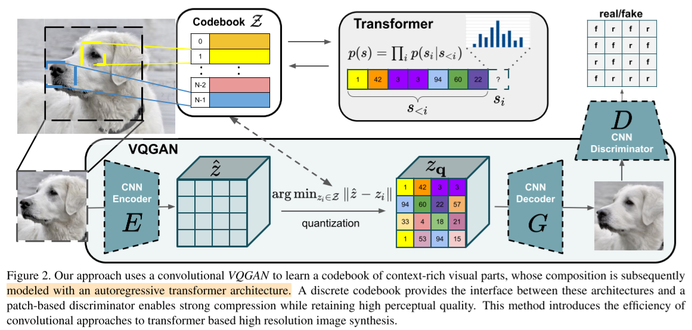
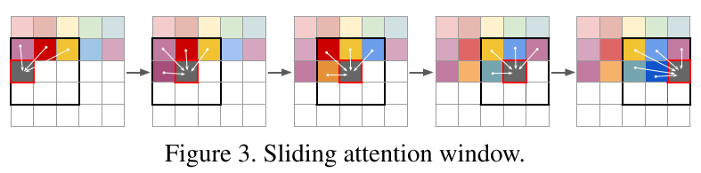

# Taming Transformers for High-Resolution Image Synthesis

- aka VQGAN
- CVPR 2021
- Replaces VQ-VAE2's "PixelCNN + multi-head attention" with "autoregressive transformers"
- Uses 10x less parameters than VQ-VAE2

## 1 Introduction

- CNN

  - has a strong locality bias

  - cons
    - bad at learning semantics
    - use shared weights across all positions

- transformers

  - pros
    - good at learning long-range relations
      - no inductive bias on locality of interactions
  - cons
    - high cost

- a codebook

## 2 Related work

- The transformer family

- Convolutional approaches

- Two-stage approaches
  - VQ-VAE
  - VQ-VAE-2

## 3 Approach

### 3.1 Learning an effective codebook of image constituents for use in transformers

Notations:

- $x \in \mathbb{R}^{H \times W \times 3}$
  - image
- $z_\mathbf{q} \in \mathbb{R}^{h \times w \times n_z}$
  - a spatial collection of code book entries
- $n_z$
  - the dimensionality of codes
- $E$
  - encoder
- $G$
  - decoder
- $\mathcal{Z} = \{z_k\}_{k=1}^K \subset \mathbb{R}^{n_z}$
  - discrete codebook
- $D$
  - a patch-based discriminator

- $\mathbf{q}(\cdot)$
  - an element-wise quantization
- $\hat{x} = G(z_\mathbf{q})$
  - an estimated image
- $\hat{z} = E(x)$
  - an encoding from the encoder

Quantized encodings:
$$
z_\mathbf{q} = \mathbf{q}(\hat{z}) := \left( \operatorname*{arg\,min}\limits_{z_k \in \mathcal{Z}} \Vert \hat{z}_{ij} - z_k \Vert \right) \in \mathbb{R}^{h \times w \times n_z} \tag{2}
$$

Reconstruction:
$$
\hat{x} = G(z_\mathbf{q}) = G(\mathbf{q}(E(x))) \tag{3}
$$
VQ loss function:
$$
\mathcal{L}_\text{VQ}(E, G, \mathcal{Z}) = \mathcal{L}_\text{rec} + \Vert\operatorname{sg}\left[ E(x) \right] - z_\mathbf{q}\Vert_2^2 + \Vert\operatorname{sg}\left[ E(x) \right] - z_\mathbf{q}\Vert_2^2 \tag{4}
$$

- $\mathcal{L}_\text{rec}$
  - reconstruction error
  - originally it had been L2 loss which is $\Vert x - \hat{x} \Vert ^2$
  - but replaced by the perceptual loss
- $\operatorname{sg}[\cdot]$ denotes the stop-gradient operation
- $\Vert\operatorname{sg}\left[ E(x) \right] - z_\mathbf{q}\Vert_2^2$
  - called commitment loss

GAN loss function:
$$
L_\text{GAN}(\{E, G, Z\}, D) = \log D(x) + \log(1 - D(\hat{x})) \tag{5}
$$
Putting all together:
$$
\mathcal{Q}^* = \operatorname*{arg\,min}\limits_{E, G, \mathcal{Z}} \max\limits_D \mathbb{E}_{x \sim p(x)} \left [ \mathcal{L}_\text{VQ}(E,G,\mathcal{Z}) + \lambda \mathcal{L}_\text{GAN}(\{E, G, \mathcal{Z}\}, D)\right] \tag{6}
$$

$$
\lambda = {\nabla_{G_L}[L_\text{rec}] \over \nabla_{G_L}[L_\text{GAN}] + \delta}
$$

- where
  - $Q^* = \{E^*, G^*, \mathcal{Z}^*\}$
    - the optimal compression model
  - $\nabla_{G_L}[\cdot]$
    - the gradient of its input $\cdot$ with respect to the last layer $L$ of the decoder
  - $\delta = 10^{-6}$

### 3.2 Learning the composition of images with transformers

#### Latent transformers

Notations:

- $s \in \{ 0, 1, ..., |\mathcal{Z}| - 1 \}^{h \times w}$
- $s_{ij} = k$ such that $(z_\mathbf{q})_{ij} = z_k$
- $z_\mathbf{q} = (z_{s_{ij}})$
- $p(s) = \prod_i p(s_i| s_{\lt i})$

$$
\mathcal{L}_\text{Transformer} = \mathbb{E}_{x \sim p(x)} [-\log p(s)] \tag{9}
$$

#### Conditioned synthesis

- $c$
  - condition
  - e.g. a single label, or an image

$$
p(s|c) = \prod_i p(s_i| s_{\lt i}, c) \tag{10}
$$

- if $c$ has spatial extent
  - learn another VQGAN
  - obtain an index-based representation
    - $r \in \{ 0, 1, ..., |\mathcal{Z_c}| - 1 \}^{h_c \times w_c}$
  - prepend $r$ to $s$
  - restrict loglikelihood to entries $p(s|c) = \prod_i p(s_i| s_{\lt i}, r)$

#### Generating high-resolution images

- how to pick $h$ and $w$

  - $h = H/2^m$
  - $w = W/2^m$
  - $m \in \mathbb{N}$
  - $f = 2^m$
  - observe degradation as $m$ increases, and pick $m$

- for generating the megapixel images

  - sliding window approach

    - work patch-wise and crop images

    - note that this can be used to generate images of arbitrary ratio and size

## 4 Experiments

- NOTE:
  - I guess they use these terms interchangeably for the same thing
    - $\dim \mathcal{Z}$
    - $|\mathcal{Z}|$
    - $K$
    - codebook size
    - codebook dimension
  - But in the VQ-VAE2 paper `codebook size=512` and `codebook dimension=64` are different things.
  - So I'd use the terms like the below.
    - $K = |\mathcal{Z}| = \text{codebook size} = \text{number of codebook entries}$
    - $n_{z} = \text{the dimensionality of codebook entries}$
  - and I'd not use $\dim \mathcal{Z}$ or codebook dimension since it sounds ambiguous
- $|\mathcal{Z}| \in \{512, 1024, 8192, 16384 \}$
  - (usually) 1024

- $n_z \in \{64, 256\}$
- $\text{sequence length} = 16 \cdot 16$
- GPU
  - 12GB VRAM
- methods for sampling from autoregressive models
  - top-k
    - k=100
      - (COCO-Stuff or ADE20K)
    - k=400
      - (CelebA-HQ)
    - k=300
      - (FFHQ)
  - nucleus
    - top-p
  - beam-search
    - (not used)

### 4.1 attention is all you need in the latent space

- transformers in the latent space outperforms PixelSNAIL

### 4.2 A unified model for image synthesis tasks

- (i) Semantic image synthesis
- (ii) Structure-to-image
  - using depth or edge information
- (iii) Pose-guided synthesis
  - using segmentation map or depth map
- (iv) stochastic super-resolution
  - upsampling factor = 8
- (v) class conditional image synthesis
- high resolution synthesis
  - using the sliding window approach
  - to generate images beyond 256x256

### 4.3 Building context-rich vocabularies

- experiment
  - f1
    - crop size: 16x16 (pixels)
    - the receptive field of a single codebook entry: 1x1 (pixels)
  - f2
    - crop size: 32x32 (pixels)
    - the receptive field of a single codebook entry: 2x2 (pixels)
  - f8
    - crop size: 128x128 (pixels)
    - the receptive field of a single codebook entry: 8x8 (pixels)
  - f16
    - crop size: 256x256 (pixels)
    - the receptive field of a single codebook entry: 16x16 (pixels)
- globally consistent structures can only be modeled with a context-rich vocabulary
  - the higher f value is the better

### 4.4 Benchmarking image synthesis results

#### Class-conditional synthesis on ImageNet

- ImageNet256
- $|\mathcal{Z}| = 16384$ 
- $f=16$

- classifier-rejection is optionally applied
- So, it performs comparably good as much as other nice models at that time.
  - with much less parameters

#### How good is the VQGAN?

- VQGAN outperforms DALL·E and VQ-VAE2

## 5 Conclusion

