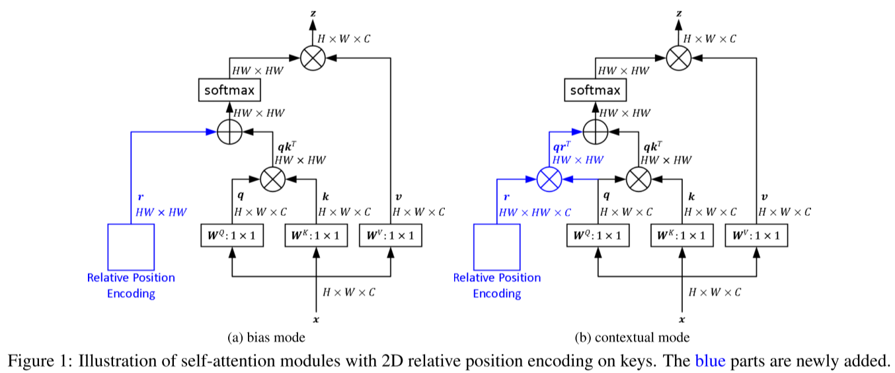
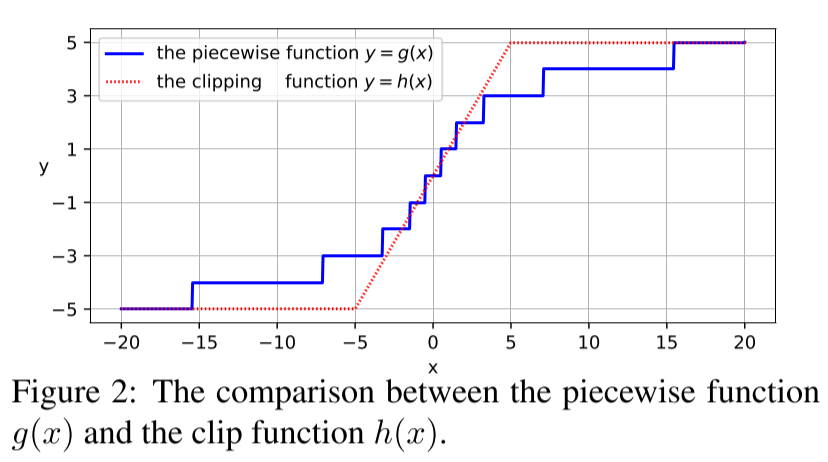
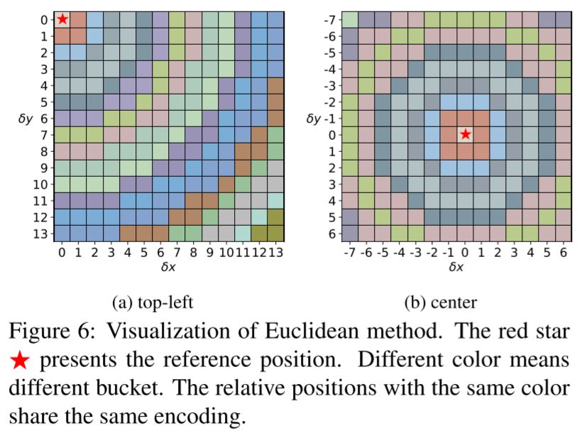
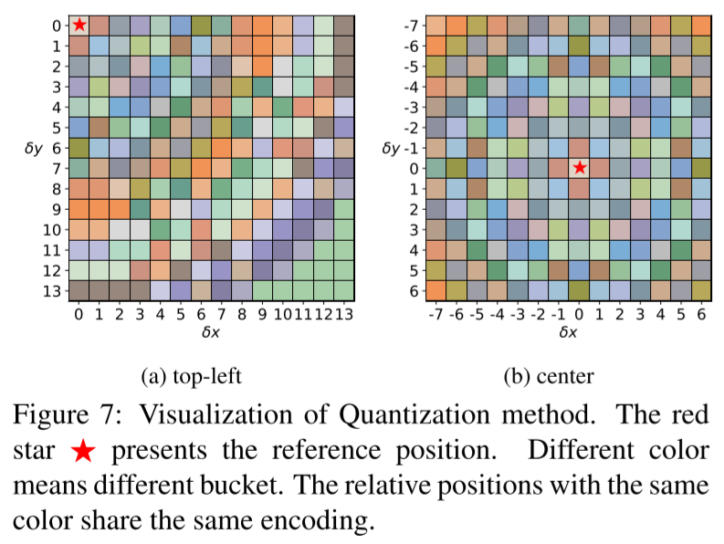
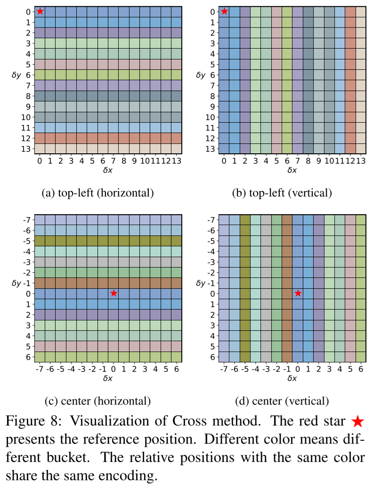
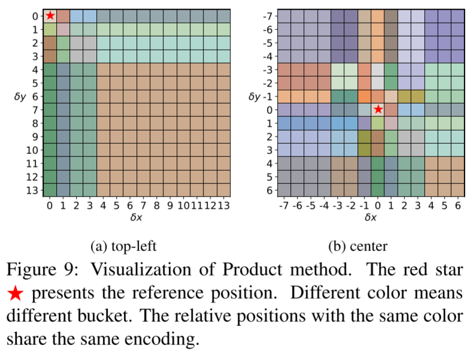
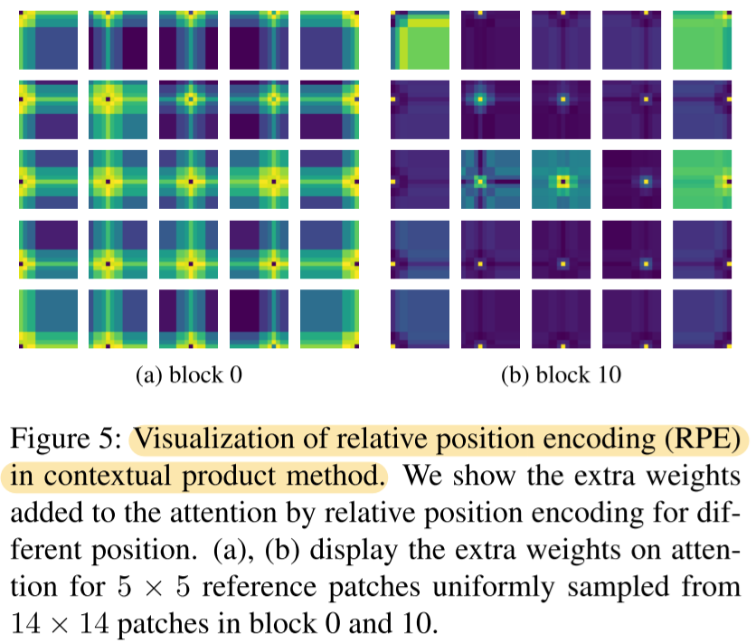

# Rethinking and Improving Relative Position Encoding for Vision Transformer

- https://arxiv.org/abs/2107.14222
- ICCV 2021
- image relative position encoding (iRPE)

## 1 Introduction

- relative position encoding has been verified to be effective in NLP

## 2 Background

### 2.1 Self-attention

### 2.2 Position encoding

##### Absolute position encoding

##### Relative position encoding

## 3 Method

### 3.1 Previous relative position encoding methods

##### Shaw's RPE

- 1D
- the original RPE
- clip the distance beyond $k$
  - to reduce the number of parameters

##### RPE in Transformer-XL

- 1D

##### Huang's RPE

- 1D

##### RPE in SASA

- 2D

##### PRE in Axial-Deeplab

- 2D

### 3.2 Proposed relative position encoding methods

##### Bias mode and contextual mode

##### A piecewise index function

##### 2D relative position calculation

###### Euclidean method

###### Quantization method

###### Cross method

###### Product method

##### An efficient implementation

## 4 Experiments

### 4.1 Implementation details

### 4.2 Analysis on relative position encoding

In terms of classification accuracy improvement

- `directed` is better than `undirected`
- `contextual` is better than `bias`
- `unshared` is better than `shared`
  - but the shared version is memory efficient
- `piecewise` is almost the same as `clip`
  - but it seems better at detection tasks
- number of buckets of 50 looks enough.
  - when it comes to `DeiT-S` that has 14x14 feature map
- the product method looks like the best
  - also, in the experiment, when equipped with relative position encoding, the absolute position encoding does not bring any gains
- the efficient implementation suggested in this paper is way better than a naive implementation

### 4.3 Comparison on image classification

### 4.4 comparison on object detection

### 4.5 Visualization

- in block 0
  - the current patch focus more on its neighborhoods patches
- in block 10 (which represents for higher blocks)
  - the current patch does not.
- in theory, without RPEs, transformer does not explicitly capture locality.
- but RPEs can inject Conv-like inductive bias into transformer in terms of locality

## 5 Related work

##### Transformer

##### Relative position encoding

## 5 Conclusion and remarks

## References

## A Proof of formula 1

## B Proof of formula 2

## Notes

### Self-Attention with Relative Position Representations

- https://arxiv.org/abs/1803.02155v2
