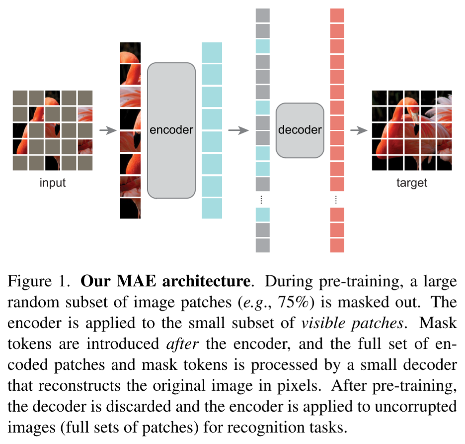

# Masked Autoencoders Are Scalable Vision Learners

- https://arxiv.org/abs/2111.06377
- Facebook AI Research (FAIR)
- Kaiming He et al.

## 1 Introduction

- remarks
  - models today can easily overfit one million images
  - for NLP models, words contain rich semantic information
    - decoder can be a simple MLP
  - for CV models, 
    - decoder plays an important role

## 2 Related work

##### Masked language modeling

- BERT
- GPT

##### Autoencoding

- autoencoders
  - PCA
  - k-means
- denoising autoencoders

##### Masked image encoding

##### Self-supervised learning

## 3 Approach

##### Masking

- mask random patches of the input image
  - for example 75%

##### MAE encoder

- process only available patches

  - for example 25% 

  - fast training

- it generalizes well

##### MAE decoder

- only used during pre-training to perform the image reconstruction task
- light weighted
  - 10% computation per token compared to the encoder
- process all patches
  - encoded visible patches
  - mask tokens
- add positional embeddings to all tokens

##### Reconstruction target

- the decoder's output is reshaped to form a reconstructed image
- loss
  - MSE
  - computed only on masked patches
    - similar to BERT

##### Simple implementation

- shuffle tokens randomly
- remove the last portion of the list
- perform encoding
- append list of mask tokens
- unshuffle tokens

## 4 ImageNet experiments

##### Baseline: ViT-Large

### 4.1 Masking properties

##### Masking ratio

- 75% is good for both linear probing and finetuning

##### Decoder design

- can be flexible
- less relevant for recognition

##### Mask token

- if the encoder uses mask tokens it performs worse
- without them we can save the time and memory
  - especially good for big models

##### Reconstruction target

##### Data augmentation

- it's fine not to use data augmentation

##### Mask sampling strategy

- Simple random masking is better than block-wise masking or grid-wise sampling

##### Training schedule

- 800 epoch pretraining
- no saturation found in term of linear probing accuracy event at 1600 epochs

### 4.2 Comparisons with previous results

##### Comparisons with self-supervised methods

##### Comparisons with supervised pre-training

### 4.3 Partial fine-tuning

- linear probing
  - doesn't take non-linear features into account
  - not well correlated with transfer learning performance
    - e.g. object detection
- partial fine-tuning
  - finetune last a few layers
    - e.g. 4 or 6 layers
    - freeze others
  - it can achieve accuracy close to full fine-tuning

## 5 Transfer learning experiments

##### Object detection and segmentation

##### Semantic segmentation

##### Classification tasks

##### Pixels vs. tokens.

## 6 Discussion and conclusion

## References

## A Implementation details

### A.1 ImageNet experiments

##### Pre-training

##### End-to-end fine-tuning

##### Linear probing

##### Partial fine-tuning

### A.2 Supervised training ViT-L/H from scratch

### A.3 Object detection and segmentation in COCO

### A.4 Semantic segmentation in ADE20K

### A.5 Additional classification tasks

## B Comparison on linear probing results

## C Robustness evaluation on ImageNet

