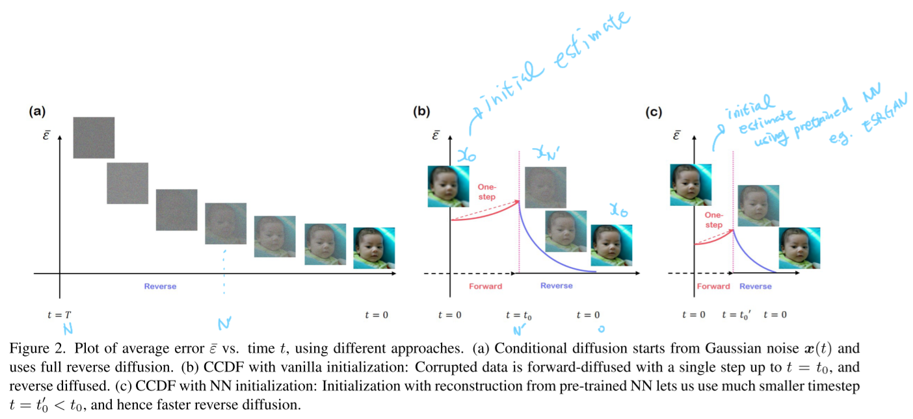

# Come-Closer-Diffuse-Faster: Accelerating Conditional Diffusion Models for Inverse Problems through Stochastic Contraction

- https://arxiv.org/abs/2112.05146
- [2022 CVPR](https://openaccess.thecvf.com/content/CVPR2022/html/Chung_Come-Closer-Diffuse-Faster_Accelerating_Conditional_Diffusion_Models_for_Inverse_Problems_Through_Stochastic_CVPR_2022_paper.html)

## Notations

- $0 \le t_0 \le 1$
- $N' = N t_0 \lt N$
  - the time step where we want to start the reverse phase from
- $\tilde{\boldsymbol{x}}_0$
  - a ground truth sample
- $\boldsymbol{x}_0$
  - initial estimate
- $\mathcal{E}_0 = \Vert \boldsymbol{x}_0 - \tilde{\boldsymbol{x}}_0\Vert^2$
  - estimation error between the initial estimate and the real sample
- $\bar{\mathcal{E}}_{N'} = \mathbb{E}\Vert \boldsymbol{x}_{N'} - \tilde{\boldsymbol{x}}_{N'}\Vert^2$
  - expected estimate error between the generated samples and the ground truth at the step $N'$ 
- $\bar{\mathcal{E}}_{j, r}$
  - expected estimate error between the generated samples following the reverse trajectory and the ground truth at the step j 

##  Definition

- contraction mapping $\boldsymbol{f}$
  - $: \mathbb{R}^n \to \mathbb{R}^n$ is defined as $\Vert\boldsymbol{f}(\boldsymbol{x}) - \boldsymbol{f}(\boldsymbol{x})\Vert \le \lambda \Vert \boldsymbol{x} - \boldsymbol{y} \Vert$
    - where $0 \le \lambda \lt 1$

##  Reverse diffusion

- (13): standard reverse diffusion step
- (14): alternating step

$$
\boldsymbol{x}'_{i-1} = \boldsymbol{f}(\boldsymbol{x}_i, i) + g(\boldsymbol{x}_i, i)\boldsymbol{z}_i\tag{13}
$$

$$
\boldsymbol{x}_{i-1} = \boldsymbol{A}\boldsymbol{x}'_{i-1} + \boldsymbol{b}\tag{14}
$$

##  Key ideas

- $\boldsymbol{x}_i$ converges to $\tilde{\boldsymbol{x}}_i$ exponentially where (13), (14) altogether is a contraction mapping.
  - The estimation error at the final step has exponentially contracting upper bound. (Theorem 1.)
    - $\bar{\mathcal{E}}_{0, r} \le {2C\tau \over 1 - \lambda^2} + \lambda^{2N'}\bar{\mathcal{E}}_{N'}$
    - where
      - $\tau = {\operatorname{Tr}({\boldsymbol{A}^T\boldsymbol{A}}) \over n}$
      - $\lambda$
        - constant depending on the standard diffusion
      - $C$
        - constant depending on the standard diffusion
- There exist a minimum $N'$ which is a shortcut path. (Theorem 2.)
  - such that
    - $\bar{\mathcal{E}}_{0, r} \le \mu\mathcal{E}_0$
    - For any $0 \lt \mu \le 1$

##  Applications

$\boldsymbol{A} = (I - \boldsymbol{P})$

$b = \hat{\boldsymbol{x}}$

- super resolution
  - $\boldsymbol{P}$: Gaussian blur
- image inpainting
  - $\boldsymbol{P}$: measurement mask
- ...