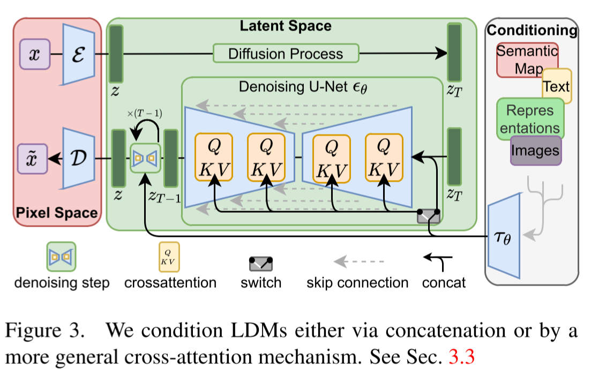

# High-Resolution Image Synthesis with Latent Diffusion Models

- CVPR 2022
- LDM
- https://arxiv.org/abs/2112.10752
- (stable diffusion is based on this)
- latent space
  - 2D
    - the same as the original number of dimensions
    - So U-Net can be used by LDM
- encoder/decoder
  - auto-encoder based perceptual compression
  - fixed when training the latent diffusion model
  - training
    - perceptual loss
    - architecture
      - VAE
        - KL-reg
          - give a little KL-penalty toward standard normal on learned latent
        - VQ-reg
          - vector quantization
          - was better than KL-reg
          - embedded in the decoder
      - VQ-GAN
        - stage1
          - VQ-VAE based encoder/decoder/codebook training
          - a patch-based adversarial object
        - stage2
          - training an autoregressive transformer model
            - to generate the latent vectors using the codebook as vocabulary
          - trained separately with the encoder/decoder/code-book frozen
- cross-attention layers
  - enables multi-modal training
  - Not only decoder but also encoder of U-Net has attention
- References
  - https://github.com/CompVis/latent-diffusion
  - https://github.com/huggingface/diffusers
  - https://github.com/CompVis/stable-diffusion
  - https://github.com/AUTOMATIC1111/stable-diffusion-webui
- TODO
  - how to do inpainting?
  - how to do super resolution?

## 1 Introduction

##### Democratizing high-resolution image synthesis

- requires massive computation resources
- training a powerful diffusion model may take150-1000 V100 days

##### Departure to latent space

- two phases in training generative models
  - semantic compression
    - learn the semantic and conceptual composition
    - let a latent diffusion model to learn
  - perceptual compression
    - remove high-frequency details
    - learn little semantic variation
    - let the encoder and the decoder to learn

## 2 Related work

##### Generative models for image synthesis

- GAN
- VAE
- autoregressive models
- Diffusion Probabilistic Models (DPM)

##### Two-stage image synthesis

- VQ-VAEs
- VQ-GANs

## 3 Method

### 3.1 Perceptual image compression

Notations:

- $x \in \mathbb{R}^{H \times W \times 3}$
  - image
- $z \in \mathbb{R}^{h \times w \times c}$
  - non-quantized latent vector

- $c$
  - the dimensionality of codes

- $\mathcal{E}$
  - encoder
- $\mathcal{D}$
  - decoder

- $z = \mathcal{E}(x)$
  - an encoding from the encoder
- $\tilde{x} = \mathcal{D}(\mathcal{E}(x))$
  - an estimated image

Regularizations:

- $\text{KL-reg}$
  - a slight KL-penalty toward a standard normal on learnt latent
  - similar to VAE
- $\text{VQ-reg}$
  - the quantization layer absorbed by the decoder

### 3.2 Latent diffusion models

##### Diffusion models

$$
L_\text{DM} = \mathbb{E}_{x, \epsilon \sim \mathcal{N(0, 1)}, t} \left[ \Vert \epsilon - \epsilon_\theta (x_t, t) \Vert_2^2\right] \tag{1}
$$

- where $t$ is uniformly sample from $\{1, ..., T\}$

##### Generative modeling of latent representations

$$
L_\text{LDM} = \mathbb{E}_{\mathcal{E}(x), \epsilon \sim \mathcal{N(0, 1)}, t} \left[ \Vert \epsilon - \epsilon_\theta (z_t, t) \Vert_2^2\right] \tag{2}
$$

- note that
  - here $\mathcal{D}$ or the codebook is not involved
  - $z \sim p(z)$ can be decoded to image space with $\mathcal{D}$, but $z_t$ cannot.

### 3.3 Conditioning mechanism

Loss function:

$$
L_\text{LDM} = \mathbb{E}_{\mathcal{E}(x), \epsilon \sim \mathcal{N(0, 1)}, t} \left[ \Vert \epsilon - \epsilon_\theta (z_t, t, \tau_\theta) \Vert_2^2\right] \tag{3}
$$

- where
  - $\epsilon_\theta$ and $\tau_\theta$ are jointly optimized

  - $\epsilon_\theta(z_t, t, y)$
    - implementation for $p(z|y)$

  - $\tau_\theta: y \mapsto \tau_\theta(y) \in \mathbb{R}^{M \times d_\tau}$
    - domain specific encoder

- Concatenation
  - as extra input channels

- Cross attention layer:

  - $\varphi_i(z_t) \in \mathbb{R}^{N \times d_\epsilon^i}$
    - intermediate representation of the UNet

  - $\operatorname{Attention}(Q,K,V) = \operatorname{softmax}\left( {QK^T \over \sqrt{d}} \right) \cdot V$

  - $Q = W_Q^{(i)} \cdot \varphi_i(z_t)$

  - $K = W_K^{(i)} \cdot \tau_\theta(y)$

  - $V = W_V^{(i)} \cdot \tau_\theta(y)$

## 4 Experiments

### 4.1 On perceptual compression tradeoffs

- comparison to pixel based diffusion model which is `LDM-1`
- FID comparison for class-conditional models trained on ImageNet  
  - LDM-{1,2} look bad
  - LDM-{4-16} look good
- sampling speed test for ImageNet and CelebA-HQ
  - LDM-{4-8} look good

### 4.2 Image generation with latent diffusion

- performs decent despite of using much less computational resources
- compared to the other SOTA models

### 4.3 Conditional latent diffusion

#### 4.3.1 Transformer encoders for LDMs

- text conditioned image synthesis
  - performs decent despite of using much less computational resources
  - applying classifier free guidance greatly boosts the sample quality
- semantic layouts conditioned image synthesis
- class-conditional image synthesis on ImageNet 
  - $f \in \{4, 8\}$ was the best
  - SOTA despite of using much less computational resources

#### 4.3.2 Convolutional sampling beyond $256^2$

- conditioning on spatially aligned conditioning information via concatenation
- signal-to-noise ratio induced by the scale of the latent space significantly affects the results

### 4.4 Super-resolution with latent diffusion

- conditioning on low-resolution images via concatenation
- x4 upscaling
- better FID than SR3
- worse IS than SR3
- PSR and SSIM can be pushed by using a post-hoc guiding mechanism.
  - implemented a image-based guider via a perceptual loss
- models
  - LDM-SR
  - LDM-BSR
    - using more diverse degradation
      - the bicubic degradation process does not generalize well to images which do not follow this pre-processing

### 4.5 Inpainting with latent diffusion

- conditioning on masked images and the mask itself via concatenation

## 5 Limitations & societal impact

##### Limitations

##### Societal impact

## 6 Conclusion

## References

- [15] ADM or guided diffusion
- [23] VQGAN
- [30] DDPM
- [32] Classifier-free diffusion guidance
- [45] Variational diffusion models
- [66] Zero-shot text-to-image generation
- [67] VQ-VAE-2
- [72] SR3
- [76] projected GAN
- [82] NET
- [93] Score-based generative modeling in latent space (LSGM)
- [96] VQ-VAE

## A Changelog

## B Detailed information on denoising diffusion models

## C Image guiding mechanisms

## D Additional results

### D.1 Choosing the signal-to-noise ratio for high-resolution synthesis

### D.2 Full list of all first stage models

### D.3 Layout-to-image synthesis

### D.4 Class-conditional image synthesis on ImageNet

### D.5 Sample quality vs. V100 days (continued from sec. 4.1)

### D.6 Super-resolution

#### D.6.1 LDM-BSR: general purpose SR model via diverse image degradation

## E Implementation details and hyperparameters

### E.1 Hyperparameters

TODO

### E.2 Implementation details

#### E.2.1 Implementations of $\tau_\theta$ for conditional LDMs

TODO

#### E.2.2 Inpainting

### E.3 Evaluation details

#### E.3.1 Quantitative results in unconditional and class-conditional image synthesis

#### E.3.2 Text-to-image synthesis

#### E.3.3 Layout-toimage syntehsis

#### E.3.4 Super resolution

#### E.3.5 Efficiency analysis

#### E.3.6 User study

## F Computational requirements

TODO

## G Details on autoencoder models

(When training autoencoder)

The full objective to train the autoencoding model $(\mathcal{E}, \mathcal{D})$:
$$
L_\text{Autoencoder} = \min\limits_{\mathcal{E}, \mathcal{D}} \max_\limits{\psi} \left( L_\text{rec}(x, \mathcal{D}(\mathcal{E}(x))) - L_\text{adv}(\mathcal{D}(\mathcal{E}(x))) + \log D_\psi (x) + L_\text{reg}(x; \mathcal{E}, \mathcal{D}) \right)\tag{25}
$$
(where)

- $D_\psi$ 
  - a patch based discriminator
- $L_\text{reg}$
  - we may minimize $D_\text{KL}(q_\mathcal{E}(z|x) \Vert \mathcal{N}(z; 0, 1))$ but with a small weight like $10^{-6}$
    - for training the diffusion model
      - $z = {\mathcal{E}(x) \over \hat{\sigma}}$
        - $\mathcal{E}(x) = \mathcal{E}_\mu(x) + \varepsilon \, \mathcal{E}_\sigma(x)$
          - $\varepsilon \sim \mathcal{N}(0, 1)$
        - $\hat{\sigma}^2 = {1 \over bchw} \sum\limits_{b,c,h,w} (z^{b,c,h,w} - \hat{\mu})^2$
          - $\hat{\mu} = {1\over bchw} \sum\limits_{b,c,h,w} z^{b,c,h,w}$
  - we may use vector quantization layer but we choose a high codebook dimensionality $|Z|$.
    - for training the diffusion model
    - $z = \mathcal{E}(x)$
        - quantization is included in the decoder so it's not applied to $z$

## H Additional qualitative results
