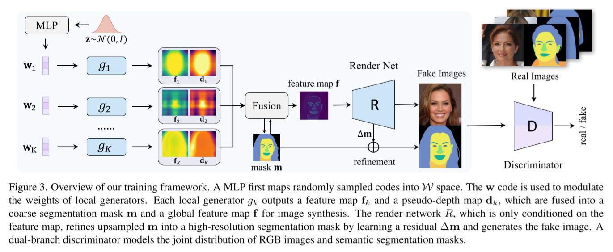
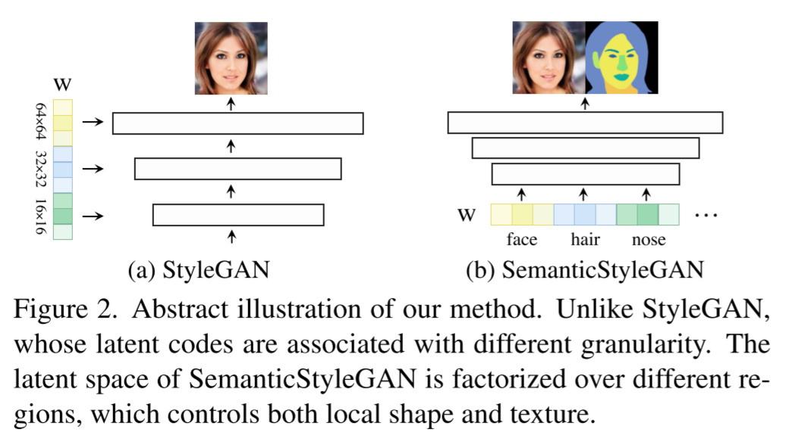
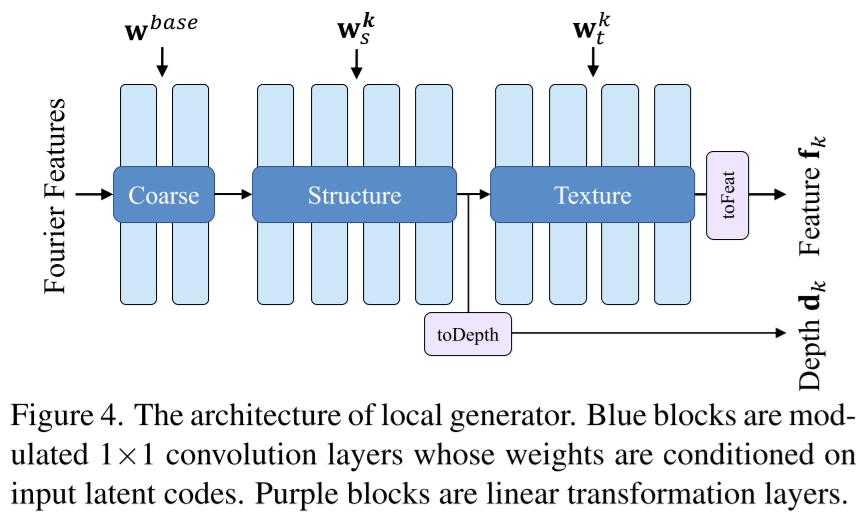
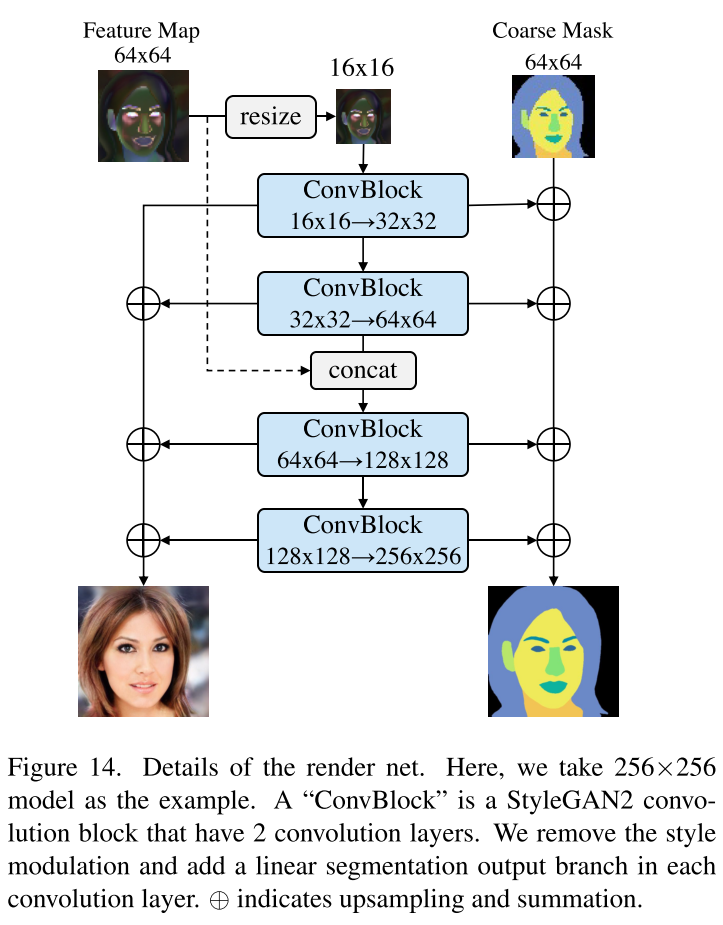
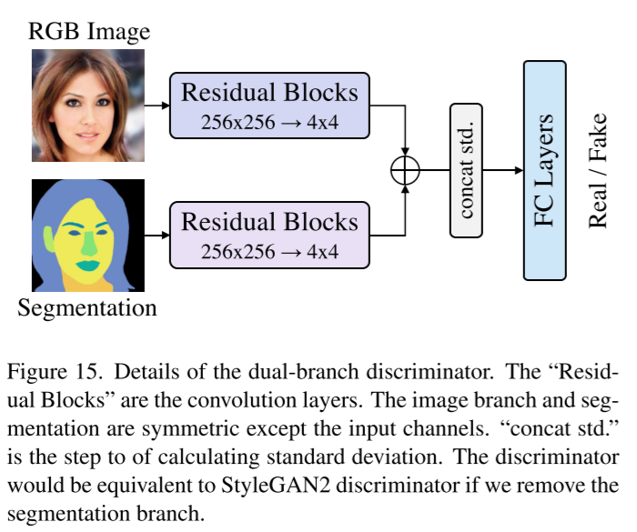

# SemanticStyleGAN: Learning Compositional Generative Priors for Controllable Image Synthesis and Editing

- CVPR 2022
- https://semanticstylegan.github.io/
- https://arxiv.org/abs/2112.02236
- https://github.com/seasonSH/SemanticStyleGAN
- StyleGAN2 generator + StyleGAN editing methods + composition + segmentation map generation
  - for semantic editing of both texture and shape

## 1 Introduction

## 2 Related work

### 2.1 GAN latent space for image editing

(types)

- learn a model to manipulate the latent space
  - GANSpace
- learn a GAN with more disentangled latent space using additional supervision 

### 2.2 Compositional image synthesis

(skipped)

### 2.3 Layout-based generators for latent editing

- one or more layout images are provided as a condition e.g.
  - a semantic segmentation mask
  - a sketch image
  - etc.

## 3 Methodology

(notation)

- $\mathbf{z} \sim \mathcal{Z}$
  - usually standard normal distribution
- $\mathcal{W}$ space
- $\mathcal{W}^+$ space
  - controls output styles at different resolutions
- $D = \left\{ (x_1, y_1), ..., (x_n, y_n) \right\}$
  - a labeled dataset
  - $y_i \in {0, 1}^{H \times W \times K}$
  - $K$
    - number of semantic classes
- $\mathbf{w}^\text{base} \in \mathcal{W}^\text{base}$  
- $\mathbf{w}^k = (\mathbf{w}^k_s, \mathbf{w}^k_t)\in \mathcal{W}^k$  
  - $\mathbf{w}_s^k$
    - a shape code
  - $\mathbf{w}_t^k$
    - a texture code
- $G: \mathcal{W}^+ \to \mathcal{X} \times \mathcal{Y}$
  - generator
- $D: \mathcal{X} \times \mathcal{Y} \to \mathbb{R}$ 
  - discriminator

We want to factorize $\mathcal{W}^+$.
$$
\mathcal{W}^+ = \mathcal{W}^\text{base} \times \mathcal{W}^{1} \times ... \times \mathcal{W}^{K}\tag{1}
$$
Challenges

- How to decouple different local  areas?
  - 👉 local generators
  - 👉 compositional synthesis

- How to ensure the semantic meaning of these areas?
  - 👉use a dual branch discriminator that models the joint distribution $p(x, y)$

### 3.1 Generator

#### Local generator

$$
g_k = (\mathbf{p}, \mathbf{w}^\text{base}, \mathbf{w}_s^k, \mathbf{w}_t^k) \mapsto (\mathbf{f}_k, \mathbf{d}_k)\tag{2}
$$

- $g_k$
  - a modulated MLP with 10 layers
  - the output feature map
    - (toFeat) 64x64x512
    - (toDepth) 64x64x1

  - all the hidden layers has 64 channels

- $\mathbf{p}$
  - Fourier features (which is positional encoding)
- $\mathbf{f}_k$
  - a feature map
- $\mathbf{d}_k$
  - a pseudo-depth map

#### Fusion

$$
\mathbf{m}_k(i, j) = {\exp(\mathbf{d}_k(i,j)) \over \sum_{k^\prime}^K \exp(\mathbf{d}_{k^\prime}(i, j))}\tag{3}
$$

- $\mathbf{m} \in \mathbb{R}^{K \times H^c \times W^c}$
  - a coarse segmentation mask
- $\tilde{\mathbf{m}}$
  - a modified segmentation mask for transparent  classes

- $\mathbf{m}_k(i, j)$

$$
\mathbf{f} = \sum\limits_{k=1}^K \mathbf{m}_k \odot \mathbf{f}_k \tag{4}
$$

- $\mathbf{f}$
  - the aggregated feature map
- $\odot$
  - element-wise multiplication

#### Render net

- $R$
  - the render net
  - similar to the original StyleGAN2 generator
  - but pretty different

    - no modulated conv layers

      - output is purely conditioned on the input feature map
    - input the feature map at both 16 x 16 and 64 x 64 resolutions
    - has

      - not only `ToRGB` branch
      - but also `ToSeg` branch
        - outputs the mask residuals $\Delta \mathbf{m}$
        - for final mask $\hat{y}$ to be
          - $\hat{y} = \operatorname{upsample}(\mathbf{m}) + \Delta\mathbf{m}$
        - regularization term is introduced within the loss function

$$
\mathcal{L}_\text{mask} = \Vert \Delta\mathbf{m} \Vert^2 \tag{5}
$$

### 3.2 Discriminator and learning framework

$$
\mathcal{L}_\text{all} = \mathcal{L}_\text{StyleGAN2} + \lambda_\text{mask} \mathcal{L}_\text{mask} + \lambda_{\text{R1}_\text{seg}}\mathcal{L}_{\text{R1}_\text{seg}}\tag{6}
$$
Note:

- StyleGAN and StyleGAN2 don't suggest any new loss term.
- StyleGAN2 adapted lazy regularization where the regularization terms is not always included.

$$
\mathcal{L}_\text{StyleGAN2} = \mathcal{L}_\text{logistic} + \lambda_{\text{R1}_\text{img}} \mathcal{L}_{\text{R1}_\text{img}}
$$

## 4 Implementation details

- $\lambda_{\text{R1}_\text{img}} = 10$
- $\lambda_{\text{R1}_\text{mask}} = 1000$
- $\lambda_{\text{mask}} = 100$
- Style mixing probability reduced to 0.3
- path regularization reduced to 0.5

## 5 Experiments

## 6 Limitations and discussion

#### Applicable datasets

- $K$ should be small
  - since we need to build $K$ local generators
- fully supervised learning required
  - a paired segmentation map is required for each sample
  - semi-supervised learning is not explored yet.

#### Disentanglement

- features might be still entangled between each other

#### Societal impact

(skipped)

## References

- [35] StyleGAN3
- [36] StyleGAN1
- [37] StyleGAN2

## A Implementation details

### A.1 Fusion with transparent classes

### A.2 Architecture details

### A.3 Efficiency

- trained on 4 or 8 32GB Tesla V100 GPUs

## B Additional discussion

## C Style mixing and additional results

