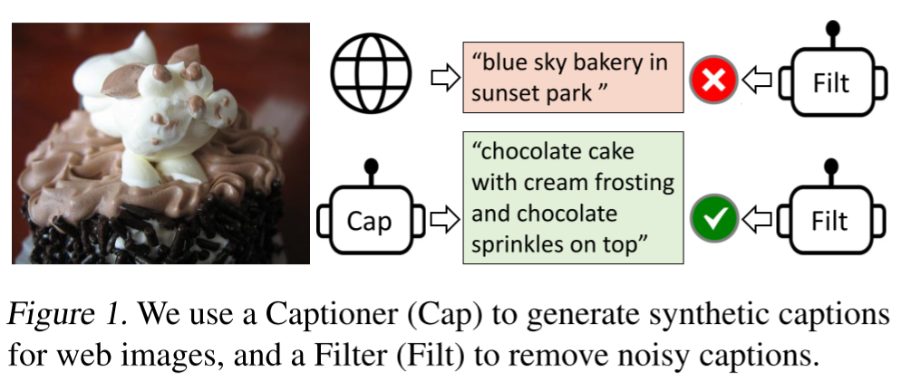
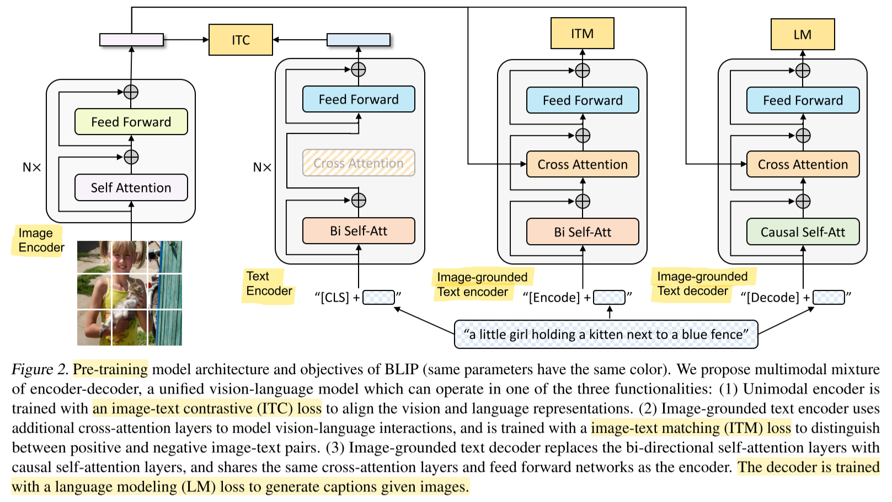
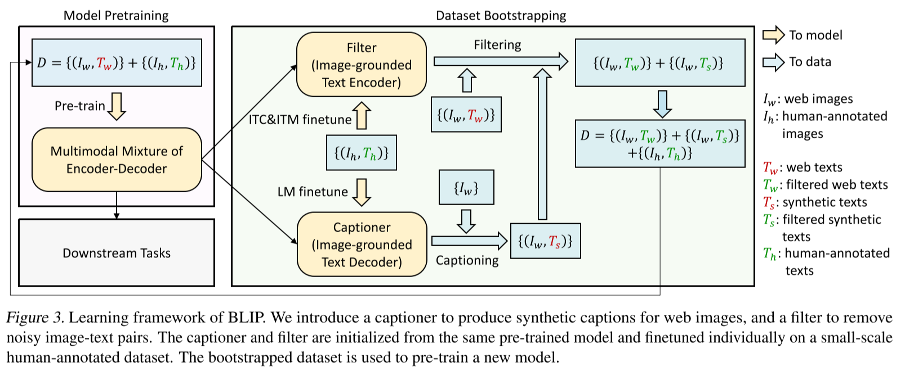

# BLIP: Bootstrapping Language-Image Pre-training for Unified Vision-Language Understanding and Generation

- https://arxiv.org/abs/2201.12086
- https://github.com/salesforce/BLIP

- Salesforce
- pretrain image encoder and text encoder/decoder by three tasks
- finetune text encoder/decoder conditioned on images with user labeled datasets
  - which means training a filter and a captioner
  - can gather clean dataset at the end
- problems to solve
  - many image-text pairs within a dataset gathered from the internet are not high quality
- TODO
  - read in detail

