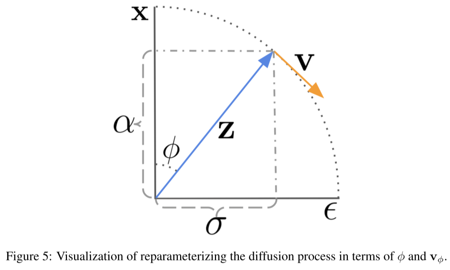

# Progressive Distillation for Fast Sampling of Diffusion Models

- https://arxiv.org/abs/2202.00512
- https://github.com/google-research/google-research/tree/master/diffusion_distillation
- Tim Salimans, Jonathan Ho
- Google Research
- TODO
  - read in detail

## 1 Introduction

(skipped)

## 2 Background on diffusion models

(skipped)

## 3 Progressive distillation

- distill a slow teacher diffusion model into a faster student model by leveraging DDIM
- a student diffusion model is twice faster than the teacher diffusion model
- training
  - use discrete time points when it comes to distillation
    - whereas the original model is trained with continuous time
  - $z_1 \sim \mathcal{N}(\mathbf{0}, \mathbf{I})$
    - whereas DDPMs are not "trained" with $\mathcal{N}(\mathbf{0}, \mathbf{I})$

- Refer to appendix G for the derivation of $\tilde{\mathbf{x}}$

## 4 Diffusion model parameterization and training loss

$$
L_\theta=\left\|\epsilon-\hat{\epsilon}_\theta\left(\mathbf{z}_t\right)\right\|_2^2=\left\|\frac{1}{\sigma_t}\left(\mathbf{z}_t-\alpha_t \mathbf{x}\right)-\frac{1}{\sigma_t}\left(\mathbf{z}_t-\alpha_t \hat{\mathbf{x}}_\theta\left(\mathbf{z}_t\right)\right)\right\|_2^2=\frac{\alpha_t^2}{\sigma_t^2}\left\|\mathbf{x}-\hat{\mathbf{x}}_\theta\left(\mathbf{z}_t\right)\right\|_2^2
\tag{9}
$$

- the simple DDPM loss is equivalent to the denoising loss where $\exp({\lambda_t})$ is used as its weights.
- this is not well suited for distillation
  - note that $\exp(\lambda_t) \to 0$ when $t=1$

There are two alternatives described as below

- both were good empirically.
- They were tested with
  - $\alpha_t = \cos(0.5 \pi t)$
  - $t \sim \mathcal{U}(0, 1)$

(truncated SNR weighting)
$$
L_\theta = \max(\Vert \mathbf{x} - \hat{\mathbf{x}}\Vert_2^2, \Vert \mathbf{\epsilon} - \hat{\mathbf{\epsilon}}_t\Vert_2^2) = \max({\alpha_t^2 \over \sigma_t^2}, 1)\Vert \mathbf{x} - \hat{\mathbf{x}}\Vert_2^2
$$
(SNR + 1 weighting)
$$
L_\theta = \Vert \mathbf{v}_t - \hat{\mathbf{v}}_t \Vert_2^2 = (1 + {\alpha_t^2 \over \sigma_t^2}) \Vert \mathbf{x} - \hat{\mathbf{x}}\Vert_2^2
$$

- Refer to appendix D for v-parameterization details.

## 5 Experiments

## 6 Related work on fast sampling

## 7 Discussion

## References

## A probability flow ODE in terms of log-SNR

TODO

## B DDIM is an integrator of the probability flow ODE

TODO

## C Evaluation of integrators of the probability flow ODE

## D Expression of DDIM in angular parameterization

- $\phi_t = \arctan(\sigma_t / \alpha_t)$
- $\alpha_\phi ^ 2 + \sigma_\phi^2 = 1$
  - assuming DDPM or VP SDE
- $\mathbf{z}_\phi = \alpha_\phi \mathbf{x} + \sigma_\phi \mathbf{\epsilon}$ 
- $\alpha_{\phi} = \cos(\phi)$
- $\sigma_\phi = \sin(\phi)$
- $\mathbf{v}_\phi \equiv {d\mathbf{z}_\phi \over d\phi} = \alpha_\phi \mathbf{\epsilon} - \sigma_\phi \mathbf{x} = \cos(\phi)\mathbf{\epsilon} - \sin(\phi)\mathbf{x}$
  - the velocity of $\mathbf{z}$
- $\mathbf{x} = \alpha_\phi\mathbf{z}_\phi - \sigma_\phi\mathbf{v}_\phi = \cos(\phi)\mathbf{z}_\phi - \sin(\phi)\mathbf{v}_\phi$ 
- $\mathbf{\epsilon} = \sigma_\phi \mathbf{z}_\phi  +  \alpha_\phi \mathbf{v}_\phi = \sin(\phi) \mathbf{z}_\phi  +  \cos(\phi) \mathbf{v}_\phi$

- $\hat{\mathbf{v}}_\theta \equiv \cos(\phi) \hat{\mathbf{\epsilon}}_\theta(\mathbf{z}_\phi) - \sin(\phi) \hat{\mathbf{x}}_\theta (\mathbf{z}_\phi)$
- $\hat{\mathbf{\epsilon}}_\theta = (\mathbf{z}_\phi - \cos(\phi)\hat{\mathbf{x}}_\theta (\mathbf{z}_\theta)) / \sin(\phi)$

(Rewriting the DDIM update rule)

TODO

## E Settings used in experiments

## F Stochastic sampling with distilled models

TODO

## G Derivation of the distillation target