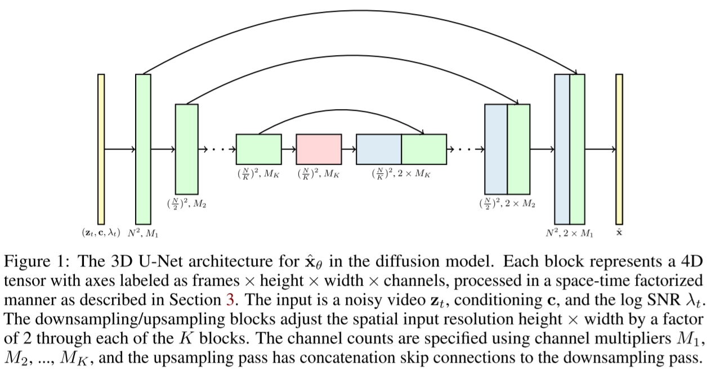

# Video Diffusion Models

 

- https://video-diffusion.github.io/
- https://arxiv.org/abs/2204.03458
- Jonathan Ho et al.
- Google

## 1 Introduction

(skipped)

## 2 Background

- $\mathbf{z} = \{\mathbf{z}_t | t \in [0, 1]\}$
  - a set of latent variables
- $\mathbf{x} \sim p(\mathbf{x})$
  - data
- $q(\mathbf{z}|\mathbf{x})$
  -  a forward process
  - starting at $\mathbf{x}$
- $q(\mathbf{z}_t|\mathbf{x}) = \mathcal{N}(\mathbf{z}_t; \alpha_t \mathbf{x}, \sigma_t^2 \mathbf{I})$
- $\alpha_t, \sigma_t$
  - a differentiable noise schedule
- $\lambda_t = \log [\alpha_t^2 / \sigma_t ^2]$
  - log signal-to-noise-ratio
  - decreases with $t$
- $q(\mathbf{z}_t|\mathbf{z}_s) = \mathcal{N}(\mathbf{z}_t; (\alpha_t/\alpha_s)\mathbf{z}_s, \sigma_{t|s}^2 \mathbf{I})$
  - where
    - $0 \le s \lt t \le 1$
    - $\sigma_{t|s}^2 = (1 - e^{\lambda_t - \lambda_s})\sigma_t^2$
- $q(\mathbf{z}_1) \approx \mathcal{N}(\mathbf{0}, \mathbf{I})$
  - note that $1$ is the biggest $t$ value when defining $\mathbf{z}$

#### Training

- $\hat{\mathbf{x}}_\theta := \hat{\mathbf{x}}_\theta(\mathbf{z_t}) := \hat{\mathbf{x}}_\theta(\mathbf{z}_t, \lambda_t)$
  - denoising model
- $p(\mathbf{z}_t)$
  - a marginal distribution
  - the true density of $\mathbf{z}_t$ under $\mathbf{x} \sim p(\mathbf{x})$

(theoretical training object)
$$
\mathbb{E}_{\boldsymbol{\epsilon}, t} \left[w(\lambda_t) \Vert \hat{\mathbf{x}}_\theta (\mathbf{z}_t) - \mathbf{x} \Vert_2^2 \right] \tag{2}
$$

- where $t \sim \mathcal{U}_{[0, 1]}$

(practical training object)

- $t$ is sampled according to a cosine schedule
- $\boldsymbol{\epsilon}$-prediction
  - $\hat{\mathbf{x}}_\theta(\mathbf{z}_t) = (\mathbf{z}_t - \sigma_t \boldsymbol{\epsilon}_\theta(\mathbf{z}_t))$
  - $\boldsymbol{\epsilon}_\theta(\mathbf{z}_t) \approx - \sigma_t \nabla_{\mathbf{z}_t} \log p(\mathbf{z}_t)$
- $\mathbf{v}$-prediction
  - $\mathbf{v}_t := \alpha_t \boldsymbol{\epsilon} - \sigma_t\mathbf{x}$
    - velocity of $\mathbf{z}_t$ with respect to $\phi_t = \arctan(\sigma_t / \alpha_t)$

#### Sampling

- $q(\mathbf{z}_s|\mathbf{z}_t, \mathbf{x}) = \mathcal{N}(\mathbf{z}_s; \tilde{\mathbf{\mu}}_{s|t}(\mathbf{z}_t, \mathbf{x}), \tilde{\sigma}_{s|t}^2 \mathbf{I})$
  - the forward process described in reverse
  - $ s \lt t$

- where

$$
\tilde{\mathbf{\mu}}_{s|t}(\mathbf{z}_t, \mathbf{x})\tag{3a} = e^{\lambda_t - \lambda_s}(\alpha_s / \alpha_t) \mathbf{z}_t + (1 - e^{\lambda_t - \lambda_s})\alpha_s \mathbf{x}
$$

$$
\tilde{\sigma}_{s|t}^2 \tag{3b} = (1 - e^{\lambda_t - \lambda_s})\sigma_s^2
$$

##### Ancestral sampler

$$
\mathbf{z}_s = \tilde{\mu}_{s|t} (\mathbf{z}_t, \hat{\mathbf{x}}_\theta(\mathbf{z}_t)) + \sqrt{(\tilde{\sigma}_{t|s}^2)^{1 - \gamma}(\sigma_{t|s}^2)^\gamma}\boldsymbol{\epsilon} \tag{4}
$$

- starting at $\mathbf{z}_1 \sim \mathcal{N}(\mathbf{0}, \mathbf{I})$
- $\boldsymbol{\epsilon} \sim \mathcal{N}(\mathbf{0}, \mathbf{I})$
- note that $\hat{\mathbf{x}}_\theta(\mathbf{z}_t)$ is used unlikely to DDPM
- $\gamma$ 
  - a hyperparameter that controls the stochasticity of the sampler inspired by `iDDPM`

##### Predictor corrector sampler

- (4) along with (5) which is the Langevin step

$$
\mathbf{z}_s \leftarrow \mathbf{z}_s - {1 \over 2} \delta \sigma_s \boldsymbol{\epsilon}(\mathbf{z}_s) + \sqrt{\delta} \sigma_s \boldsymbol{\epsilon}^{\prime}
$$

- where
  - $\delta = 0.1$
    - step size
  - $\boldsymbol{\epsilon}^{\prime} \sim \mathcal{N}(\mathbf{0}, \mathbf{I})$

##### Classifier free guidance

$$
\tilde{\boldsymbol{\epsilon}}_\theta (\mathbf{z}_t, \mathbf{c}) = (1 + w) \boldsymbol{\epsilon}_\theta(\mathbf{z}_t, \mathbf{c}) - w \boldsymbol{\epsilon}_\theta(\mathbf{z}_t)
$$

- where
  - $w$
    - guidance strength
  - $\boldsymbol{\epsilon}_\theta (\mathbf{z}_t)$
    - an unconditional prediction
  - $\boldsymbol{\epsilon}_\theta (\mathbf{z}_t, \mathbf{c})$
    - a regular conditional prediction
  - $\tilde{\boldsymbol{\epsilon}}_\theta (\mathbf{z}_t, \mathbf{c})$
    - a conditional prediction with $\mathbf{c}$ over-emphasized

## 3 Video diffusion models

(Video U-Net )

- based on a typical U-Net for diffusion models
- 2D convolution layers are replaced 3D convolution layers
  - 1 x 3 x 3 
- conditions are processed via MLP layers before they are used
- factorized space-time attention
  - spatial attention blocks are followed by temporal attention blocks
  - it's possible to jointly train the model on both video and image generation
- relative position embeddings are used for taking account of ordering of video frames
  - add a learnt relative positional embedding into each key/value vector within each self-attention block
  - instead of adding positional embeddings into inputs once for the entire network
  - refer to [45] for further details

### 3.1 Reconstruction-guided sampling for improved conditional generation

- $\mathbf{x}^a$

  - an initial video

    unconditionally generated

- $\mathbf{x}^b$

  - a second sample
  - conditionally generated from $p_\theta(\mathbf{x}^b | \mathbf{x}^a)$

(replacement method)

- A temporal inpainting method which equivalent to the inpainting method suggested by Score SDE
- results
  - isolated samples would look good
  - but they would not be well coherent to the conditioned samples
- assuming
  - $\mathbf{x}_\theta^b \approx \mathbb{E}_q[\mathbf{x}^b | \mathbf{z}_t, \mathbf{x}^a] \approx \mathbb{E}_q[\mathbf{x}^b | \mathbf{z}_t]$
- but
  - $\mathbb{E}_q[\mathbf{x}^b | \mathbf{z}_t, \mathbf{x}^a] = \mathbb{E}_q[\mathbf{x}^b | \mathbf{z}_t] + (\sigma_t / \alpha_t) \nabla_{\mathbf{z}_t^b} \log q(\mathbf{x}_a | \mathbf{z}_t)$
    - looks reasonable in that we need to fix the value with a score term
    - (but not sure how the equality holds...🤔)

(reconstruction guided sampling in the case of temporal interpolation)

- a temporal/spatial inpainting/super-resolution method
- $q(\mathbf{x}^a|\mathbf{z}_t) \approx \mathcal{N}(\hat{\mathbf{x}}_\theta^a(\mathbf{z}_t), (\sigma_t^2/\alpha_t^2)\mathbf{I})$
  - a heuristic(?) approximation but empirically looks good

$$
\tilde{\mathbf{x}}_\theta^b (\mathbf{z}_t) = \hat{\mathbf{x}}_\theta^b(\mathbf{z}_t) - {w_r \alpha_t \over 2} \nabla_{\mathbf{z}_t^b} {\Vert \mathbf{x}^a - \hat{\mathbf{x}}_\theta^a(\mathbf{z}_t) \Vert}_2^2
\tag{7}
$$

- $w_r$
  - a weighting factor
  - improves the sample quality when $w_r \gt 1$
    - especially when combined with predictor-corrector samplers using Langevin diffusion

(reconstruction guided sampling in the case of spatial interpolation)
$$
\tilde{\mathbf{x}}_\theta (\mathbf{z}_t) = \hat{\mathbf{x}}_\theta(\mathbf{z}_t) - {w_r \alpha_t \over 2} \nabla_{\mathbf{z}_t^b} {\Vert \mathbf{x}^a - \hat{\mathbf{x}}_\theta^a(\mathbf{z}_t) \Vert}_2^2
\tag{8}
$$

## 4 Experiments

- evaluation

  - metrics
    - FID
    - IS
    - FVD

  - pretrained networks used
    - C3D
      - spatial dimension: 112x112
      - available within https://github.com/pfnet-research/tgan2
    - I3D
      - spatial dimension: ?

### 4.1 Unconditional video modeling

### 4.2 Video prediction

#### BAIR robot pushing

#### Kinetics-600

### 4.3 Text-conditioned video generation

- used BERT-large embeddings

#### 4.3.1 Joint training on video and image modeling

- concatenate random independent image to the end of each video 
- mask the attention in the temporal attention blocks
  - to prevent mixing information across video frames and each independent image frame

#### 4.3.2 Effect of classifier-free guidance

- improve IS-like metrics
  - guidance weight = 5 was the best
- improve and degrade FID-like metrics
  - guidance weight = 1 or 2 was the best

#### 4.3.3 Autoregressive video extension for longer sequences

## 5 Related work

## 6 Conclusion

## References

- [10] [WaveGrad](https://arxiv.org/abs/2009.00713)
- [20] CFG
- [22] DDPM
- [28] VDM
- [37] iDDPM
- [42] [Progressive Distillation for Fast Sampling of Diffusion Models](https://arxiv.org/abs/2202.00512)
- [45] [Self-Attention with Relative Position Representations](https://arxiv.org/abs/1803.02155)
- [46] NET
- [47] SMLD
- [48] Score SDE
- [53] [Neural Stochastic Differential Equations: Deep Latent Gaussian Models in the Diffusion Limit](https://arxiv.org/abs/1905.09883)
- [54] [FVD](https://arxiv.org/abs/1812.01717)

## A Details and hyperparameters

(skipped)