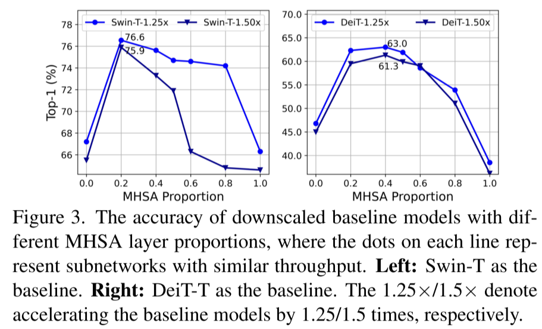
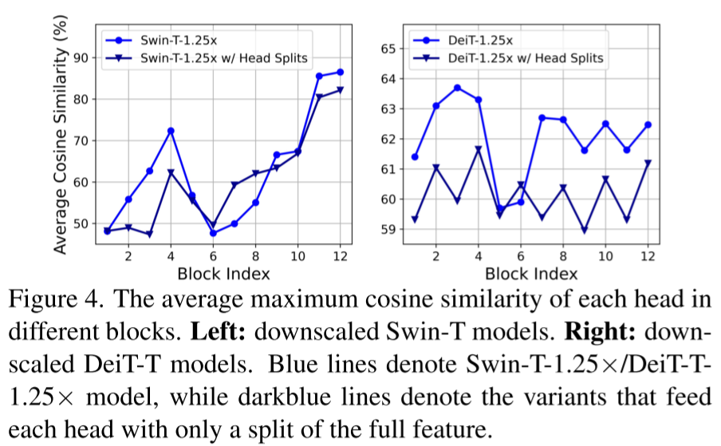
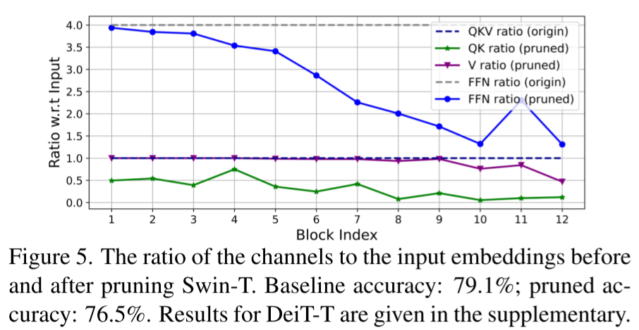
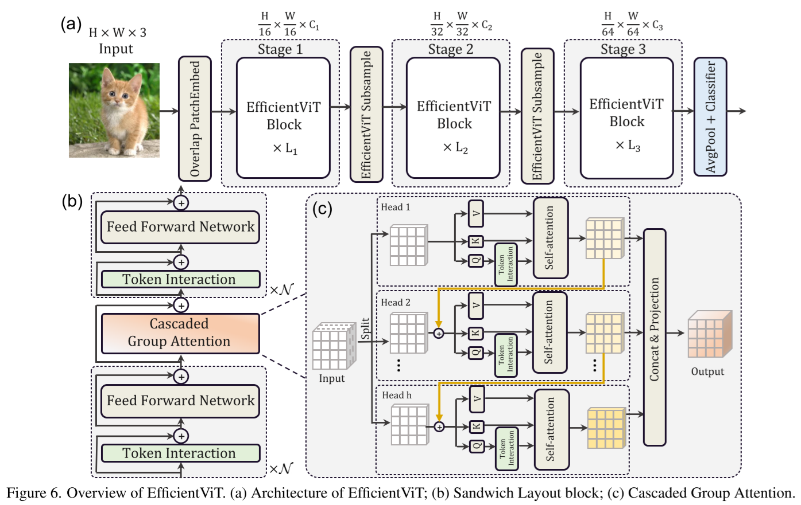
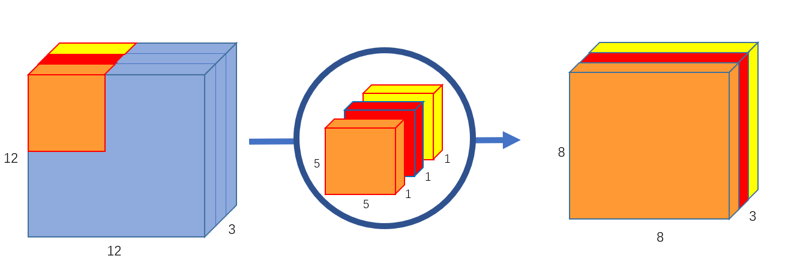
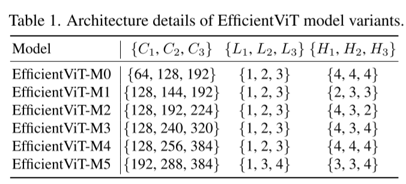
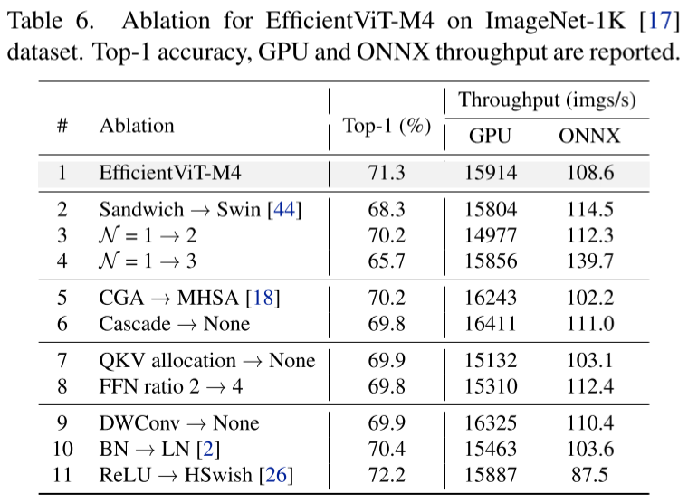
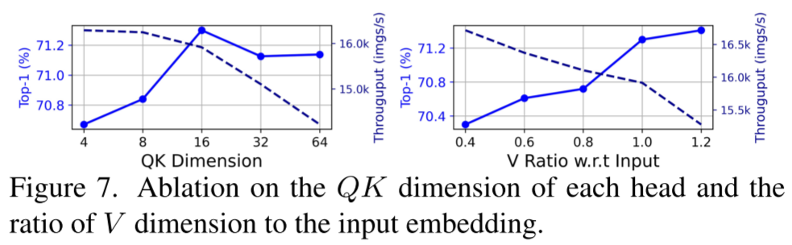

# EfficientViT: Lightweight Multi-Scale Attention for On-Device Semantic Segmentation

- https://arxiv.org/abs/2205.14756
- The Chinese University of Hong Kong
- Microsoft Research

## 1 Introduction

## 2 Going faster with vision transformers

### 2.1 Memory efficiency

- We need more FFN compared to MHSA

### 2.2 Computation efficiency

- There are redundant features across multi heads.
- We can secure the feature diversity by splitting input features.

### 2.3 Parameter efficiency

- Blocks later don't really need that FFN channels
- We need V channels as much as the input features
- We don't need QK channels as much as V channels

## 3 Efficient vision transformer

### 3.1 EfficientViT building blocks

##### Sandwich layout

- (composition)
  - (token interaction + FFN) $\times \mathcal{N}$
  - self attention
  - (token interaction + FFN) $\times \mathcal{N}$
- token interaction layer using a depthwise convolution (DWConv)
  - https://paperswithcode.com/method/depthwise-convolution

##### Cascaded group attention

- split input features as much as the number of heads
- add the result feature of a head into the input feature of the next head

##### Parameter reallocation

- less QK channels
- more V channels as much as the input embedding dimension
  - less FNN channels from the expansion ratio 4 to 2

### 3.2 EfficientViT network architectures

- Efficient ViT subsample block
  - apply the sandwich layout
  - replace the attention layer with an inverted residual block 🤔
- BN instead of LN
- ReLU instead of GELU or HardSwish
- fewer blocks at higher resolutions
- increase width(channels) over stages with a small factor ($\le 2$)
  - see Table 1.
    - C: width
    - L: depth
    - H: the number of heads

## 4 Experiments

### 4.1 Implementation details

### 4.2 Results on ImageNet

##### Comparisons with efficient CNNs

##### Comparisons with efficient ViTs

##### Finetune with higher resolutions

### 4.3 Transfer learning results

##### Downstream image classification

##### Object detection

### 4.4 Ablation study

##### Impact of the sandwich layout block

##### Impact of the cascaded group attention

##### Impact of the parameter reallocation

##### Impact of other components

##### Result of 1,000 training epochs and distillation

## 5 Related work

## 6 Conclusion

## References
