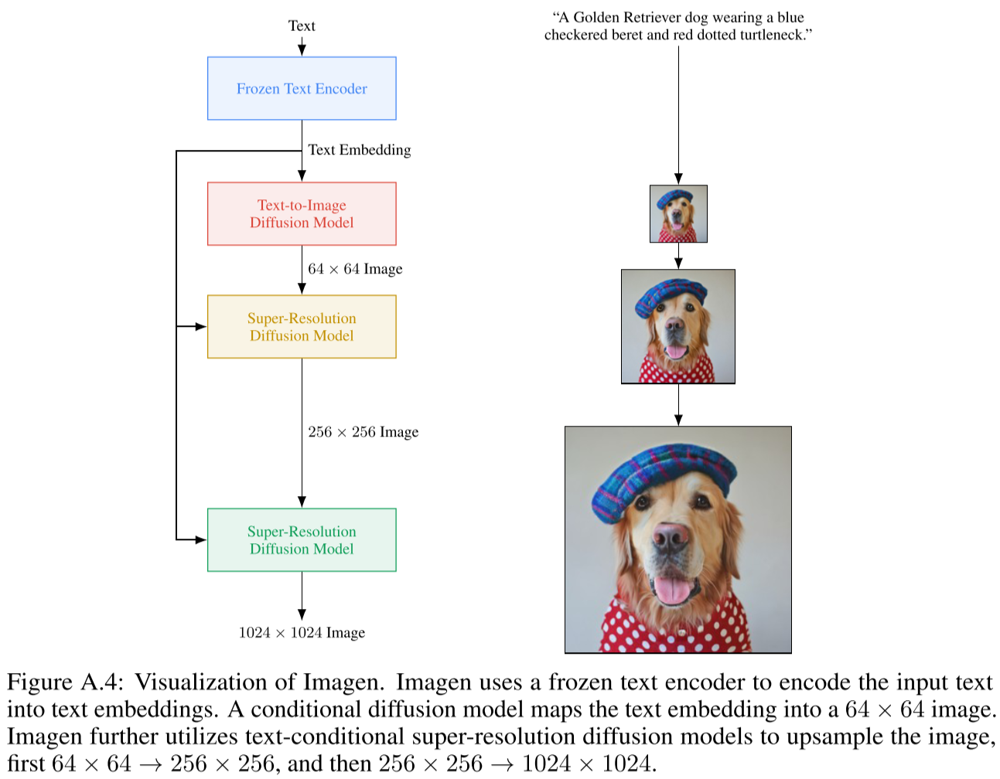
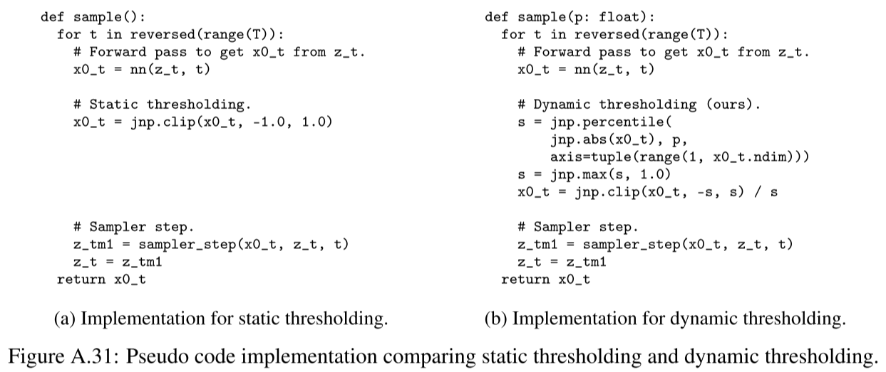
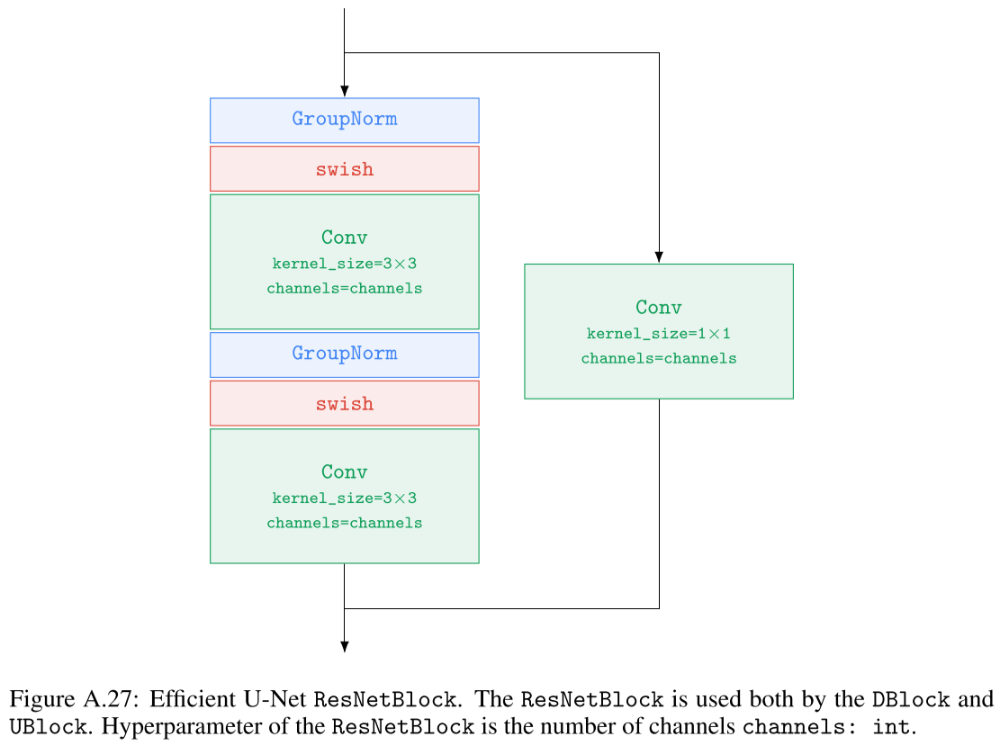
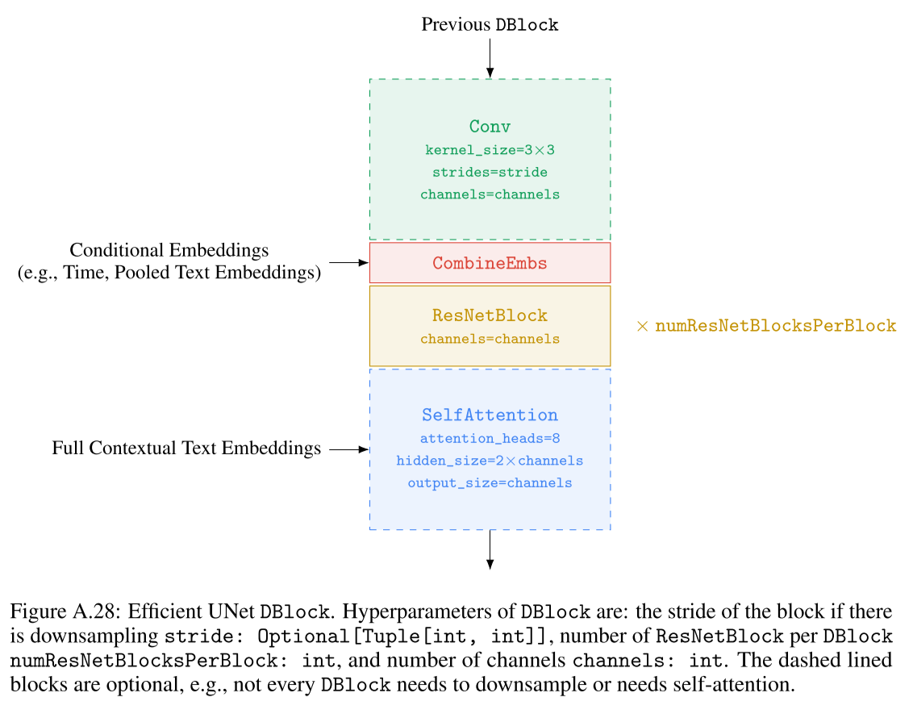
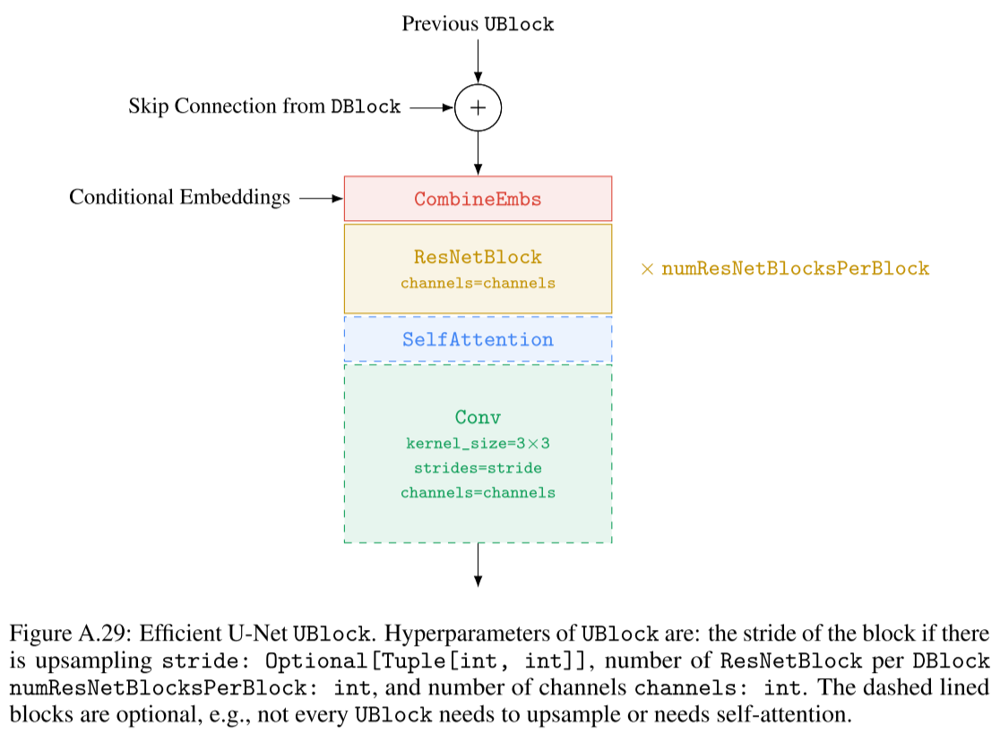
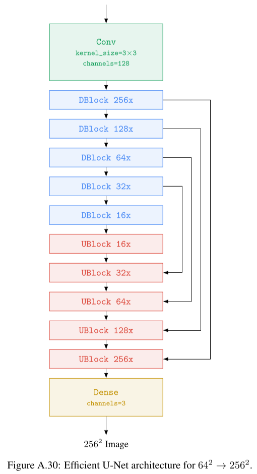
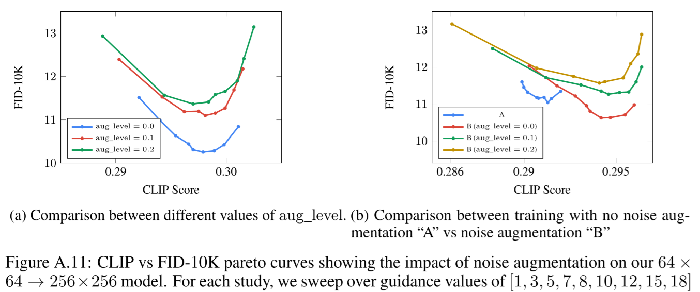

# Photorealistic Text-to-Image Diffusion Models with Deep Language Understanding

- https://arxiv.org/abs/2205.11487
- Imagen

## 1 Introduction

## 2 Imagen

- 64x64 text-to-image base model (2B parameters)
  - conditioned on the text embeddings
    - use cross attention
  - conditioned on a pooled text embedding vector
    - add it to the diffusion timestep embedding
- 64x64 to 256x256 super resolution model (600M parameters)
  - f=4
  - conditioned on the text embeddings
    - use cross attention
  - conditioned on a low resolution image
    - conditioning augmentation
      - add some noise
      - also provide the noise level as a condition ⭐
  - no self attention
  - Efficient U-net
    - refer to B.1 for more details
- 256x256 to 1024x1024 super resolution model (400M parameters)
  - f=4
  - conditioned on the text embeddings
    - use cross attention
  - conditioned on a low resolution image
    - add some noise
    - also provide the noise level as a condition ⭐
  - no self attention
  - Efficient U-net
    - refer to B.1 for more details

### 2.1 Pretrained text encoders

### 2.2 Diffusion models and classifier-free guidance

### 2.3 Large guidance weight samplers

- When the guidance wight is big a train-test mismatch arises
  - Empirically, with a big guidance weight, the variance of values becomes higher 
- Correct it.

##### Static thresholding

- clip values to be within [-1, 1]

##### Dynamic thresholding

- $s$
  - a certain percentile absolute pixel value in $\hat{\mathbf{x}} _0^t$
  - if $s \gt 1$ divide $\hat{\mathbf{x}} _0^t$ by $s$

### 2.4 Robust cascaded diffusion models

### 2.5 Neural network architecture

- layer normalization on text conditions

## 3 Evaluating text-to-image models

## 4 Experiments

### 4.1 Training details

### 4.2 Results on COCO

### 4.3 Results on DrawBench

### 4.4 Analysis of Imagen ⭐

##### Scaling text encoder size is extremely effective

##### Scaling text encoder size is more important than U-Net size

##### Dynamic thresholding is critical

##### Human raters prefer T5-XXL over CLIP on DrawBench

##### Noise conditioning augmentation is critical

##### Text conditioning method is critical

##### Efficient U-Net is critical

## 5 Related work

## 6 Conclusions, limitations and societal impact

## References

## A Background

## B Architecture details

### B.1 Efficient U-Net

- improvements

  - uses less memory

  - converges faster

  - faster inference 

- how?

  - adding more residual blocks for the lower resolutions
    - to increase the model capacity through more model parameters, without egregious memory and computation costs
  - scale the skip connections by $1/\sqrt{2}$
    - it improves convergence speed significantly
  - downsample first before other convolutions and unsampled later after the other convolutions
    - no performance degradation found

## C DrawBench

## D Imagen detailed ablations and analysis

### D.1 Pre-trained text encoders

### D.2 Classifier-free guidance and the alignment-fidelity trade-off

Fig. A.11(b) says it's the best when

- training with noise augmentation
- sampling with $\text{aug\_level} = 0.0$

##### Thresholding techniques

##### Guidance for super-resolution

##### Impact of conditioning augmentation
