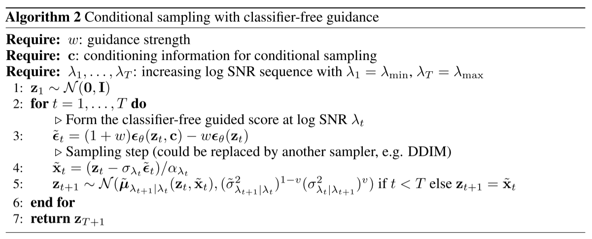

# Classifier-Free Diffusion Guidance

- Jonathan Ho, Tim Salimans
- https://arxiv.org/abs/2207.12598

## 1 Introduction

- classifier-guided diffusion
  - a previous method
  - requires training an extra classifier over the noisy samples including the original zero noise samples
  - "It can be interpreted as attempting to confuse an image classifier with a gradient based adversarial attack"
- classifier-free diffusion guidance

## 2 Background

- $\mathbf{x} \sim p(\mathbf{x})$
  - data distribution
- $\mathbf{z} = \{\mathbf{z}_\lambda | \lambda \in [\lambda_\text{min}, \lambda_\text{max}] \}$
  - noisy data
  - (in the experiments of this paper)
    - $\lambda_\text{min} = -20$
    - $\lambda_\text{max} = 20$
- $\lambda \in \mathbb{R}$ 
  - the log signal-to-noise ratio of $\mathbf{z}_\lambda$
    - tells, relatively, how much signal it contains 
  - decreasing in the forward process
  - $\lambda = \log \alpha_{\lambda}^2 / \sigma_\lambda^2$
- $q(\mathbf{z}|\mathbf{x})$
  - the forward process
  - a variance preserving Markov process
- $q(\mathbf{z}_\lambda|\mathbf{x}) = \mathcal{N}(\alpha_\lambda \mathbf{x}, \sigma_\lambda^2 \mathbf{I})$
  - perturbation kernel
  - where
    - $\alpha_\lambda^2 = 1 / (1 + e^{-\lambda})$
    - the factor for shifting the mean
    - $\sigma_\lambda^2 = 1 - \alpha_\lambda^2$
      - noise level
- $q(\mathbf{z}_\lambda|\mathbf{z}_{\lambda^{'}}) = \mathcal{N}((\alpha_\lambda / \alpha_\lambda^{'}) \mathbf{z}_\lambda^{'}, \sigma_{\lambda|\lambda^{'}}^2 \mathbf{I})$
  - a single forward diffusion step
  - where
    - $\lambda \lt \lambda^{'}$
      - SNR is decreasing
    - $\sigma_{\lambda | \lambda^{'}}^2 = (1 - e^{\lambda - \lambda^{'}})$
- $p(\mathbf{z})$ or $p(\mathbf{z}_\lambda)$
  - marginal distribution
  - where
    - $\mathbf{x} \sim p(\mathbf{x})$
    - $\mathbf{z} \sim q(\mathbf{z}|\mathbf{x})$
- $q(\mathbf{z}_{\lambda^{'}}|\mathbf{z}_\lambda, \mathbf{x}) = \mathcal{N}(\tilde{\boldsymbol{\mu}}_{\lambda|\lambda^{'}}(\mathbf{z}_\lambda, \mathbf{x}), \tilde\sigma_{\lambda|\lambda^{'}}\mathbf{I})$
  - "forward process in reverse"
    - sometimes called a posterior in the sense that the observed data $\mathbf{x}$ is given
  - where
    - $\tilde{\boldsymbol{\mu}}_{\lambda|\lambda^{'}}(\mathbf{z}_\lambda, \mathbf{x}) = e^{\lambda - \lambda^{'}}(\alpha_\lambda{'}/\alpha_\lambda)\mathbf{z}_\lambda + (1-e^{\lambda - \lambda^{'}})\alpha_{\lambda^{'}}\mathbf{x}$
    - $\tilde{\sigma}_{\lambda | \lambda^{'}}^2 = (1 - e^{\lambda - \lambda^{'}})\sigma_{\lambda^{'}}^2$
- $p_\theta(\mathbf{z}_{\lambda_\text{min}}) = \mathcal{N}(\mathbf{0}, \mathbf{I})$
  - the prior distribution, the reverse process starts from
- $p_\theta(\mathbf{z}_{\lambda^{'}}| \mathbf{z}_\lambda) = \mathcal{N}(\tilde{\boldsymbol{\mu}}_{\lambda | \lambda^{'}}(\mathbf{z}_\lambda, \mathbf{x}_\theta(\mathbf{z}_\lambda), (\tilde\sigma_{\lambda|\lambda^{'}}^2)^{1-v}(\sigma_{\lambda|\lambda^{'}}^2)^{v}\mathbf{I})$
  - a single reverse diffusion step
  - The variance is an interpolation in the log space, and $v$ is a hyperparameter.
- $T$
  - number of discrete time steps we take for sampling
- $\mathbb{E}_{\mathbf{\epsilon}, \lambda}\left[\Vert \mathbf{\epsilon}_\theta(\mathbf{z}_\lambda) - \mathbf{\epsilon}\Vert_2^2\right]$
  - where
    - $\mathbf{\epsilon} \sim \mathcal{N}(\mathbf{0}, \mathbf{I})$
    - $\mathbf{z}_\lambda = \alpha_\lambda \mathbf{x} + \sigma_\lambda\mathbf{\epsilon}$
      - $\mathbf{z}_\lambda = \alpha_\lambda \mathbf{x}_\theta(\mathbf{z}_\lambda) + \sigma_\lambda\mathbf{\epsilon}_\theta(\mathbf{z}_\lambda)$
    - $\mathbf{\epsilon}_\theta(\mathbf{z}_\lambda) \approx - \sigma_\lambda \nabla_{\mathbf{z}_\lambda}\log p(\mathbf{z}_\lambda)$
    - $\lambda \sim p(\lambda)$
      - if it's uniform, then it's proportional to the VLB on the marginal log likelihood of the latent variable model $\int p_\theta(\mathbf{x}|\mathbf{z})p_\theta(\mathbf{z}))d\mathbf{z}$ ignoring the terms $p_\theta(\mathbf{x}|\mathbf{z})$ and for the prior at $\mathbf{z}_{\lambda_\text{min}}$
      - if it's not uniform, it corresponds to the weighted form

## 3 Guidance

### 3.1 Classifier guidance

- Originally introduced by [Dhariwal & Nicole (2021)](https://arxiv.org/abs/2105.05233).
- Train a noise prediction model with conditions jointly as inputs.
  - $\mathbf{\epsilon}_\theta(\mathbf{z}_\lambda, \mathbf{c}) \approx -\sigma_\lambda \nabla_{\mathbf{z}_\lambda} \log p(\mathbf{z}_\lambda | \mathbf{c})$
- Train an auxiliary classifier model.
  - $p_\theta(\mathbf{c}|\mathbf{z}_\lambda)$
- With two of them above we can define a guided diffusion model which is equivalent to defining an alternative noise prediction model $\tilde{\mathbf{\epsilon}}_\theta$.
  - $\tilde{\mathbf{\epsilon}}_\theta(\mathbf{z}_\lambda, \mathbf{c})$
    - $:=  \mathbf{\epsilon}_\theta(\mathbf{z}_\lambda, \mathbf{c}) - w\sigma_\lambda \nabla_{\mathbf{z}_\lambda}\log p_\theta(\mathbf{c}| \mathbf{z}_\lambda)$
    - $\approx -\sigma_\lambda \nabla_{\mathbf{z}_\lambda} [\log p(\mathbf{z}_\lambda | \mathbf{c}) + w\log p_\theta(\mathbf{c}| \mathbf{z}_\lambda)]$
    - $= -\sigma_\lambda \nabla_{\mathbf{z}_\lambda}\log [p(\mathbf{z}_\lambda | \mathbf{c}) p_\theta(\mathbf{c}| \mathbf{z}_\lambda)^w]$
    - $= -\sigma_\lambda \nabla_{\mathbf{z}_\lambda}\log [p(\mathbf{z}_\lambda) p_\theta(\mathbf{c}| \mathbf{z}_\lambda)^{w+1}]$
    - $= -\sigma_\lambda \nabla_{\mathbf{z}_\lambda} [\log p(\mathbf{z}_\lambda) + (w+1) \log p_\theta(\mathbf{c}| \mathbf{z}_\lambda)]$
    - $= -\sigma_\lambda \nabla_{\mathbf{z}_\lambda} [\log p(\mathbf{z}_\lambda) + (w+1)(\log p_\theta(\mathbf{z}_\lambda|\mathbf{c}) - \log p_\theta(\mathbf{z}_\lambda))]$
    - $= -\sigma_\lambda \nabla_{\mathbf{z}_\lambda} [(w+1)\log p_\theta(\mathbf{z}_\lambda|\mathbf{c}) - w \log p_\theta(\mathbf{z}_\lambda)]$
- And it corresponds to a new conditional distribution $\tilde{p}_\theta$
  - $\tilde{p}_\theta(\mathbf{z}_\lambda|\mathbf{c}) \propto p_\theta(\mathbf{z}_\lambda|\mathbf{c})p_\theta(\mathbf{c}|\mathbf{z}_\lambda)^w = p_\theta(\mathbf{z}_\lambda)p_\theta(\mathbf{c}|\mathbf{z}_\lambda)^{w+1}$
- Compared to $p_\theta(\mathbf{z}_\lambda|\mathbf{c})$,  $\tilde{p}_\theta(\mathbf{z}_\lambda|\mathbf{c})$ with $ w \gt 0$ has more mass at the the points where $\mathbf{c}$ is likely to be classified.

### 3.2 Classifier-free guidance

- We want to achieve the same result as the classifier guidance above but without the classifier model.

- Train $\mathbf{\epsilon}_\theta(\mathbf{z}_\lambda) = \mathbf{\epsilon}_\theta(\mathbf{z}_\lambda, \varnothing)$ and $\mathbf{\epsilon}_\theta(\mathbf{z}_\lambda, \mathbf{c})$ at the same time as a single network.
  - Note that we're training $\mathbf{\epsilon}_\theta$, not $\tilde{\mathbf{\epsilon}}_\theta$
- $p_\text{uncond} \in [0.1, 0.5]$ in the paper
  - 0.1 and 0.2 were better than 0.5
- $\lambda = -2 \log \tan ((\arctan^{-\lambda_\text{min}/2} - \arctan^{-\lambda_\text{max}/2})u + \arctan^{-\lambda_\text{max}/2})$
  - where $u \sim \mathcal{U}(0,1)$

- Note that in the section 3.1, with Bayes rule, we can represent $\tilde{\mathbf{p}}_\theta(\mathbf{z}_\lambda| \mathbf{c})$ using just any two terms among $p_\theta(\mathbf{z}_\lambda, \mathbf{c})$, $p_\theta(\mathbf{z}_\lambda)$, and $p_\theta(\mathbf{c}|\mathbf{z}_\lambda)$.
- So we can design the classifier free guidance with the expression below.
  - $\tilde{\mathbf{\epsilon}}_\theta(\mathbf{z}_\lambda, \mathbf{c}) = (w+1)\mathbf{\epsilon}_\theta(\mathbf{z}_\lambda, \mathbf{c}) - w\mathbf{\epsilon}_\theta(\mathbf{z}_\lambda)$
  - Note that we don't have access to the exact implicit classifier guidance $\nabla_{\mathbf{z}_\lambda} \log p^i(\mathbf{c}|\mathbf{z}_\lambda)$, so it's not guaranteed for the model to work as the exact classifier guidance model.
    - That's why the experiments are important.
- $w \in [0, 4]$ in the paper

## 4 Experiments

- architecture
  - guided-diffusion models with less capacity were used
    - not aiming at SOTA FID
- dataset
  - ImageNet64
  - ImageNet128

### 4.1 Varying the classifier-free guidance strength

- $w_\text{FID\_best} \in \{0.1, 0.3\}$
- $w_\text{IS\_best} \ge 4$

### 4.2 Varying the unconditional training probability

- $p_\text{uncond} \in \{0.1, 0.2\}$ perform better than $p_\text{uncond} = 0.5$.

### 4.3 Varying the number of sampling steps

- as expected, sampling quality improved as $T$ increased
- $T=256$ might be recommended considering quality-speed trade off.

## 5 Discussion

- pros
  - simplicity
  - can control FID-IS trade-off 
  - it doesn't resemble classifier gradients
    - cannot be interpreted as a gradient-based adversarial attack on a classifier
- cons
  - sampling speed
  - fidelity-diversity trade off

## 6 Conclusion

## Extra notes

- conservative vector field
  - is the gradient of a scalar potential
- solenoidal vector field
  - divergence is zero always
