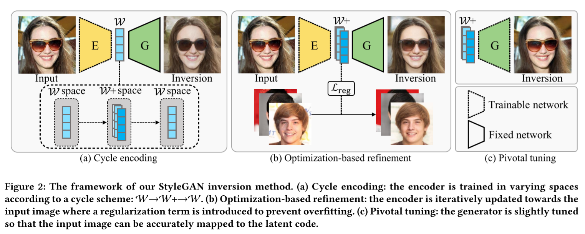

# Cycle Encoding of a StyleGAN Encoder for Improved Reconstruction and Editability

- https://arxiv.org/abs/2207.09367
- cycle encoding
  - improved PTI
  - progressively train an encoder in varying spaces
    - according to cycle scheme $W \to W+ \to W$
    - to preserve high editability of $W$ and low distortion of $W+$
- refine the pivot code with an optimization-based method where regularization term is introduced
  - to reduce the degradation in editability

## 1 Introduction

## 2 Related work

## 3 Analysis of pivotal tuning inversion

### 3.1 Pivotal tuning inversion

(step1 - find $w_p$)
$$
w_p = \underset{w, n}{\operatorname{argmin}}\, \mathcal{L}_\text{LPIPS} (x, G(w, n)) + \lambda_n \mathcal{L}_n(n)
\tag{1}
$$

(step2 - fine-tune $G$)
$$
\mathcal{L}_\text{PTI} = \mathcal{L}_{LPIPS}(x, G(w_p)) + \lambda_\text{L2}\mathcal{L}_\text{L2}(x, G(w_p))
\tag{2}
$$

### 3.2 Distortion-editability tradeoff

## 4 Method

- `e4e` trains an encoder that maps an image to the latent value in $W+$.

### 4.1 Cycle encoding

- training the encoder with `e4e`

#### 4.1.1 $W \to W+$

- training encoder

$$
\mathcal{L}_\text{delta}(x) = \sum\limits_{i=1}^{N-1} \Vert \Delta_i \Vert _2
$$

- where
  - $E(x) = (w _0, w _1, ..., w _{N-1}) = (w _0, w _0 + \Delta _1, ..., w _0 + \Delta _{N-1})$
  - if $\Delta _i = 0$, then all the $W+$ values by layers become the same.

#### 4.1.2 $W+ \to W$

$$
\mathcal{L}(x)
= \lambda_\text{L2} \mathcal{L}_\text{L2}(x)
+ \lambda_\text{lpips} \mathcal{L}_\text{LPIPS}(x)
+ \lambda_\text{id} \mathcal{L}_\text{ID}(x)
+ \lambda_\text{adv} \mathcal{L}_\text{adv}(x)
+ \lambda_\text{delta} \mathcal{L}_\text{delta}(x)
\tag{4}
$$

### 4.2 Decreasing distortion via optimization

- training the generator

$$
\mathcal{L}_\text{reg}(x^*) = {1 \over M} \sum\limits_{i = 0}^{M - 1} \mathcal{L}_\text{S}(x_i^*, G(E(x_i^*)))
\tag{5}
$$

- where

  - $x^*$
    - random sample $M$ images
  - $\mathcal{L}_\text{S}(x) = \lambda _\text{L2} \mathcal{L} _\text{L2} + \lambda _\text{lpips} \mathcal{L} _\text{LPIPS}(x) + \lambda _\text{id} \mathcal{L} _\text{ID}(x)$

  - $\mathcal{L} _\text{L2}$
    - correspond to MSE between pixels
  - $\mathcal{L} _\text{LPIPS}$
    - correspond to the discrepancy between the outputs of LPIPS model
  - $\mathcal{L} _\text{ID}$
    - correspond to inner product between feature maps

$$
\mathcal{L}_\text{ref}(x, x^*) = \mathcal{L}_\text{S}(x) + \lambda_\text{reg}\mathcal{L}_\text{reg}(x^*)
\tag{6}
$$

## 5 Experiments

## 6 Discussion and conclusion

## References
