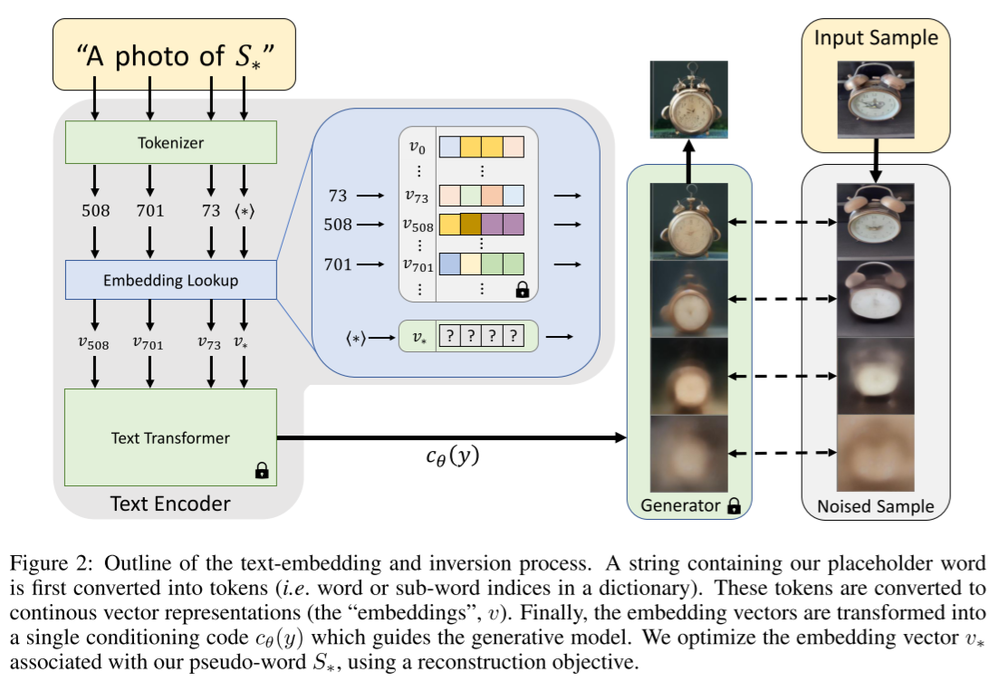
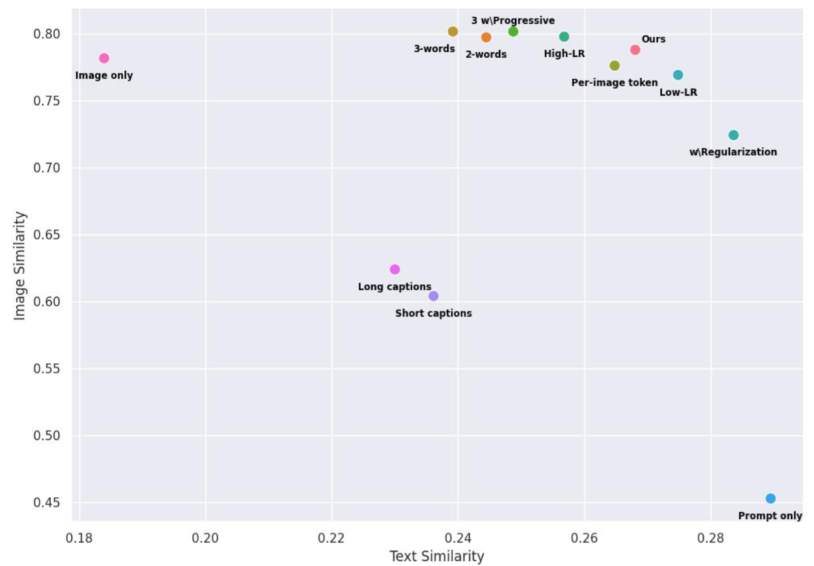
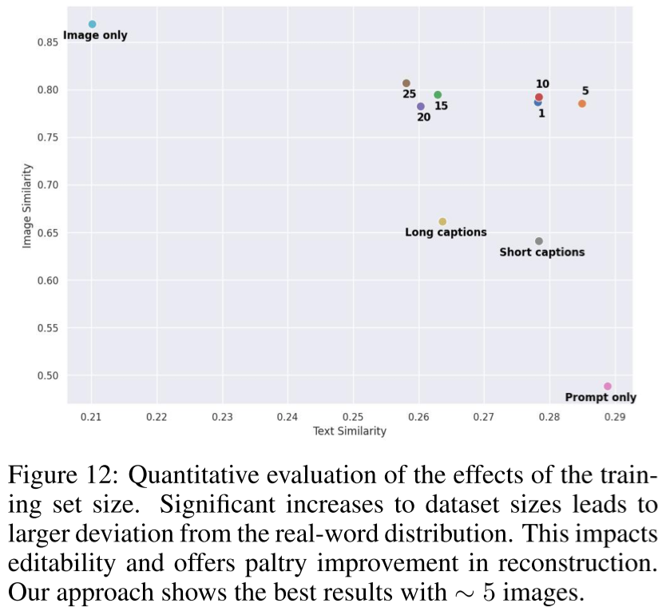

# An Image is Worth One Word: Personalizing Text-to-Image Generation using Textual Inversion

- https://arxiv.org/abs/2208.01618

- so we introduce a new token and correspondingly a new embedding to train

- evaluation method
  - image similarity:
    - average cosine similarity between generated images and the training images in the CLIP space on 64 pairs
  - text similarity
    - average cosine similarity between generated images and the testing prompts with the pseudo word $S*$ omitted on 64 pairs
- long/short human captions are limited
- training multi words embeddings doesn't help that much
- adjusting learning rate would affect the results

- 5 samples are enough for training
  - IMHO, we might need more accurate text prompts to scale the number of training samples
- Remark
  - learn by seeing 20,000~40,000 samples in total by repeating the 5 samples