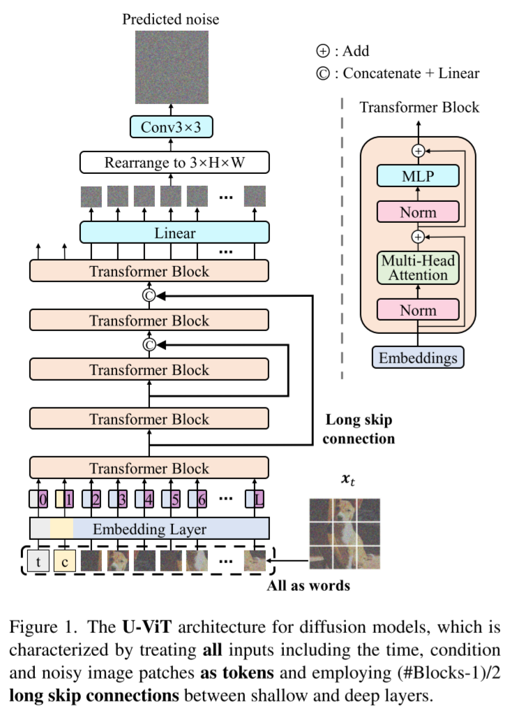

# All are Worth Words: A ViT Backbone for Diffusion Models

- https://arxiv.org/abs/2209.12152
- CVPR 2023
- https://github.com/baofff/U-ViT

## 1 Introduction

## 2 Background

##### Diffusion models

##### Vision Transformer (ViT)

## 3 Method

### 3.1 Implementation details

##### The way to combine the long skip branch

(skip connections are crucial!)

- $\operatorname{Linear}(\operatorname{Concat}(\boldsymbol{h} _m, \boldsymbol{h} _s))$ 🥇
- $\boldsymbol{h} _m + \boldsymbol{h} _s$
- $\boldsymbol{h} _m + \operatorname{Linear}(\boldsymbol{h} _s)$ 🥉
- $\operatorname{Linear}(\boldsymbol{h} _m + \boldsymbol{h} _s)$ 🥈
- no long skip connection

##### The way to feed the time into the network

- time as token 🥇
  - needs to be clarified compared to DiT's experiments
- AdaLN

##### The way to add an extra convolutional block after the transformer

(at the end)

- after linear 🥇
- before linear
- no conv

##### Variants of the patch embedding

(at the beginning)

- linear patch embedding 🥇
- conv stack

##### Variants of the position embedding

- 1d learnable 🥇
- 2d sinusoidal

### 3.2 Effect of depth, width, and patch size

- depth
  - 9 🥉
  - 13 🥇
  - 17 🥈
- width
  - 256 🥉
  - 512 🥇
  - 768 🥈
- patch size
  - 1
  - 2 🥇
  - 4
  - 8

## 4 Related work

##### Transformers in diffusion models

##### U-Net in diffusion models

## 5 Experiments

### 5.1 Experimental Setup

##### Datasets

##### High resolution image generation

- pretrained stable diffusion VAEs are used
  - for 256x256 and 512x512 images
  - where the latent sizes are 32x32 and 64x64

##### Text-to-image learning

##### U-ViT configurations

##### Training

### 5.2 Unconditional and class conditional image generation

### 5.3 Text-to-image generation on MS-COCO

## 6 Conclusion

## References

## A Experimental setup

## B Details of the U-Net baseline on MS-COCO

## C Results of other metrics and configurations on ImageNet

## D CKA Analysis

**TODO**: Interesting.. 😀

## E Compare with U-Net under similar amount of parameters and computational cost

## F Additional samples
