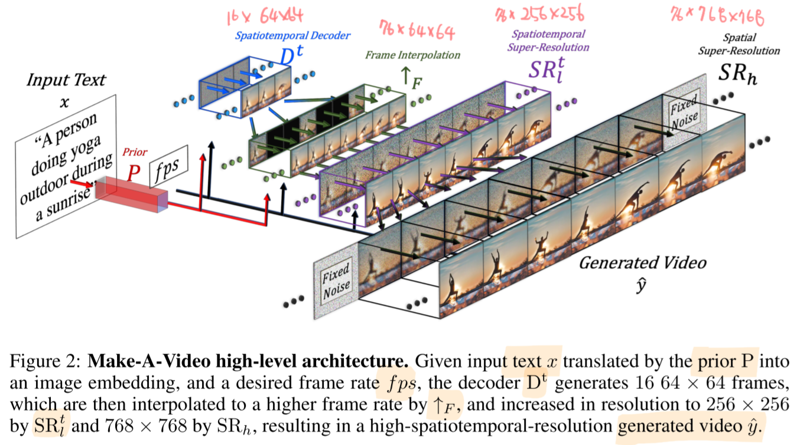
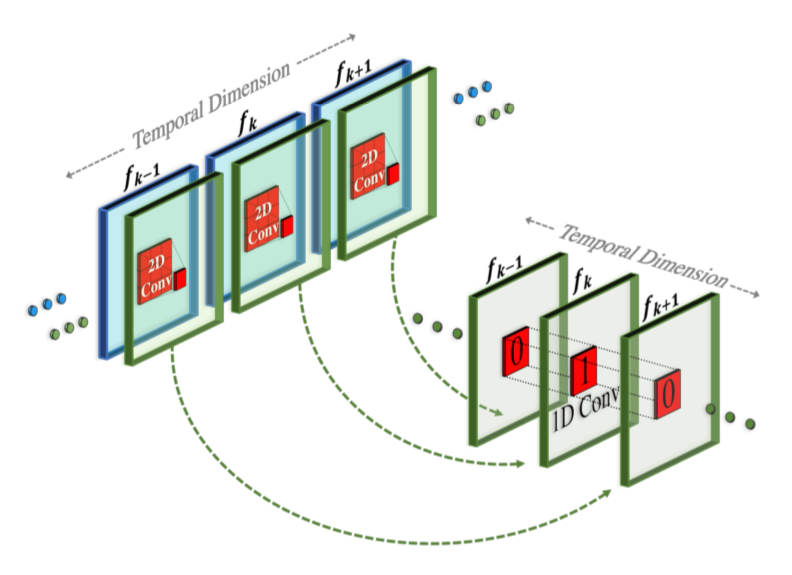
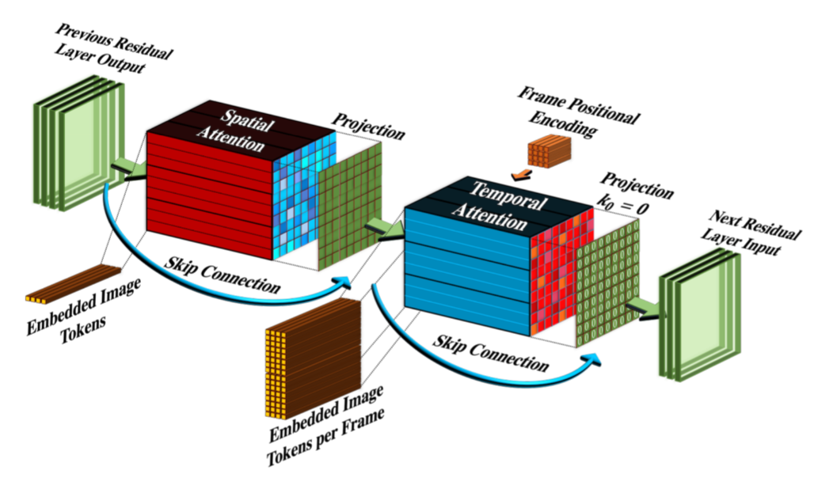

# Make-A-Video: Text-to-Video Generation without Text-Video Data

- Meta AI
- https://arxiv.org/abs/2209.14792
- (demo) https://make-a-video.github.io/
- (unofficial implementation) https://github.com/lucidrains/make-a-video-pytorch/blob/main/make_a_video_pytorch/make_a_video.py

## 1 Introduction

Make-A-Video

- leverages T2I models

- no paired text-image data needed

## 2 Previous Work

skipped

## 3 Method

$$
\hat{y_t} = \operatorname{SR}_h \circ \operatorname{SR}_l^t \circ \uparrow_F \circ D^t \circ P \circ (\hat{x}, C_x(x))
\tag{1}
$$

### 3.1 Text-to-image model

- $C _x: x \mapsto x _e$

  - clip text encoder
  - $x$
    - input text
  - $x_e$
    - text embeddings

- $P: (x _e, \hat{x}) \mapsto y _e$
  - a prior network
  - $y_e$
    - image embeddings
  - $\hat{x}$
    - BPE encoded text

- $D: y_e \mapsto \hat{y}_l$

  - a decoder network

- $\operatorname{SR} _h \circ \operatorname{SR} _l: \hat{y} _l \mapsto \hat{y}$

  - two consecutive spatial SR networks

  - $\hat{y}$
    - a generated "image"

### 3.2 Spatiotemporal layers

- $D^t: \cdot \mapsto \cdot$
  - the spatiotemporal decoder
  - generates 16 64x64 RGB frames from a image embedding
  - with random fps within $[1, 30]$
  - modified and fine-tuned from $D$
- $\uparrow _F: \cdot \mapsto \cdot$
  - a network for masked frame interpolation/extrapolation
  - 16 frames to 76 frames
    - $76 = (16 -1)\times5+1$
  - modified and fine-tuned from $D^t$
  - conditioned fps and frames
- $\operatorname{SR} _l^t: \cdot \mapsto \cdot$
  - a spatiotemporal SR network
  - modified and fine tuned from $\operatorname{SR}_l$

- $SR _h: \cdot \mapsto \hat{y} _t$
  - not modified but with the same noise initialization for each frame
  - $\hat{y}_t$
    - a generated "video"

#### 3.2.1 Pseudo-3D convolutional layers

Append a new 1D convolution layer following each pretrained 2d convolutional conv layer.
$$
\operatorname{Conv}_\text{P3D}(h) := \operatorname{Conv_\text{1D}}(\operatorname{Conv_\text{2D} \circ T}) \circ T
\tag{2}
$$

- $h \in \mathbb{R}^{B \times C \times F \times H \times W }$
  - an input tensor
  - with a given batch, channels, frames, heigh, and width dimensions respectively

- $T$
  - the transpose operator that swaps between the spatial and temporal dimensions
- $\operatorname{Conv_\text{2D}}$
  - pretrained 2D convolutional layer
- $\operatorname{Conv_\text{1D}}$
  - a new 1D convolutional layer initialized as the identity function

#### 3.2.2 Pseudo-3D attention layers

$$
\operatorname{ATTN}_\text{P3D}(h) := \operatorname{unflatten}(\operatorname{ATTN_\text{1D}}(\operatorname{ATTN_\text{2D}(\operatorname{flatten}(h)) \circ T}) \circ T)
\tag{3}
$$

- $\operatorname{flatten}: \mathbb{R}^{B \times C \times F \times H \times W} \to \mathbb{R}^{B \times C \times F \times HW}$
- $\operatorname{unflatten} = \operatorname{flatten}^{-1}$
- $\operatorname{ATTN}_\text{1D} $
  - 1D temporal attention
  - relative position embeddings are used
- frame rate conditioning
  - can be considered as an additional augmentation method
  - can control the generated video at inference time

### 3.3 Frame interpolation network

(skipped)

### 3.4 Training

(skipped)

## 4 Experiments

## 5 Discussion

## References
