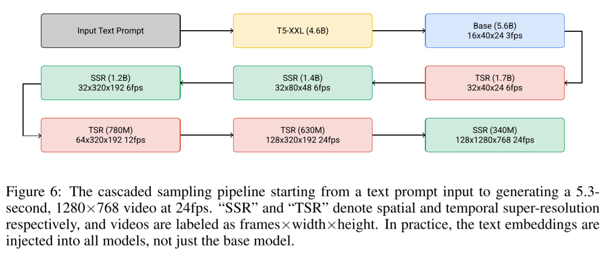

# Imagen Video: High Definition Video Generation with Diffusion Models

- Jonathan Ho et al.
- google research
- text-to-video
- cascaded video diffusion models
- additional methods
  - v-prediction
  - progressive distillation
  - classifier free guidance

(comparison table)

|                                                       | Video Diffusion Models                | Make-A-Video                         | Imagen Video                    | Flexible Diffusion Modeling of Long Videos |
| ----------------------------------------------------- | ------------------------------------- | ------------------------------------ | ------------------------------- | ------------------------------------------ |
| summary                                               |                                       | use a pretrained text-to-image model | cascaded video diffusion models |                                            |
| spatial resolution                                    | 128x128                               | 768x768                              | 1280x768                        | low                                        |
| temporal length                                       | 64 frames                             | 76 frames                            | 128 frames                      | 25 mins                                    |
| training set                                          | (text, video)                         | (text, image), (video)               | (text, video)                   |                                            |
| text conditions                                       | BERT-large                            | CLIP text encoder + 1 prior network  | T5-XXL                          |                                            |
| parameterization                                      | $\epsilon$-prediction, $v$-prediction | -                                    | $v$-prediction                  |                                            |
| progressive distillation                              | X                                     | X                                    | O                               |                                            |
| classifier free guidance                              | O                                     | X                                    | O                               |                                            |
| model composition (single or latent space or cascade) | single                                | decoder-TSR-(T)SSR-SSR               | base-TSR-SSR-TSR-TSR-SSR-SSR    | ?                                          |

## 1 Introduction

## 2 Imagen video

### 2.1 Diffusion models

- $\mathbf{z} = \{\mathbf{z}_t | t \in [0, 1]\}$
  - a set of latent variables
- $\mathbf{x} \sim p(\mathbf{x})$
  - data
- $q(\mathbf{z}|\mathbf{x})$
  -  a forward process
  - starting at $\mathbf{x}$
- $q(\mathbf{z}_t|\mathbf{x}) = \mathcal{N}(\mathbf{z}_t; \alpha_t \mathbf{x}, \sigma_t^2 \mathbf{I})$
- $\alpha_t, \sigma_t$
  - a differentiable noise schedule
- $\lambda_t = \log [\alpha_t^2 / \sigma_t ^2]$
  - log signal-to-noise-ratio
  - decreases with $t$
- $q(\mathbf{z}_t|\mathbf{z}_s) = \mathcal{N}(\mathbf{z}_t; (\alpha_t/\alpha_s)\mathbf{z}_s, \sigma_{t|s}^2 \mathbf{I})$
  - where
    - $0 \le s \lt t \le 1$
    - $\sigma_{t|s}^2 = (1 - e^{\lambda_t - \lambda_s})\sigma_t^2$
      - for the derivation refer to https://ai.stackexchange.com/a/39152/68132
- $q(\mathbf{z}_1) \approx \mathcal{N}(\mathbf{0}, \mathbf{I})$
  - note that $1$ is the biggest $t$ value when defining $\mathbf{z}$

##### Training

- $\hat{\mathbf{x}}_\theta := \hat{\mathbf{x}}_\theta(\mathbf{z_t}) := \hat{\mathbf{x}}_\theta(\mathbf{z}_t, \lambda_t)$
  - denoising model
- $\hat{\mathbf{x}}_\theta(\mathbf{z}_t, \mathbf{c}_t)$
  - conditional denoising model
  - for spatial and temporal super-resolution
  - also for text conditions

- $p(\mathbf{z}_t)$
  - a marginal distribution
  - the true density of $\mathbf{z}_t$ under $\mathbf{x} \sim p(\mathbf{x})$

(theoretical training object)
$$
\mathbb{E}_{\boldsymbol{\epsilon}, t} \left[w(\lambda_t) \Vert \hat{\mathbf{x}}_\theta (\mathbf{z}_t) - \mathbf{x} \Vert_2^2 \right] \tag{2}
$$

- where $t \sim \mathcal{U}_{[0, 1]}$

(practical training object)

- $t$ is sampled according to a cosine schedule
- $\boldsymbol{\epsilon}$-prediction
  - (not used in this work)
  - $\hat{\mathbf{x}}_\theta(\mathbf{z}_t) = (\mathbf{z}_t - \sigma_t \boldsymbol{\epsilon}_\theta(\mathbf{z}_t))$
  - $\boldsymbol{\epsilon}_\theta(\mathbf{z}_t) \approx - \sigma_t \nabla_{\mathbf{z}_t} \log p(\mathbf{z}_t)$
  
- $\mathbf{v}$-prediction
  - $\mathbf{v}_t := \alpha_t \boldsymbol{\epsilon} - \sigma_t\mathbf{x}$
    - velocity of $\mathbf{z}_t$ with respect to $\phi_t = \arctan(\sigma_t / \alpha_t)$

##### Ancestral sampler

- $q(\mathbf{z}_s|\mathbf{z}_t, \mathbf{x}) = \mathcal{N}(\mathbf{z}_s; \tilde{\mathbf{\mu}}_{s|t}(\mathbf{z}_t, \mathbf{x}), \tilde{\sigma}_{s|t}^2 \mathbf{I})$
  - the forward process described in reverse
  - $ s \lt t$

- where

$$
\tilde{\mathbf{\mu}}_{s|t}(\mathbf{z}_t, \mathbf{x})\tag{3a} = e^{\lambda_t - \lambda_s}(\alpha_s / \alpha_t) \mathbf{z}_t + (1 - e^{\lambda_t - \lambda_s})\alpha_s \mathbf{x}
$$

$$
\tilde{\sigma}_{s|t}^2 \tag{3b} = (1 - e^{\lambda_t - \lambda_s})\sigma_s^2
$$

$$
\mathbf{z}_s = \tilde{\mu}_{s|t} (\mathbf{z}_t, \hat{\mathbf{x}}_\theta(\mathbf{z}_t)) + \sqrt{(\tilde{\sigma}_{t|s}^2)^{1 - \gamma}(\sigma_{t|s}^2)^\gamma}\boldsymbol{\epsilon} \tag{4}
$$

- starting at $\mathbf{z}_1 \sim \mathcal{N}(\mathbf{0}, \mathbf{I})$
- $\boldsymbol{\epsilon} \sim \mathcal{N}(\mathbf{0}, \mathbf{I})$
- note that $\hat{\mathbf{x}}_\theta(\mathbf{z}_t)$ is used unlikely to DDPM
- $\gamma$ 
  - a hyperparameter that controls the stochasticity of the sampler inspired by `iDDPM`

##### Deterministic DDIM sampler

- can be seen as a numerical integration rule for "the probability flow ODE" (of the score SDE paper)

### 2.2 Cascaded diffusion models and text conditioning

- train low resolution models with 
  - spatial resizing
  - frame skipping
- generate an entire block of frames simultaneously ⭐
  - so the SSR models do not suffer from obvious artifacts that would occur from naively running super-resolution on independent frames

### 2.3 Video diffusion architectures

- networks are built on video U-Net from "Video Diffusion Models"
- conditioned on
  - images upsampled by the bilnear resizing
  - frames upsampled by repeating them
- composition
  - base model
    - temporal attention
    - spatial attention + spatial convolution
  - TSR
    - temporal convolution
  - SSR
    - temporal convolution
    - spatial attention + spatial convolution
  - SSR
    - temporal convolution
    - spatial attention + spatial convolution
  - TSR
    - temporal convolution
  - TSR
    - temporal convolution
  - SSR
    - spatial convolution

### 2.4 v-prediction

- can be formulated from DDPM/VP-SDE like signal/noise schedule 
- better numerical stability
  - enables progressive distillation
- less color shifting artifacts over time
- faster convergence of sample quality metrics

### 2.5 Conditioning augmentation

- Gaussian noise augmentation applied to the conditional image.
- It reduces the sensitivity to domain gap between the cascade stages. ⭐
- how?
  - at training time
    - use a randomly sampled SNR ratio
  - at sampling time
    - use a fixed SNR ratio such as 3 or 5
  - and the SNR ratio is provided to the model
- originated from Imagen

### 2.6 Video-image joint training

- image datasets are bigger than video-text datasets
- how?
  - bypass the temporal convolutional residual blocks
    - by masking out their computation path
  - disable cross-frame temporal attention
    - by masking out the temporal attention maps
- observations
  - increases video quality
  - the knowledge transfer from images to videos
    - e.g. image styles (such as sketch, painting, etc)

#### 2.6.1 Classifier free guidance

$$
\tilde{\mathbf{x}}_\theta (\mathbf{z}_t, \mathbf{c}) = (1 + w) \hat{\mathbf{x}}_\theta(\mathbf{z}_t, \mathbf{c}) - w \hat{\mathbf{x}}_\theta(\mathbf{z}_t)
\tag{5}
$$
where

- $w \ge 0$
  - guidance strength or guidance weight
- $\hat{\mathbf{x}}_\theta (\mathbf{z}_t)$
  - an unconditional prediction
- $\hat{\mathbf{x}}_\theta (\mathbf{z}_t, \mathbf{c})$
  - a conditional prediction
- $\tilde{\mathbf{x}}_\theta (\mathbf{z}_t, \mathbf{c})$
  - a conditional prediction with $\mathbf{c}$ over-emphasized

equivalently
$$
\tilde{\mathbf{v}}_\theta (\mathbf{z}_t, \mathbf{c}) = (1 + w) \hat{\mathbf{v}}_\theta(\mathbf{z}_t, \mathbf{c}) - w \hat{\mathbf{v}}_\theta(\mathbf{z}_t)
\tag{5}
$$

or
$$
\tilde{\boldsymbol{\epsilon}}_\theta (\mathbf{z}_t, \mathbf{c}) = (1 + w) \hat{\boldsymbol{\epsilon}}_\theta(\mathbf{z}_t, \mathbf{c}) - w \hat{\boldsymbol{\epsilon}}_\theta(\mathbf{z}_t)
$$

Note that a large guidance weight $w$ may generate unexpected artifacts. See 2.6.2.

#### 2.6.2 Large guidance weights

- static thresholding
  - `np.clip(x, -1, 1)`
  - generates artifacts
- dynamic thresholding
  - `np.clip(x, -s, s)/s`
  - `s`
    - dynamically chosen threshold (?)
- oscillating guidance
  - high guidance weight $w$ at first a certain number of steps
  - oscillate $w$ between a high and a low guidance weight
    - e.g.  such as between $15$ and $1$
  - applied to the base and the first two SR models

### 2.7 Progressive distillation with guidance and stochastic samplers

- $N$-step DDIM sampler (which is the original diffusion model) is distilled to a new model with $N/2$ steps.
- Can distill the effect of classifier free guidance into a single model
  - we don't need to evaluate the network outputs twice for a single step

- $N$-step stochastic sampler inspired by `k-diffusion`
  - go two DDIM steps forward
  - go one stochastic step backward
- each of all 7 video diffusion models was distilled to use 8 sampling steps

## 3 Experiments

- datasets
  - 14M video-text pairs
  - 60M image-text pairs
  - LAION-400M image-text dataset
- evaluation metrics
  - FID on individual frames
  - FVD
    - for temporal consistency
  - frame-wise CLIP scores
    - for video-text alignment
  - CLIP-R precision
    - https://openreview.net/forum?id=bKBhQhPeKaF
    - https://github.com/Seth-Park/comp-t2i-dataset

### 3.1 Unique video generation capabilities

- style generation
- 3d consistency
- graphical text generation

### 3.2 Scaling

- the base model is scalable with respect to the generative quality ⭐

### 3.3 Comparing prediction parameterizations

- v-parameterization
  - converged faster
  - performed better than $\epsilon$-parameterization especially at high-resolutions

### 3.4 Perceptual quality and distillation

- To sample one batch of videos
  - it takes 618 seconds with the original model 
  - it takes 35 seconds with the distilled model
    - (around 18 times faster)

## 4 Limitations and societal impact

## 5 Conclusion

## References

- [Progressive Distillation for Fast Sampling of Diffusion Models](https://arxiv.org/abs/2202.00512)
- [On Distillation of Guided Diffusion Models](https://arxiv.org/abs/2210.03142)
- [Photorealistic Text-to-Image Diffusion Models with Deep Language Understanding](https://arxiv.org/abs/2205.11487)
  - called Imagen
