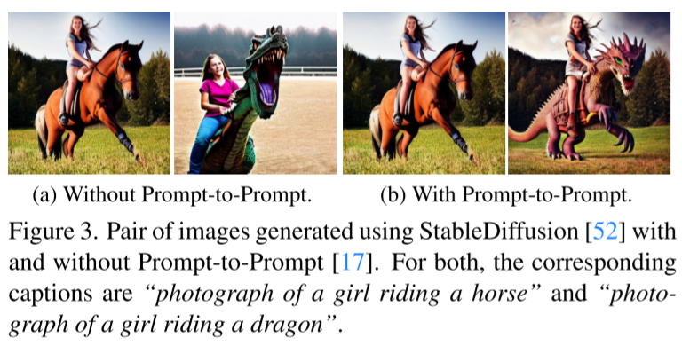
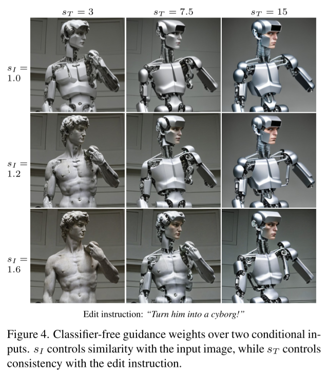

# InstructPix2Pix: Learning to Follow Image Editing Instructions

- https://arxiv.org/abs/2211.09800

- https://www.timothybrooks.com/instruct-pix2pix
- CVPR 2023 (Highlight)
- UC Berkeley

## 1 Introduction

## 2 Prior work

## 3 Method

### 3.1 Generating a multi-modal training dataset

#### 3.1.1 Generating instructions and paired captions

- in this stage everything is in the text domain
- finetune GPT-3 DAVINCI ⭐
  - 700 input captions sampled from LAION-Aesthetics V2 6.5+
  - manually write instructions and output captions
- generate 454,445 examples of instructions and paired captions
  - input caption
  - instruction
  - edited caption

#### 3.1.2 Generating paired images from paired captions

- challenge
  - consistency between each original image and the corresponding output image
  - diversity
  - quality
- Prompt-to-Prompt
  - use borrowed cross attention weights for some number of denoising steps
  - improve consistency dramatically 

- filtering by directional similarity in CLIP space ⭐
  - I guess...
    - $v _\text{out-txt} - v _\text{in-text}   \approx v _\text{gen-out-img} - v _\text{gen-in-img}$
  - introduced by StyleGAN NADA

### 3.2 InstructPix2Pix

- use Stable Diffusion v1.5
  - add extra channels into the first layer for the encoded conditional input image
    - initialize the new channels with zero

#### 3.2.1 Classifier-free guidance for two conditionings

$$
\begin{align}
\tilde{e}_\theta(z_t, c_I, c_T) &= e_\theta(z, \varnothing, \varnothing) \\
& + s_I \cdot \left( e_\theta(z, c_I, \varnothing) - e_\theta(z, \varnothing, \varnothing) \right) \\
& + s_T \cdot \left( e_\theta(z, c_I, c_T) - e_\theta(z, c_I, \varnothing) \right)
\end{align}
\tag{3}
$$

which is derived from
$$
\begin{align}
\nabla_z \log P(z \vert c_I, c_T) &= \nabla_z \log P(z) \\
& + \nabla_z \log P (c_I \vert z) \\
& + \nabla_z \log P (c_T \vert c_I, z) \\
\end{align}
$$

## 4 Results

## 5 Discussion

## References

## A Implementation details

### A.1

### A.2

### A.3

## B Classifier-free guidance details
