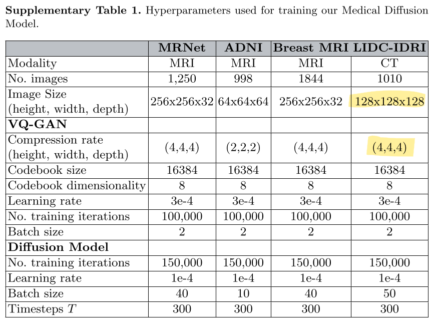
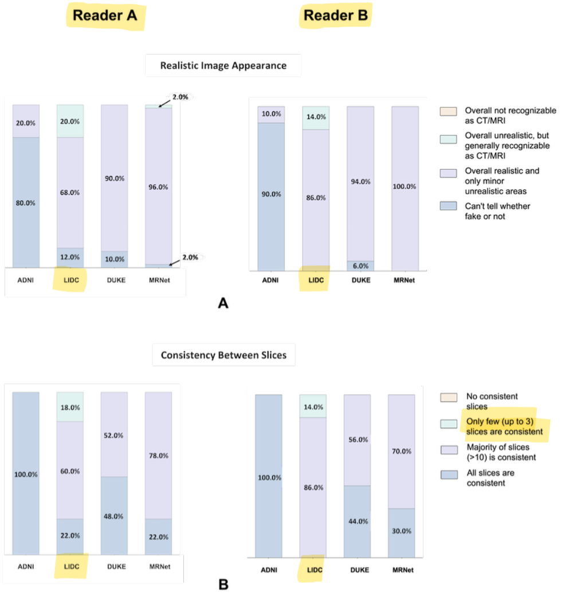
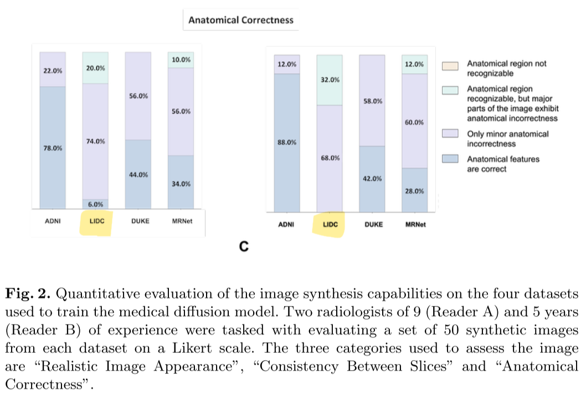
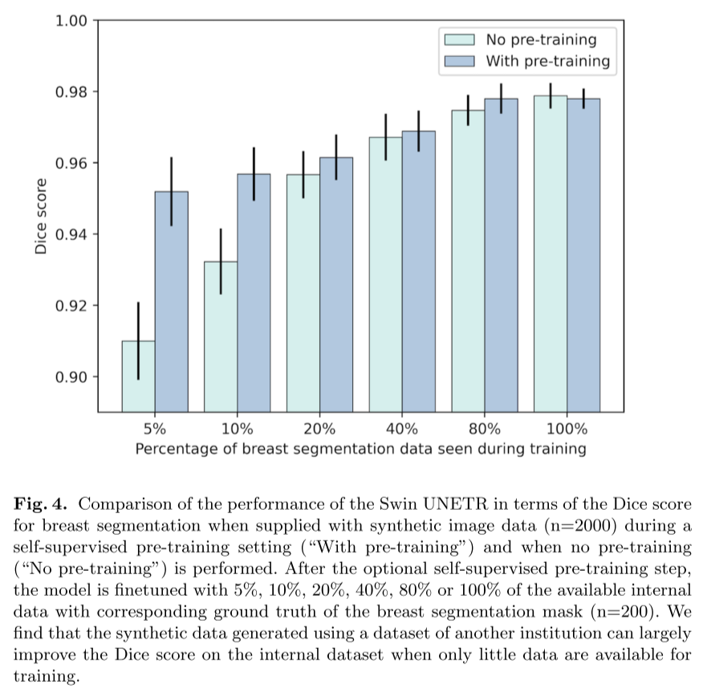

# Medical Diffusion: Denoising Diffusion Probabilistic Models for 3D Medical Image Generation

- https://arxiv.org/abs/2211.03364
- 3d image generation
- based on basic LDM and video generation methods

## 1 Introduction

## 2 Materials and methods

- more details can be found at https://github.com/FirasGit/medicaldiffusion

### 2.2 Data preprocessing

- histogram based intensity normalization
  - seems to have been devised for MRI images
  - not sure how much this is important 🤔

### 2.3 Architecture

#### VQ-GAN

- discriminators
  - a slice-wise discriminator
    - takes a random slice
  - a 3D discriminator
- feature matching loss

#### Diffusion model

- DDPM
- basic composition (in order) ⭐
  - 2D conv
    - 3x3x1 kernel
  - a spatial attention block
  - a depth attention block

#### Putting it all together

- trained on 1GPU with 24G VRAM

## 3 Results

### 3.2 Medical diffusion models can generate high quality medical 3d data

- two radiologists evaluate 20 generated 3D images for each dataset

### 3.3 The dimension of the latent space is important  for high quality image generation

### 3.5 Synthetic data can be used to train neural networks

## Discussion

- limitations
  - small datasets
    - 1000 volumes
  - low resolution volumes
  - image quality and resolution trade off

## References

- [22] [On standardizing the MR image intensity scale (Nyúl and Udupa, 1999)](https://pubmed.ncbi.nlm.nih.gov/10571928/)
- [26] [Long Video Generation With Time-Agnostic VQGAN and Time-Sensitive Transformer (Ge et al, 2022)](https://arxiv.org/abs/2204.03638) 
- [28] [Video Diffusion Models (Ho et al, 2022)](https://arxiv.org/abs/2204.03458)
- [30] [Self-Supervised Pre-Training of Swin Transformers for 3D Medical Image Analysis (Tang et al, CVPR 2022)](https://arxiv.org/abs/2111.14791)

