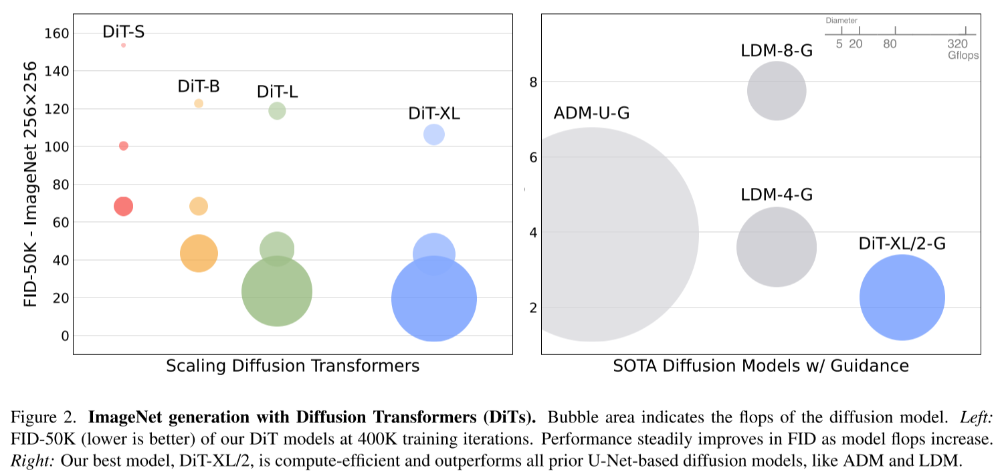
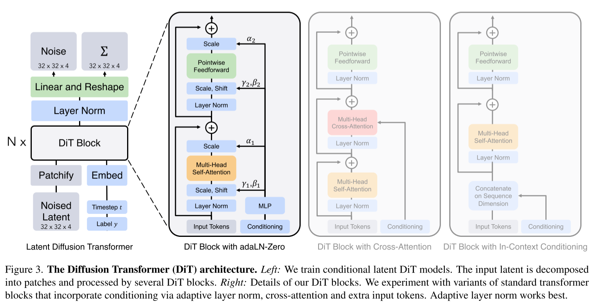

# Scalable Diffusion Models with Transformers

- (paper) https://arxiv.org/abs/2212.09748
- (project) https://www.wpeebles.com/DiT
- (code) https://github.com/facebookresearch/DiT
  - JAX
  - CC-BY-NC license (so we cannot use this in a startup.)
- (review) https://youtu.be/eTBG17LANcI

- DiT models need to be compared to `LDM-8-G` in that they all use encoding factor=8
- `-G` seems to mean guidance
- SOTA fid on ImageNet256 and ImageNet512
- GFLOPs
  - floating point operations (in giga)
- trained on TPU v3-256 pod

- a latent diffusion model but with transformers as the backbone instead of U-Net 
- DiT Block
  - type
    - in-context conditioning
    - cross-attention block
    - adaptive layer Norm (adaLN) block
      - regress $\gamma$, $\beta$
    - adaLN-Zero block
      - regress $\gamma$, $\beta$, $\alpha$
        - using $t$ and $c$
      - $\gamma_i$
        - scale parameter
      - $\beta_i$
        - shift parameter
      - $\alpha_i$
        - set as zero by initializing MLP weights.
          - then DiT block becomes an identity block
        - dimension wise scaling parameter prior to residual connections
- first stage model
  - f=8
  - 256x256x3 👉 32x32x4
  - reuse stable diffusion's pretrained encoder/decoder
- with DDPM like settings
- predict $\Sigma_\theta$ as well as iDDPM does
- Use Classifier Free Guidance (CFG) if needed
  - scale
    - 4.0 (for generating 256x256 images)
    - 6.0 (for generating 512x512 images)
- block design
  - (option 1) in-context conditioning
  - (option 2) cross-attention
  - (option 3) adaLN
  - (option 4) adaLN-Zero
    - best
- model size
  - the bigger the better the more efficient in terms of training compute and FID
  - DiT-S
  - DiT-B
  - DiT-L
  - DiT-XL
- patch size
  - the smaller patch size we have
    - the more GFLOPs
    - the better in terms of FID
  - meaning p=2 was the best
  - note that modifying the patch size doesn't change the number of model parameters but it changes GFLOPs
- FID is negatively correlated to model GFLOPs
  - but more sampling compute does not compensate for less model compute
    - which mean a small model with large number of steps cannot outperform a bigger model with the small number of steps