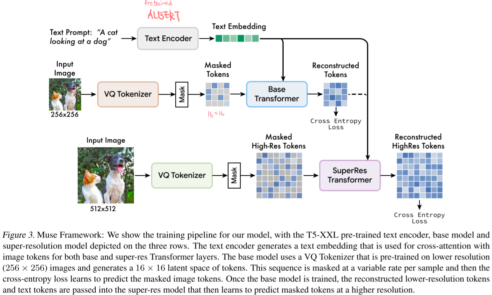
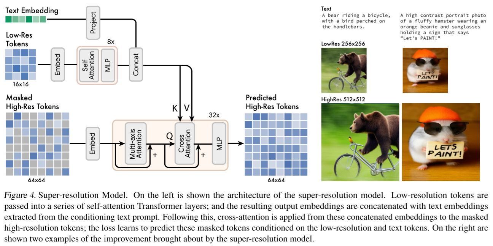
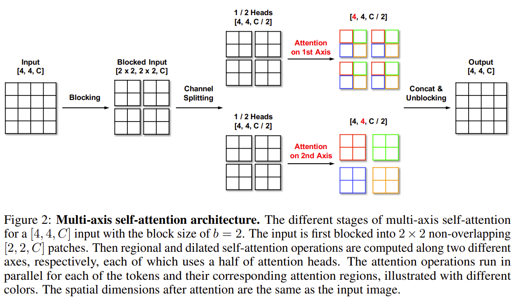
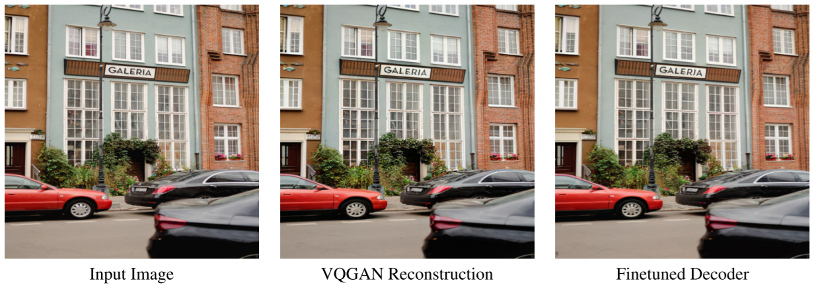

# Muse: Text-To-Image Generation via Masked Generative Transformers

- https://arxiv.org/abs/2301.00704
- Google Research
- SOTA in text-to-image tasks

## 1 Introduction

- a text-to-image transformer model

## 2 Model

### 2.1 Pre-trained text encoders

- a pre-trained large language model (LLM)

  - which is ALBERT

  - outputs T5XXL text embeddings

### 2.2 Semantic tokenization using VQGAN

- provides quantized latent space
- (low-res) 256x256 VQ tokenizer
  - trained as VQGAN
  - f=16
    - 256x256 into 16x16
  - the codebook size = 8192
    - They said larger codebook size didn't result in performance improvements
- (high-res) 512x512 VQ tokenizer
  - trained as VQGAN
  - f=8
    - 512x512 into 64x64

### 2.3 Base model

- trained on a masked modeling task

- predicts the marginal distribution for each masked token
  - using `[MASK]` tokens
- conditioned on
  - self-attention
    - the unmasked low-resolution tokens
  - cross-attention
    - a T5XXL text embedding

### 2.4 Super-resolution model

- trained on a masked modeling task
- conditioned on
  - self-attention
    - the unmasked high-resolution tokens
  - cross-attention
    - the low resolution tokens
    - a T5XXL text embeddings

#### Remark: Multi-axis self-attention

[Improved Transformer for High-Resolution GANs (Zhao et al. NeurIPS 2021)](https://arxiv.org/abs/2106.07631)

### 2.5 decoder finetuning ⭐

- freeze
  - encoder
  - codebook
- fine-tune
  - decoder (with more layers appended)

### 2.6 Variable masking rate

- masked images using cosine scheduling during training
- $r \in [0, 1]$
- $r \sim p(r) = {2 \over \pi} (1 - r^2)^{-{1 \over 2}}$
  - a truncated $\operatorname{arccos}$ distribution
- $\mathbb{E}(r) = 0.64$

### 2.7 Classifier free guidance

- (training)
  - the probability of unconditional samples = 0.1
- (inference)
  - $\ell_g = (1 + t) \ell_c - t\ell_u$
    - $\ell_g$
      - a guided logit for each token
    - $\ell_c$
      - a conditional logit
    - $\ell_u$
      - an unconditional logit
      - or a negatively conditional logit
    - $t$
      - guidance scale
  - apply increasing $t$ to allow diversity at first and reduce diversity later during a single inference ⭐

### 2.8 iterative parallel decoding at inference

- base model
  - decoding steps: 24
- super resolution model
  - decoding steps: 8

## 3 Results

dataset

- Imagen dataset
  - 460M text-image pairs

### 3.1 Qualitative performance

(skipped)

### 3.2 Quantitative performance

- There was the tradeoff between FID and CLIP score.

### 3.3 Image editing

#### 3.3.1 Text-guided inpainting / outpainting

#### 3.3.2 Zero-shot mask-free editing

- given a text prompt
  - iteratively mask and resample a random subset of tokens with the base model
  - perform super-resolution

## 4 Related work

(skipped)

## 5 Discussion and social impact

(skipped)

## References

- D3PM
- BERT
- VQGAN
- Transformers
- ALBERT

## Notes

### Comparison between DiT and Muse 

|                             | [DiT](./202212-scalable-diffusion-models-with-transformers.md) | Muse                                                         |
| --------------------------- | ------------------------------------------------------------ | ------------------------------------------------------------ |
| uploaded to arxiv           | 202212                                                       | 201301                                                       |
| related company             | (Facebook Research)                                          | Google Research                                              |
| core model type             | diffusion                                                    | non-diffusion (but it looks like just a discrete diffusion probabilistic model) |
| task scope                  | general diffusion models                                     | text-to-image model and its applications                     |
| latent space                | continuous                                                   | discrete                                                     |
| image tokens                | patches on its latent space                                  | pixels on its latent space                                   |
| architecture                | transformers with DiT blocks                                 | 2 transformer models                                         |
| transformer type            | non-autoregressive                                           | non-autoregressive                                           |
| predicts                    | noise (mean and covariance)                                  | masked tokens                                                |
| initial state for inference | random noise sampled from $N(0, I)$                          | a latent image of masks                                      |
| classifier free guidance    | used when needed                                             | used                                                         |
| nice ideas                  | initialize residual blocks to be identical operations        | two-staged latent space                                      |
|                             |                                                              | fine tune decoders                                           |
|                             |                                                              | increase CFG scale during the sampling steps                 |
|                             |                                                              | zero-shot mask free editing (which masks and resamples tokens iteratively conditioned on a text prompt) |

