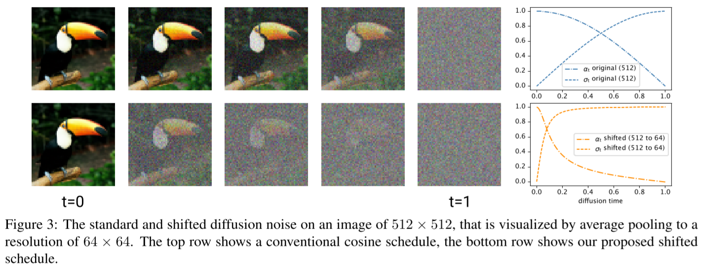
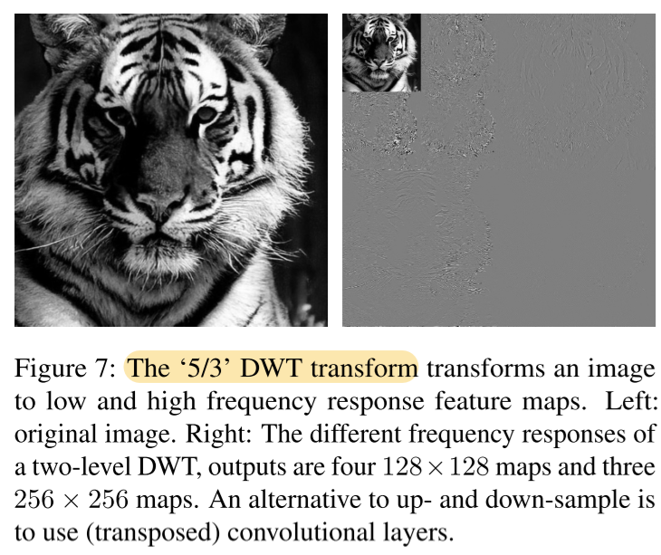
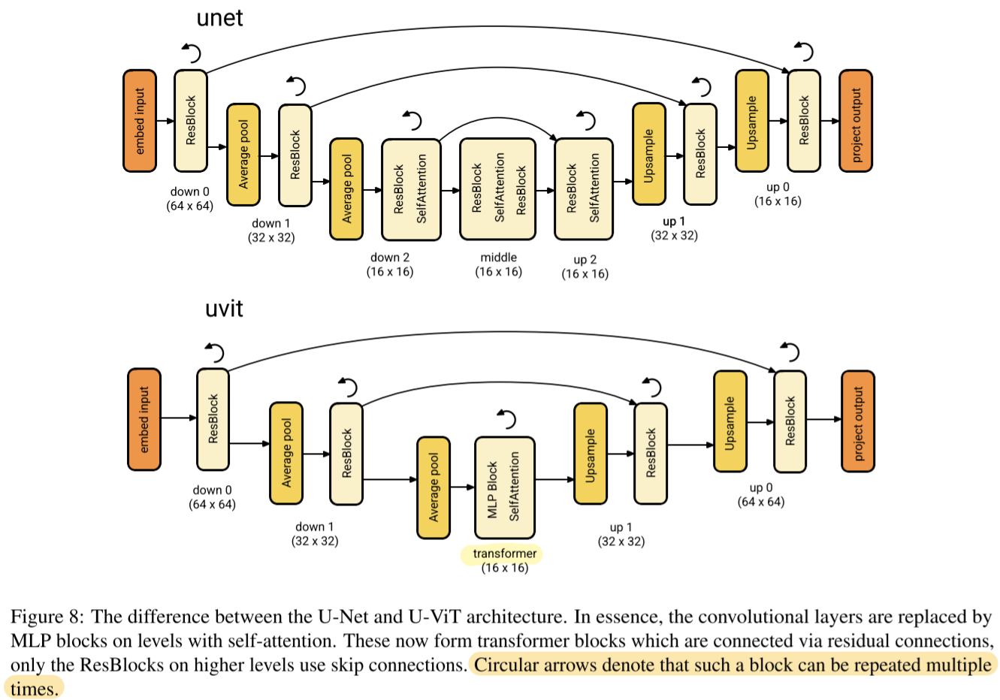
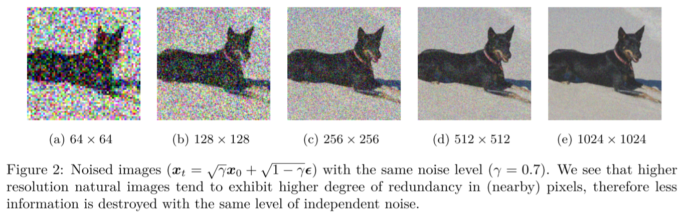

# simple diffusion: End-to-end diffusion for high resolution images

- https://arxiv.org/abs/2301.11093
- Emiel Hoogeboom, Jonathan Heek, Tim Salimans
- Google research, Brain team, Amsterdam
- make a single model to generate high resolution images
  - in contrast to LDM or Imagen

## 1 Introduction

(findings)

- the noise schedule should be adjusted, adding more noise as the resolution increases
- scale U-Net on the 16x16 resolution to improve performance
- dropout should be added but not on the highest resolution
- for higher resolutions, downsample images

## 2 Background: diffusion models

$$
q(\boldsymbol{z}_t | \boldsymbol{x}) = \mathcal{N}(\boldsymbol{z}_t | \alpha_t \boldsymbol{x}, \sigma_t^2 \mathbf{I})
\tag{1}
$$

where

- $\alpha_t, \sigma_t \in (0, 1)$
- $t \in [0, 1]$

$$
q(\boldsymbol{z}_t | \boldsymbol{z}_s) = \mathcal{N} (\boldsymbol{z}_t| \alpha_{ts} \boldsymbol{z}_s, \sigma_{ts}^2\mathbf{I})
\tag{2}
$$

where

- $\alpha _{ts} = \alpha _t / \alpha _s$
- $\sigma _{ts}^2 = \sigma _t ^2 - \alpha _{ts}^2 \sigma _s ^2$
- $t \gt s$

##### Noise schedule

- cosine schedule
  - $\alpha _t = \cos(\pi t/2)$
  - $\sigma _t = \sin(\pi t / 2)$

##### Denoising

##### Parametrization

- epsilon prediction is unstable when it's near t=1
- using v-prediction instead of epsilon-prediction was slightly helpful

##### Optimization

- $\operatorname{SNR}(t) = \alpha _t ^2 / \sigma _t ^2$

## 3 Method: simple diffusion

### 3.1 Adjusting noise schedules

- Without adjusting the noise schedule not enough noise is added for high resolution
  - refer to the note of "On the Importance of Noise Scheduling for Diffusion Models" below.

Let's assume the situation where we average pool independent pixel values.
$$
z_t^{64 \times 64} = (z_t^{(1)} + z_t^{(2)} + z_t^{(3)} + z_t^{(4)}) / 4
$$

$$
\operatorname{Var}[z_t^{64 \times 64}] = \\
\operatorname{Var}[(z_t^{(1)} + z_t^{(2)} + z_t^{(3)} + z_t^{(4)}) / 4] = \\
{1 \over 16} \cdot 4 \operatorname{Var}[z_t^{(\cdot)}] = \\
{1 \over 4} \operatorname{Var}[z_t^{(\cdot)}]
$$

So the lower resolution layer has the only the half amount of the noise.

And for SNR it's
$$
\operatorname{SNR}^{d/s \times d/s} (t) = 
\operatorname{SNR}^{d \times d} (t) \cdot s^2
\tag{4}
$$

.

$$
\operatorname{SNR}^{d \times d}_\text{shift 64} (t) = 
\operatorname{SNR}^{64 \times 64} (t) \cdot (64 / d)^2
\tag{5}
$$
where

- $\operatorname{SNR}^{64 \times 64} (t)$
  - the reference SNR assumed
- $d \times d$
  - the target resolution
- $\operatorname{SNR}^{d \times d} _\text{shift 64} (t)$
  - the adjusted SNR for the noise to be similar to the noise of the reference SNR

> A potential downside of shifting the schedule is the high frequency details are now generated much later in the diffusion process due to the increased per-pixel noise. However, we postulate that high frequency details are weakly correlated when conditioning on the global/low-frequency features that are already generated. It should therefore be possible to generate the high frequency details in few diffusion steps.

##### Interpolating schedules

$$
\log \operatorname{SNR}_{\text{interpolate}(32 \to 256)} (t) =
t \log \operatorname{SNR} _\text{shift 256}^{512 \times 512} (t) + (1 - t) \log \operatorname{SNR} _\text{shift 32} ^ {512 \times 512} (t)
\tag{6}
$$

- $\operatorname{SNR} _\text{shift 256}^{512 \times 512} (t) \gt \operatorname{SNR} _\text{shift 32}^{512 \times 512} (t)$
- postulation
  - high frequency details are weakly correlated when conditioning  on the global/low-frequency features that are already generated 
- add more noise when t is small so that the model can develop
  - make it closer to $\operatorname{SNR} _\text{shift 32}^{512 \times 512} (t)$ at first.
- I don't think there are experimental results in the paper for this suggestion🫤

### 3.2 Multiscale training loss

- useful when the resolution is greater than 256 x 256

$$
L_\theta^{d \times d} (\boldsymbol{x}) =
{1 \over d} \mathbb{E}_{\boldsymbol{\epsilon}, t}
\Vert
\mathrm{D}^{d \times d} \left[\boldsymbol{\epsilon}\right]
-
\mathrm{D}^{d \times d}
\left[
\hat{\boldsymbol{\epsilon}}_\theta(\alpha_t \boldsymbol{x} + \sigma_t \boldsymbol{\epsilon}, t)
\right]
\Vert_2^2
$$

- $\mathrm{D}^{d \times d}$
  - a linear operation downsampling to the d x d resolution

$$
\tilde{L}_\theta^{d \times d} (\boldsymbol{x}) =
\sum_{s \in \{ 32,64, 128, ..., d \}}
{1 \over s}
L_\theta^{d \times d} (\boldsymbol{x})
$$

- ${1 / s}$
  - losses for higher resolution are noisier on average due to high frequency details

### 3.3 Scaling the architecture

- for their consideration the best resolution and channels for scaling is 16x16x1024
  - typically,
    - 16x16 was used for scaling in many literature
    - scaling 16x16 resolution requires more parameters but less feature maps
      - sharding only the weights might be required

##### Avoiding high resolution feature maps

- many accelerators (GPUs) provide enough computation power but with the limited memory

- so it would be good go with memory efficient scaling

- downsample earlier and upsample later

  - actually this was also better in terms of the model performance

  - approaches
    - use the invertible and linear 5/3 wavelet (5/3 DTW transform)
    - use patching

### 3.4 Dropout

- regularization is important
  - e.g. dropout, augmentation, ...
- applying dropout to the entire layers is not a good idea
- apply it to lower resolutions than, for example, 64x64

### 3.5 The U-ViT architecture

- the transformer block
  - consist of self-attention and MLP block
  - efficient to be used by accelerators

### 3.6 Text to image generation

## 4 Related work

## 5 Experiments

### 5.1 Effects of the proposed modification

##### Noise schedule

##### Dropout

##### Architecture scaling

##### Avoiding higher resolution feature maps

##### Multiscale loss

### 5.2 Comparison with literature

##### Text to image

## 6 Conclusion

## References

- iDDPM
- VDM
- Imagen
- DiT

## A Additional background information on diffusion models

##### Sampling

##### Classifier-free guidance

##### Distillation

## B Experimental details

### B.1 U-Net settings

### B.2 U-ViT settings

## C Additional experiments

##### Guidance scale

## Notes

### On the Importance of Noise Scheduling for Diffusion Models

- https://arxiv.org/abs/2301.10972

