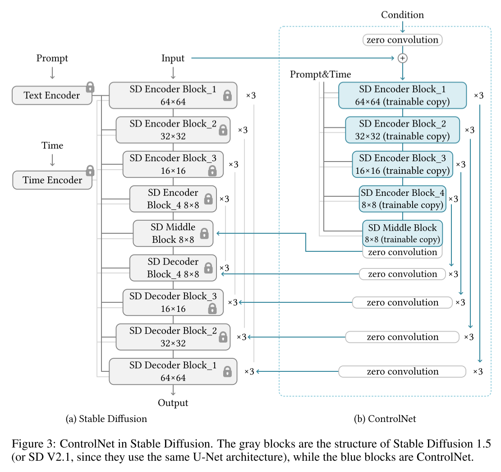

# Adding Conditional Control to Text-to-Image Diffusion Models

- Stanford Univ.
- https://arxiv.org/abs/2302.05543
- control the pretrained stable diffusion models with extra layers
- based on Stable diffusion 1.5 and 2.1
- https://github.com/lllyasviel/ControlNet
- https://huggingface.co/docs/diffusers/main/en/api/pipelines/stable_diffusion/controlnet
- https://github.com/yftzeng/stable-diffusion-webui-docker

## TODO

- copy this into confluence
- add experiments into their corresponding section
- check stable diffusion 1.5 configurations?
- What is BLIP which was used as for automatic prompt
  - https://youtu.be/X2k7n4FuI7c
  - https://youtu.be/Z3knUzwuIgo


(done)

- install controlnet into webui
  - https://github.com/Mikubill/sd-webui-controlnet

```bash
sudo apt-get install git-lfs
cd extensions/sd-webui-controlnet/models
git lfs install
git clone https://huggingface.co/lllyasviel/ControlNet
ln ... 
```


- How stable diffusion condition UNet on text?
  - cross attention


## 1 Introduction

- we want to
  - use the stable diffusion models in a specific domain
  - keep the generalization ability of the stable diffusion models
  - avoid overfitting

- problems to solve

  - much smaller datasets

  - HW resource limitation compared to big tech companies
  - task specific input conditions

- ControlNet

  - requires 1 Nvidia RTX 3090 TI to train it

## 2 Related Work

### 2.1 HyperNetwork and neural network structure

### 2.2 Diffusion probabilistic model

### 2.3 Text-to-image diffusion

- Glide
  - CLIP based
- Disco diffusion
  - https://colab.research.google.com/github/alembics/disco-diffusion/blob/main/Disco_Diffusion.ipynb
  - https://dreamingcomputers.com/disco-diffusion/disco-diffusion-cheatsheet/
  - CLIP based
- Stable diffusion
- Imagen

### 2.4 Personalization, customization, and control of pretrained diffusion model

- control text guides
- methods that manipulating CLIP
- Textual Inversion ⭐
- DreamBooth ⭐

### 2.5 Image-to-image translation

- Pix2Pix
- ViT
- Taming transformer
- Palette ⭐
- PITI
- sketch guided diffusion ⭐
  - https://sketch-guided-diffusion.github.io/

## 3 Method


### 3.1 ControlNet


$$
\boldsymbol{y} = \mathcal{F}(\boldsymbol{x}; \Theta)
\tag{1}
$$


- where

  - $\mathcal{F}(\cdot; \Theta)$

    - a neural network block

  - $\Theta$

    - parameters
    - it's going to be a locked copy

  - $\boldsymbol{x}$, $\boldsymbol{y}$

    - feature maps


$$
\boldsymbol{y}_c = \mathcal{F}(\boldsymbol{x}; \Theta) + \mathcal{Z}(\mathcal{F}(\boldsymbol{x} + \mathcal{Z}(\boldsymbol{c}; \Theta_\text{z1}); \Theta_c); \Theta_\text{z2})
\tag{2}
$$

- where
  - $\Theta _c$
    - parameters which is a trainable copy

  - $\boldsymbol{Z}(\cdot ; \cdot)$
    - 1x1 convolution
    - weights and biases are initialized as zeros

  - $\boldsymbol{y} _c$
    - the modified feature map
    - in the first training step $\boldsymbol{y} = \boldsymbol{y} _c$ due to the zero initialization of $\mathcal{Z}$
  - $c$
    - an extra condition


###### (the gradient calculation of a zero convolution layer when it's before optimization)

$$
\mathcal{Z}(\boldsymbol{I}; \{\boldsymbol{W}, \boldsymbol{B}\})_{p,i} = \boldsymbol{B}_i +\sum\limits_{j}^{c} \boldsymbol{I}_{p,i}\boldsymbol{W}_{i,j}
\tag{5}
$$

- where
  - $\boldsymbol{I} \in \mathbb{R}^{h \times w \times c }$
    - an input map
  - $p$
    - spatial position
  - $i$
    - channel-wise index

$$
\left\{\begin{array}{l}
\frac{\partial \mathcal{Z}(\boldsymbol{I} ;\{\boldsymbol{W}, \boldsymbol{B}\})_{p, i}}{\partial \boldsymbol{B}_i}=1 \\
\frac{\partial \mathcal{Z}(\boldsymbol{I} ;\{\boldsymbol{W}, \boldsymbol{B}\})_{p, i}}{\partial \boldsymbol{I}_{p, i}}=\sum_j^c \boldsymbol{W}_{i, j}=0 \\
\frac{\partial \mathcal{Z}(\boldsymbol{I} ;\{\boldsymbol{W}, \boldsymbol{B}\})_{p, i}}{\partial \boldsymbol{W}_{i, j}}=\boldsymbol{I}_{p, i} \neq \mathbf{0}
\end{array}\right.
\tag{6}
$$

- The gradient with respect to parameters $\boldsymbol{W}$ and $\boldsymbol{B}$ can be non zero.
  - So it's trainable.
  - Although we set them as zeros at the beginning.

$$
\boldsymbol{W}^*=\boldsymbol{W}-\beta_{\mathrm{lr}} \cdot \frac{\partial \mathcal{L}}{\partial \mathcal{Z}(\boldsymbol{I} ;\{\boldsymbol{W}, \boldsymbol{B}\})} \odot \frac{\partial \mathcal{Z}(\boldsymbol{I} ;\{\boldsymbol{W}, \boldsymbol{B}\})}{\partial \boldsymbol{W}} \neq \mathbf{0}
\tag{7}
$$

- 

$$
\\
\frac
{\partial \mathcal{Z} (\boldsymbol{I} ;\{\boldsymbol{W}^*, \boldsymbol{B}\})_{p, i}}
{\partial \boldsymbol{I}_{p, i}}
=\sum_j^c \boldsymbol{W}_{i, j}^* \neq \mathbf{0}
\tag{8}
$$


### 3.2 ControlNet in image diffusion model



- based on the Stable Diffusion
- requires
  - 23% more GPU
  - 34% more time in each training iteration
  - (tested on a single Nvidia A100 PCIE 40G)

$$
\boldsymbol{c}_f = \mathcal{E}(\boldsymbol{c}_i)
\tag{9}
$$


- $\mathcal{E}$
  - condition encoder
  - For more network details, refer to [the code](https://github.com/lllyasviel/ControlNet/blob/4c3aecb92ececca4c5cfc874a2301a9e99015f6f/cldm/cldm.py#L147).


### 3.3 Training

$$
\mathcal{L} = \mathbb{E}_{\boldsymbol{z}_0, t, \boldsymbol{c}_t, \boldsymbol{c}_f, \boldsymbol{\epsilon}} \sim \mathcal{N}(0, 1) \left[ \Vert \boldsymbol{\epsilon} - \boldsymbol{\epsilon}_\theta(\boldsymbol{z}_t, t, \boldsymbol{c}_t, \boldsymbol{c}_f ) \Vert_2^2\right]
\tag{10}
$$

- (There's nothing special in the loss function.)
- randomly replace 50% text prompts $\boldsymbol{c}_t$ with empty strings.
  - to make sure it depends on the new condition.

### 3.4 Improved training

##### Small-scale training

- to train the model 1.6 times faster with `RTX 3070 Ti`,

- (at first)
  - disconnect decoder block 1,2,3,4
  - connect only the middle block
- (later)
  - continue training with all the blocks connected

##### Large-scale training

- with
  - at least 8 `Nvidia A100 80G` or equivalent
  - at least 1 million of training image pairs
- (at first)
  - train ControlNets (usually more than 50k steps)
- (later)
  - train the model as a whole with all the weights of the Stable Diffusion unlocked

### 3.5 Implementation

##### Canny edge

- with random thresholds
- See also Fig. 4.

##### Canny edge (alter)

- See also Fig. 22.

##### Hough line

- [M-LSD](https://arxiv.org/abs/2106.00186) [13] used
- https://docs.opencv.org/3.4/d9/db0/tutorial_hough_lines.html
- See also Fig. 5.

##### HED boundary

- [Holistically-Nested Edge Detection](https://arxiv.org/abs/1504.06375) [33] used
- BLIP [34] used
- See also Fig. 7.

##### User sketching

- Synthesize human scribbles1
- See also Fig. 6.

##### Human pose (Openpifpaf)

- https://github.com/openpifpaf/openpifpaf
- Directly use the visualized pose images with human skeletons
- Stable Diffusion 2.1 (in this experiment alone.)
- See also Fig. 8.

##### Human pose (Openpose)

- Directly use the visualized pose images with human skeletons.
- See also Fig. 9.

##### Semantic segmentation (COCO)

- BLIP [34] used
- See also Fig. 12.

##### Semantic segmentation (ADE20K)

- https://groups.csail.mit.edu/vision/datasets/ADE20K/
- BLIP [34] used
- See also Fig. 11.

##### Depth (large-scale)

- See also Fig. 23,24,25.

##### Depth (small-scale)

- See also Fig. 14.

##### Normal maps

- https://diode-dataset.org/
- BLIP [34] used
- See also Fig. 13.

##### Normal Maps (extended)

- See also Fig. 23,24,25.

##### Cartoon line drawing

- See also Fig. 15.

## 4 Experiments

### 4.1 Experimental settings

- No prompt
  - ""
- Default prompt
  - "a professional, detailed, high-quality image"
- Automatic prompt
  - an initial image is generated by the default prompt
  - automatic prompt is generated by BLIP
  - a new image is generated from the generated prompt
- User prompt

### 4.2 Qualitative results

### 4.3 Ablation study

- Sudden convergence phenomenon 💡
  - While training, the model suddenly able to follow the input conditions.
  - See Fig. 21.

- See also Fig. 20, 22.

### 4.4 Comparison to previous methods

- See Fig. 14, 17, 18, 19.

### 4.5 Comparison of pre-trained models

- See Fig. 23, 24, 25

### 4.6 More applications

- masked diffusion can be used for letting users to edit an image by partially scribbling
  - See Fig. 16

- When the content is simple the model can manipulate the content accurately
  - See Fig. 26
- When users don't want their input shape to be preserved in the images, replace the last 50% diffusion iterations with standard stable diffusion without ControlNet. 💡
  - See Fig. 27

## 5 Limitations

- See Fig. 28.

## References

- [6] OpenPose: Realtime Multi-Person 2D Pose Estimation using Part Affinity Fields
  - https://arxiv.org/abs/1812.08008
- [13] Towards Light-weight and Real-time Line Segment Detection
  - https://arxiv.org/abs/2106.00186
  - AAAI 2022
- [27] OpenPifPaf: Composite Fields for Semantic Keypoint Detection and Spatio-Temporal Association
  - https://arxiv.org/abs/2103.02440
- [30] Towards Robust Monocular Depth Estimation: Mixing Datasets for Zero-shot Cross-dataset Transfer
  - https://arxiv.org/abs/1907.01341
  - https://github.com/isl-org/MiDaS
- [34] BLIP: Bootstrapping Language-Image Pre-training for Unified Vision-Language Understanding and Generation
  - https://arxiv.org/abs/2201.12086
  - ICML 2022
- [58] Sketch-Guided Text-to-Image Diffusion Models
  - https://sketch-guided-diffusion.github.io/
  - https://arxiv.org/abs/2211.13752
- [62] Holistically-Nested Edge Detection
  - https://arxiv.org/abs/1504.06375
  - ICCV 2015
