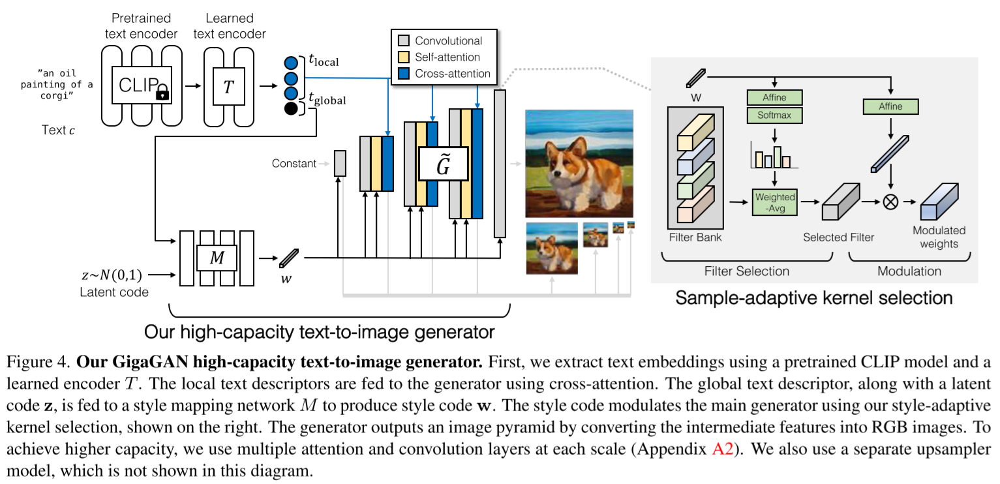
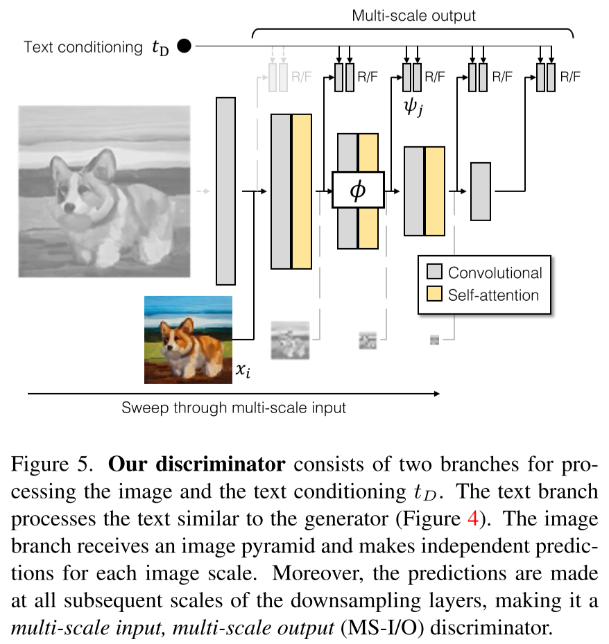
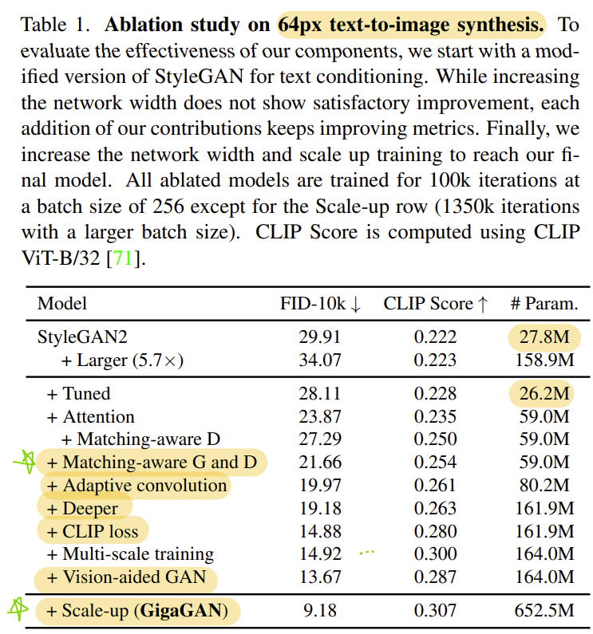
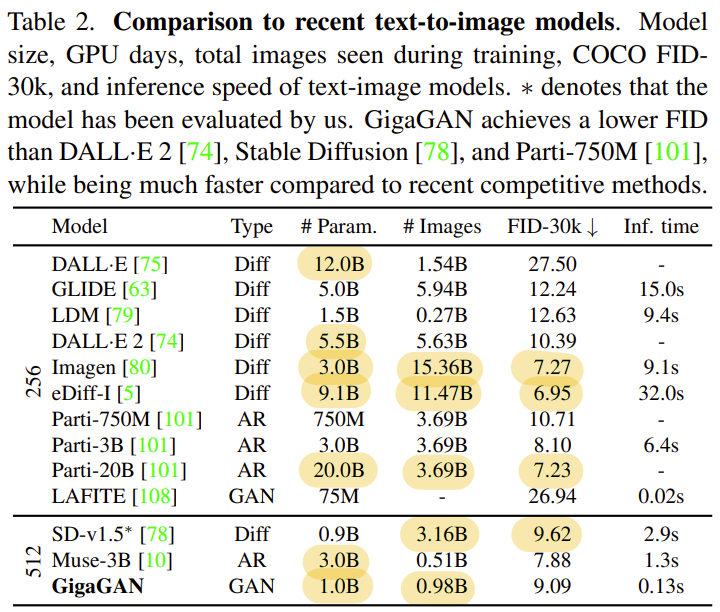

# Scaling up GANs for Text-to-Image Synthesis

- https://arxiv.org/abs/2303.05511
- POSTECH, CMU, Adobe Research
- GigaGAN
- models
  - (class to image)
    - ImageNet 64
    - ImageNet 64 → 256 
  - (text to image)
    - LAION&COYO 64
    - LAION&COYO 64 → 512 
  - (super resolution)
    - ImageNet 64 → 256 
- trained on A100 32~128 GPUs

## 1 Introduction

- Training StyleGAN2 is not stable when it comes to scaling up

## 2 Related works

(skipped)

## 3 Method

### 3.1 Modeling complex contextual interaction

##### Sample adaptive kernel selection

$$
K = \sum\limits_{i=1}^{N} K_i \cdot \operatorname{softmax}(W_\text{filter}^T \mathbf{w} + b_\text{filter})_i
\tag{1}
$$

where

- $N$: the number of filters in a bank
- $K \in \mathbb{R}^{c_\text{in} \times c_\text{out} \times K \times K}$

$$
g_\text{adaconv}(\mathbf{f}, \mathbf{w}) = ((W_\text{mod}^T \mathbf{w} + b_\text{mod}) \otimes K) * \mathbf{f}
\tag{2}
$$
where

- $\otimes$
  - (de-) modulation
- $*$
  - convolution
- $\mathbf{w} \in \mathbb{R}^d$
  - style vector
- $\mathbf{f} \in \mathbb{R}^{c_\text{in}}$
  - input feature for each layer

##### Interleaving attention with convolution

- apply L2 self-attention along with
  - equalized learning rate 🤔
    - https://youtu.be/XwUTJhKRVl8?t=298
    - hyper parameters
      - $\alpha$
        - gain
        - the default value is $1$ as in StyleGAN2
      - $\beta$
        - learning rate multiplier
        - e.g. StyleGAN/StyleGAN2
          - 0.01 for the mapping network
          - 1 for the generator and the discriminator
    - weight  initialization
      - $N(0, {1 \over \beta})$
    - runtime weight scaler
      -  $\alpha \beta \over \sqrt{\text{fan\_in}}$
        - where $fan\_in$ is the number of inputs
    - runtime bias scaler: $\beta$
    - parameters are used after scaling but it doesn't mean they are updated
  - unit normal initialization
  - scale down the L2 distance logits to roughly match the unit normal distribution at initialization
  - reduce the residual gain from the attention layer 🤔
  - tie the key and query matrix 🤔
  - apply weight decay (such as L2 regularization)

### 3.2 Generator design

##### Text and latent-code conditioning

$$
(\mathbf{t}_\text{local}, \mathbf{t}_\text{global}) = T(\mathcal{E}_\text{txt}(\mathbf{c}))
\tag{3a}
$$

$$
\mathbf{w} = M(\mathbf{z}, \mathbf{t}_\text{global})
\tag{3b}
$$

where

- $C = 77$
  - the number of words in the input prompt padded
- $\mathbf{c} \in \mathbb{R}^{C \times 1024}$
  - conditioning vector
- $\mathcal{E}_\text{txt}(\cdot)$
  - features from the penultimate layers of the CLIP text encoder 
- $T(\cdot)$
  - additional attention layers
- $\mathbf{t}_\text{local} = \mathbf{t}_{\{1:C\}\setminus\text{EOT}} \in \mathbb{R}^{(C-1) \times 1024}$
- $\mathbf{t}_\text{global} = \mathbb{R}^{1024}$
  - the embedding of EOT

$$
\mathbf{x} = \tilde{G}(\mathbf{w}, \mathbf{t}_\text{local})
\tag{4}
$$

where

- $\tilde{G}$
  - the synthesis network

##### Synthesis network

$$
\mathbf{f}_{\ell+1} = g_\text{xa}^\ell(g_\text{attn}^\ell(g_\text{adaconv}^\ell(\mathbf{f}_\ell, \mathbf{w}), \mathbf{w}), \mathbf{t}_\text{local})
\tag{5}
$$

where

- $g_\text{adaconv}^\ell$
  - weight (de-)modulation layer
- $g_\text{attn}^\ell$
  - self attention layer
- $g_\text{xa}^\ell$
  - cross attention layer

### 3.3 Discriminator design

##### Text conditioning

##### Multiscale image processing

##### Multiscale input, multi-scale output adversarial loss

$$
\mathcal{V}_\text{MS-I/O}(G, D) =
\sum\limits_{i=0}^{L - 1}
\sum\limits_{j=i+1}^L
\mathcal{V}_\text{GAN}(G_i, D_{ij}) +
\mathcal{V}_\text{match}(G_i, D_{ij})
\tag{6}
$$

where

- $L = 5$
  - the number of scale level in the pyramid outputs of the generator

$$
D_{ij}(\mathbf{x}, \mathbf{c}) = \psi_j(\phi_{i \to j}(\mathbf{x}_i), \mathbf{t}_D) + \operatorname{Conv}_{1 \times 1}(\phi_{i \to j}(\mathbf{x}_i))
\tag{7}
$$
where

- $\mathbf{t}_D$
  - text conditioning
- $\phi$
  - image processing function
- $\psi$
  - comparison function between real and fake features

##### Matching-aware loss

$$
\mathcal{V}_\text{match} = 
\mathbb{E}_{\mathbf{x}, \mathbf{c}, \hat{\mathbf{c}}}
\left[
\log(1 + \exp(D(\mathbf{x}, \hat{\mathbf{c}}))) +
\log(1 + \exp(D(G(\mathbf{c}), \hat{\mathbf{c}})))
\right]
\tag{8}
$$

where

- $\mathbf{c}$
  - conditioning vector
- $\hat{\mathbf{c}}$
  - a random conditioning vector sampled from $p_\text{data}$

##### Clip contrastive loss

$$
\mathcal{L}_\text{CLIP} = \mathbb{E}_{\{\mathbf{c}_n\}}
\left[
- \log{\frac
{\exp(\mathcal{E}_\text{img}(G(\mathbf{c}_0))^T \mathcal{E}_\text{txt}(\mathbf{c}_0))}
{\sum_n \exp(\mathcal{E}_\text{img}(\mathbf{c}_0)^T \mathcal{E}_\text{txt}(\mathbf{c}_n))}
}
\right]
\tag{9}
$$

##### Vision-aided adversarial loss ⭐

- Refer to
  - Projected GAN 🤔
    - project generated and real samples into a fixed, pretrained feature space
  - Vision-Aided GAN 🤔
    - https://paperswithcode.com/method/vision-aided-gan
    - backbone used: `CLIP-ViT-B/32-V`

Final loss:
$$
\mathcal{V}(G, D) = \mathcal{V}_\text{MS-I/O}(G, D) + \mathcal{L}_\text{CLIP}(G) + \mathcal{L}_\text{Vision}(G)
$$

### 3.4 GAN-based upsampler

- asymmetric U-Net
- loss function includes LPIPS perceptual loss

## 4 Experiments

### 4.1 Training and evaluation details

### 4.2 Effectiveness of proposed components

### 4.3 Text-to-image synthesis

### 4.4 Comparison with distilled diffusion models
### 4.5 Super-resolution for large-scale image synthesis
### 4.6 Controllable image synthesis

## 5 Discussion and limitations

## References

- [43] The Lipschitz Constant of Self-Attention ⭐
- [44] Vision-Aided GAN ⭐
- [50] ViTGAN ⭐
- [63] GLIDE
- [74] DALL·E 2
- [75] DALL·E
- [80] Imagen
- [84] Projected GAN ⭐
- [101] Parti

## A Training and evaluation details

