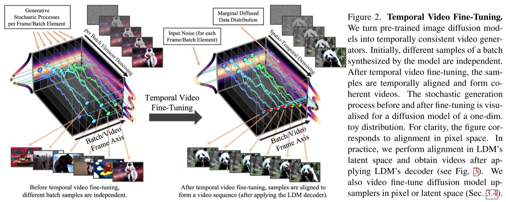
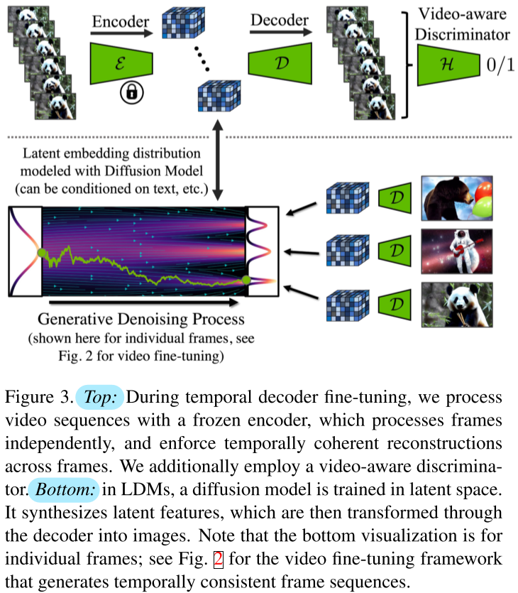
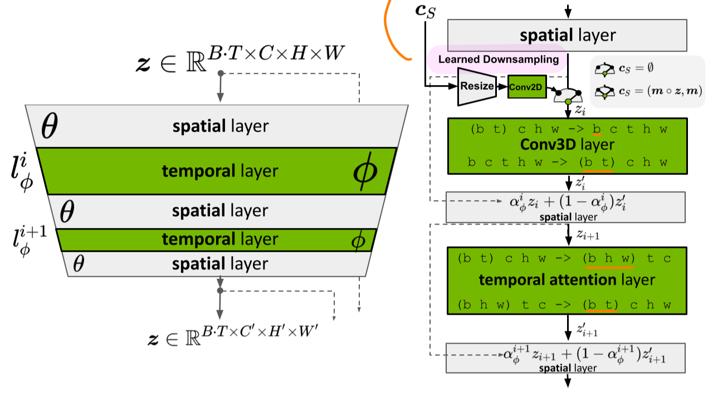
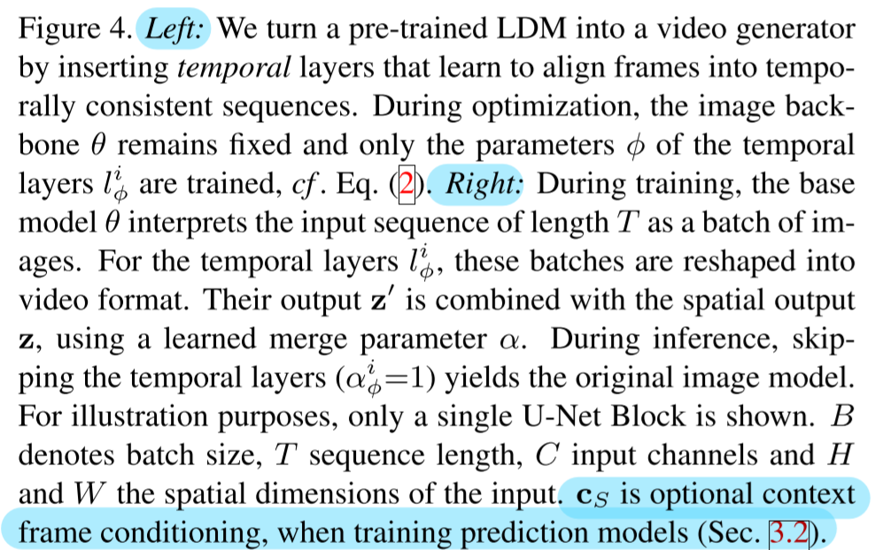

# Align your Latents: High-Resolution Video Synthesis with Latent Diffusion Models

- https://arxiv.org/abs/2304.08818
- https://research.nvidia.com/labs/toronto-ai/VideoLDM/
- CVPR 2023
- I guess Stable Video Diffusion is mostly based on this paper

## Summary

- $\tau$
  - diffusion time
- $t$
  - frame index
- models
  - Video-LDM
    - spatial layers $l_\theta^i$
      - the same as plain LDM's layers
      - treats temporal features as batches
    - temporal layers $l_\phi^i$
      - consists of
        - 3d-conv
        - temporal attention
      - uses positional encoding for time
      - interleaved with the existing spatial layers
    - finetuned VAE decoder
      - with temporal layers introduced
  - prediction models
    - for long term generation
    - $\mathbf{c}_S = (\mathbf{m}_S \circ \mathbf{z}, \mathbf{m}_S)$
      - first S={0, 1, 2} frames → VAE encoder → resize → conv2D 
      - fed into "temporal" layers $l_\phi^i$
        - in the corresponding places
        - so that they can be referred to the other frames
  - interpolation models
    - for high frame rates
      - T → 4T
    - works in the same way as of prediction models
  - (SR models)
    - noise augmentation is used with noise level conditioning
    - training on patches
    - types
      - `pixel space DM`
      - `LDM upsampler`
- training stages
  - train Video-LDM with images
    - or just use pretrained LDM such as Stable Diffusion
    - the temporal blocks are skipped in this stage by setting $\alpha_\phi^i=1$
  - train only temporal layers with videos
    - the spatial layers are frozen at this time
  - finetune VAE decoders
- inference
  - context guidance ⭐
    - CFG with respect to $\mathbf{c}_S$
    - $S$
      - conditioning frames
    - $s \ge 1$
      - guidance scale

$$
\mathbf{f}_{\theta,\phi}^\prime(\mathbf{z}_\tau; \mathbf{c}_S) =
\mathbf{f}_{\theta,\phi}(\mathbf{z}_\tau; \mathbf{c}_S) +
s \cdot \left(
  \mathbf{f}_{\theta,\phi}(\mathbf{z}_\tau; \mathbf{c}_S) -
  \mathbf{f}_{\theta,\phi}^\prime(\mathbf{z}_\tau; \mathbf{c}_S)
\right)
\tag{4}
$$

- datasets
  - in-house real driving scene (RDS) videos
    - 683,060 samples
    - 8 seconds
    - 512x1024
    - 30fps
  - WebVid-10M
    - video-caption pairs
    - total 52K video hours
  - Mountain biking dataset
