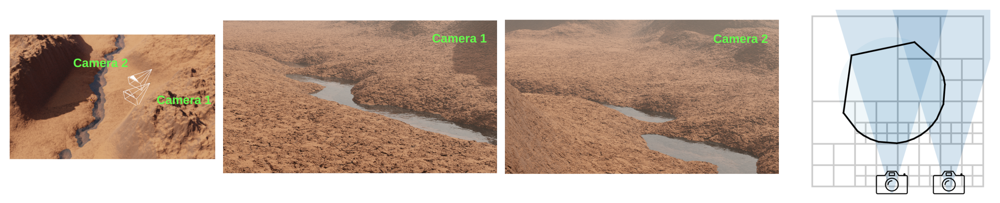

# Infinite Photorealistic Worlds using Procedural Generation

- https://arxiv.org/abs/2306.09310
- CVPR2023
- https://github.com/princeton-vl/infinigen

## Tasks

### generate_nature.py

(per scene)
- coarse
  - generate coarse terrain shape
    - resolution
      - 1m
      - 150m x 150m
  - put placeholders for creatures/trees/obstacles
- populate
  - replace the placeholders with unique detailed assets

(per camera)

- fine_terrain
  - resolution
    - 0.2m~20m
    - 1000m x 1000m
- render
- ground_truth
- (etc)
  - mesh_save
  - export

## Configuration

https://github.com/princeton-vl/infinigen/blob/main/docs/ConfiguringInfinigen.md

- `infinigen_examples/generate_nature.py`
  - Configurable via `--pipeline_configs`
  - Overwrites `infinigen_examples/configs_nature/base.gin`
  - use `simple.gin` reduces details for the low spec machiens
  - can use a specific scene type e.g. `desert.gin`
    - in `infinigen_examples/configs_nature/scene_types/`
- `manage_jobs.py`
  - Configurable via `--configs`
  - uses `infinigen_examples/generate_nature.py` as a driver script

## Rendering

Call graph

- generate_nature.main()
- execute_tasks.main()
- execute_tasks.render()
- render.render_image()

etc.

- the ground truth types are set by `passes_to_save`
- it's configured by `base.gin`

## OcMesher

- https://github.com/princeton-vl/OcMesher
- 👉 [2023 View-Dependent Octree-based Mesh Extraction in Unbounded Scenes for Procedural Synthetic Data](https://arxiv.org/abs/2312.08364)

## Marching cubes

- used to make clouds in Infinigen
- voxelization
  - point cloud ➡️ binary voxels
- `scipy.ndimage.distance_transform_edt()`
  - binary voxels ➡️ an array of distances
  - from non-zero to the closest zeros
- marching cubes
  - an array of distances ➡️ mesh

## Folders and files

### infinigen/

- assets/
  - (assets inherit AssetFactory and decorated by `@gin.configurable`)
- core/constraints/
- core/nodes/
  - Blender의 shader/geometry 노드등 "노드" 관리
- core/placement/
- core/placement/density.py
- core/placement/factory.py
  - `AssetFactory` ⭐
    - spawn_placeholder()
    - spawn_asset()
  - make_asset_collection()
- core/rendering/render.py
  - render_image()
- core/util/blender.py
  - `GarbageCollect`
    - (clean up `bpy.data`)
- core/util/pipeline.py
  - `RandomStageExecutor`
    - (run with a seed and a Blender garbage collector)
- core/execute_tasks.py
  - main()
  - execute_tasks()
- core/init.py
- core/generator.py
- core/surface.py
- core/tagging.py
- core/tags.py
- datagen/customgt/
  - (opengl과 blender에서 shader를 다루는 코드로 보임)
    - 동물 날개, 털등을 표현할때 사용하는 것으로 보임
- datagen/customgt/dependencies/
  - https://github.com/p-ranav/argparse
  - https://github.com/nlohmann/json
  - (npy in c)
    - https://github.com/rogersce/cnpy
  - (linear algebra)
    - https://gitlab.com/libeigen/eigen
  - (math for opengl)
    - https://github.com/g-truc/glm
  - (abstraction layer on opengel, vulkan, etc.)
    - https://github.com/glfw/glfw
  - (image utils)
    - https://github.com/nothings/stb
- infinigen_gpl/
- OcMesher/
- terrain/core.py
  - Terrain ⭐
    - coarse_terrain()
- tools/
- launch_blender.py ⭐
  - The entry point of the Blender python script mode

### infinigen_example/

- generate_nature.py
  - main()
  - compose_nature()
  - populate_scene()

### scripts/

- install/
- launch/
- (just for the license issue)
  - https://github.com/princeton-vl/infinigen_gpl.git
- (configuration)
  - https://github.com/google/gin-config
- (c++)

## Performance table

- `coarse` with `simple.gin`
  - 960x540
  - gen06, cpu
    - 6m05s
- `coarse`
  - creates caves, mountains,
  - 1280x720
  - gen06 , cpu
    - 28m52s

## Slurm

- https://slurm.schedmd.com/
  - cluster management
  - job scheduling
- similar to Ray in a way
- python interface
  - https://github.com/facebookincubator/submitit
