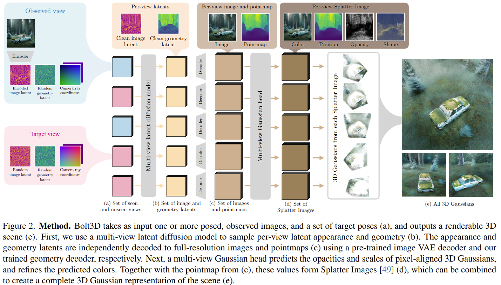

# Bolt3D: Generating 3D Scenes in Seconds

- https://arxiv.org/abs/2503.14445
- written by
  - Google Research
  - VGG, University of Oxford
  - Google DeepMind

## 1 Introduction

- dataset
  - created using SfM called MASt3R (ICCV 2024)
- LDM
  - finetune CAT3D
  - condition
    - camera
- Geometry VAE
  - outputs
    - colors
    - position
    - camera poses
- Gaussian Head Network
  - training
    - rendering loss
  - input
    - images
    - geometry maps
    - camera poses
  - outputs
    - opacity
    - shape

## 2 Related work

## 3 Method

## 4 Experiments

## 5 Discussion

## References

- [12] CAT3D
  - https://cat3d.github.io/
- [24] MASt3R
- 

## A Proof of formula 1

## B Proof of formula 2
