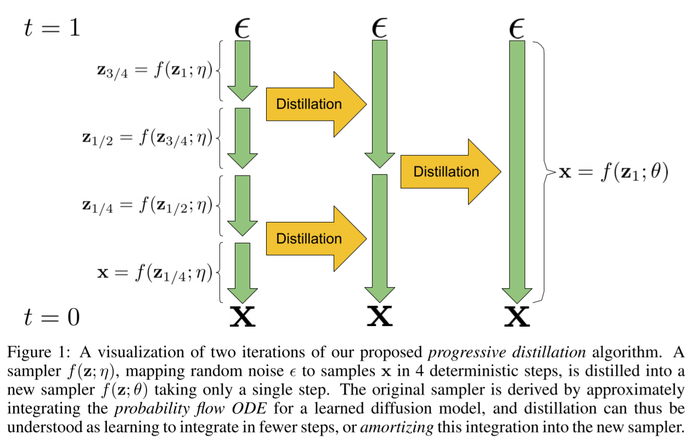
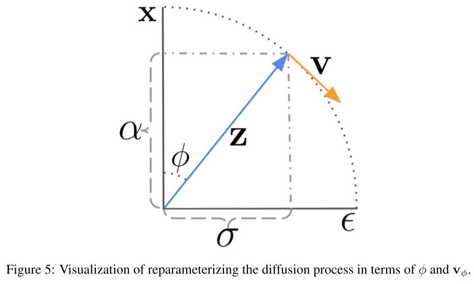

# Progressive Distillation for Fast Sampling of Diffusion Models

- https://arxiv.org/abs/2202.00512
- https://github.com/google-research/google-research/tree/master/diffusion_distillation
- Tim Salimans, Jonathan Ho
- Google Research

## 1 Introduction

(skipped)

## 2 Background on diffusion models

## 3 Progressive distillation

## 4 Diffusion model parameterization and training loss

## 5 Experiments

## 6 Related work on fast sampling

## 7 Discussion

## References

## A probability flow ODE in terms of log-SNR

## B DDIM is an integrator of the probability flow ODE

## D Expression of DDIM in angular parameterization

- $\phi_t = \arctan(\sigma_t / \alpha_t)$
- $\alpha_\phi ^ 2 + \sigma_\phi^2 = 1$
  - assuming DDPM or VP SDE
- $\mathbf{z}_\phi = \alpha_\phi \mathbf{x} + \sigma_\phi \mathbf{\epsilon}$ 
- $\alpha_{\phi} = \cos(\phi)$
- $\sigma_\phi = \sin(\phi)$
- $\mathbf{v}_\phi \equiv {d\mathbf{z}_\phi \over d\phi} = \alpha_\phi \mathbf{\epsilon} - \sigma_\phi \mathbf{x} = \cos(\phi)\mathbf{\epsilon} - \sin(\phi)\mathbf{x}$
  - the velocity of $\mathbf{z}$
- $\mathbf{x} = \alpha_\phi\mathbf{z}_\phi - \sigma_\phi\mathbf{v}_\phi = \cos(\phi)\mathbf{z}_\phi - \sin(\phi)\mathbf{v}_\phi$ 
- $\mathbf{\epsilon} = \sigma_\phi \mathbf{z}_\phi  +  \alpha_\phi \mathbf{v}_\phi = \sin(\phi) \mathbf{z}_\phi  +  \cos(\phi) \mathbf{v}_\phi$

- $\hat{\mathbf{v}}_\theta \equiv \cos(\phi) \hat{\mathbf{\epsilon}}_\theta(\mathbf{z}_\phi) - \sin(\phi) \hat{\mathbf{x}}_\theta (\mathbf{z}_\phi)$
- $\hat{\mathbf{\epsilon}}_\theta = (\mathbf{z}_\phi - \cos(\phi)\hat{\mathbf{x}}_\theta (\mathbf{z}_\theta)) / \sin(\phi)$

(Rewriting the DDIM update rule)

TODO