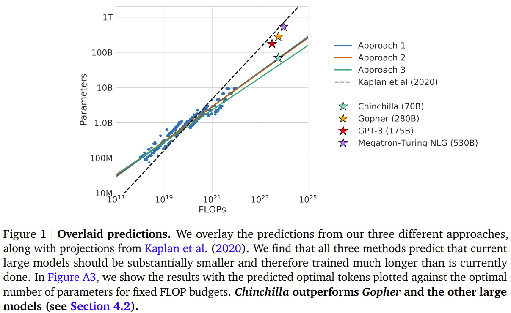
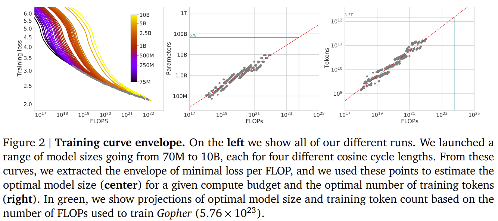

# Training Compute-Optimal Large Language Models

- https://arxiv.org/abs/2203.15556
- Jordan Hoffmann, Sebastian Borgeaud, Arthur Mensch et al.
- Chinchilla

## 1 Introduction

## 2 Related work

## 3 Estimating the optimal parameter/training tokens allocation

### 3.1 Approach 1: fix model sizes and vary number of training tokens

### 3.2 Approach 2: IsoFLOP profiles

### 3.3 Approach 3: Fitting a parametric loss function

### 3.4 Optimal model scaling

## 4 Chinchilla

### 4.1 Model and training details

### 4.2 Results

#### 4.2.1 Language modeling

#### 4.2.2 MMLU

#### 4.2.3 Reading comprehension

#### 4.2.4 BIG-bench

#### 4.2.5 Common sense

#### 4.2.6 Closed-book question answering

#### 4.2.7 Gender bias and toxicity

## 5 Discussion and conclusion

## References

## A Training dataset

## B Optimal cosine cycle length

## C Consistency of scaling results across datasets

## D Details on the scaling analyses

## E Curvature of FLOP-loss frontier

## F FLOPs computation

## G Other differences between Chinchilla and Gopher

## H Results

## I Model card

## J List of trained models

