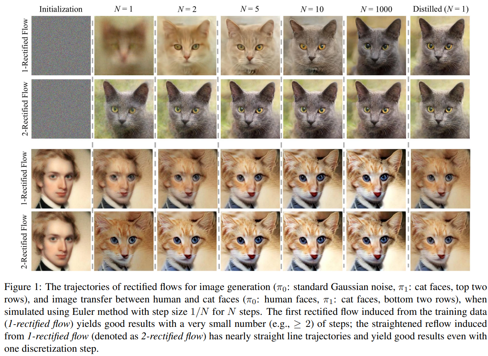
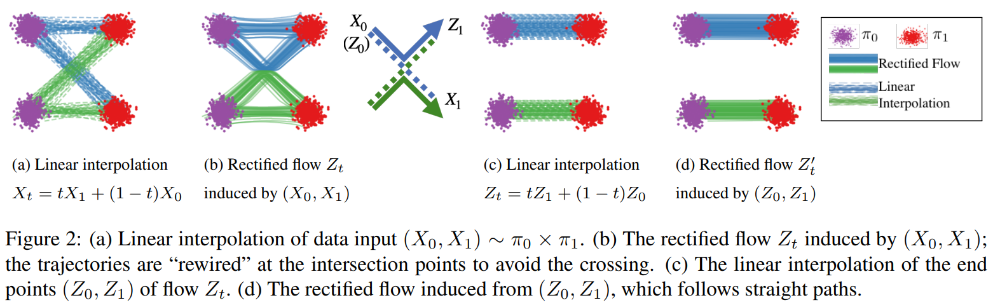
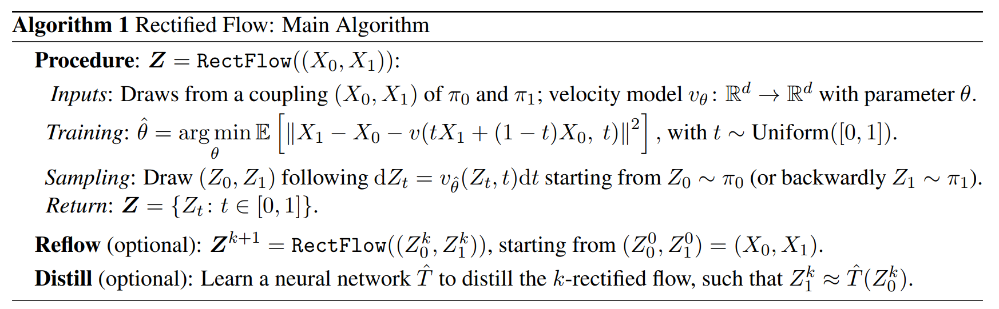
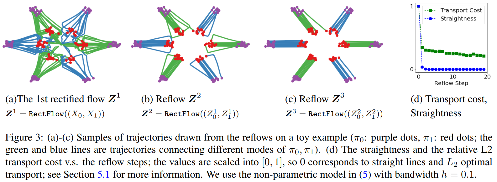

# Flow Straight and Fast: Learning to Generate and Transfer Data with Rectified Flow

- https://arxiv.org/abs/2209.03003
- ICLR 2023 Spotlight paper
- https://github.com/gnobitab/RectifiedFlow

## 1 Introduction

- start with random pairs
- learn velocity field

## 2 Method
### 2.1 Overview

#### Rectified flow

#### Flow avoid crossing

#### Rectified flows reduce transport costs

#### Straight line flows yield fast simulation

### 2.2 Main results and properties

$$
v^X(x, t) = \mathbb{E}\left[ X_1 - X_0 \vert X_t = x\right]
\tag{2}
$$

#### Marginal preserving property ⭐

#### Reducing transport costs

#### Reflow, straightening, fast simulation

### 2.3 A nonlinear extension

## 3 Theoretical analysis
### 3.1 The marginal preserving property
### 3.2 Reducing convex transport costs
### 3.3 The straightening effect
### 3.4 Straight vs optimal couplings
### 3.5 Denoising diffusion models and probability flow ODEs

## 4 Related works and discussion

## 5 Experiments
### 5.1 Toy examples
### 5.2 Unconditioned image generation
### 5.3 Image-to-image translation
### 5.4 Domain adaptation

## References

## A Additional experiment details