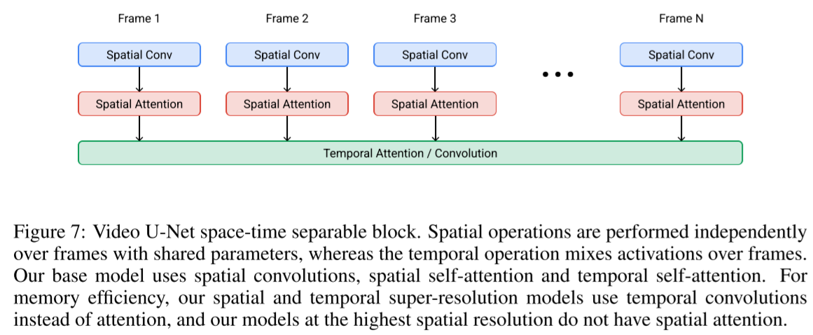

# Imagen Video: High Definition Video Generation with Diffusion Models

- Jonathan Ho et al.
- google research
- text-to-video
- cascaded video diffusion models
- additional methods
  - v-prediction
  - progressive distillation
  - classifier free guidance

(comparison table)

|                                      | Imagen Video                    | Video Diffusion Models              | Make-A-Video                         | Flexible Diffusion Modeling of Long Videos |
| ------------------------------------ | ------------------------------- | ----------------------------------- | ------------------------------------ | ------------------------------------------ |
| summary                              | cascaded video diffusion models |                                     | use a pretrained text-to-image model |                                            |
| spatial resolution                   | 1280x768                        | 128x128                             | medium                               | low                                        |
| temporal length                      | 128 frames                      | 64 frames                           | short                                | 25 mins                                    |
| training set                         | (text, video)                   | (text, video)                       | (text, image), (video)               |                                            |
| text embeddings                      | T5-XXL                          | BERT-large                          |                                      |                                            |
| parameterization                     | v-prediction                    | $\epsilon$-prediction, v-prediction |                                      |                                            |
| progressive distillation             | O                               | X                                   |                                      |                                            |
| classifier free guidance             | O                               | O                                   |                                      |                                            |
| encoder/decoder to/from latent space | ?                               | X                                   | ?                                    | ?                                          |

## 1 Introduction

## 2 Imagen video

### 2.1 Diffusion models

- $\mathbf{z} = \{\mathbf{z}_t | t \in [0, 1]\}$
  - a set of latent variables
- $\mathbf{x} \sim p(\mathbf{x})$
  - data
- $q(\mathbf{z}|\mathbf{x})$
  -  a forward process
  - starting at $\mathbf{x}$
- $q(\mathbf{z}_t|\mathbf{x}) = \mathcal{N}(\mathbf{z}_t; \alpha_t \mathbf{x}, \sigma_t^2 \mathbf{I})$
- $\alpha_t, \sigma_t$
  - a differentiable noise schedule
- $\lambda_t = \log [\alpha_t^2 / \sigma_t ^2]$
  - log signal-to-noise-ratio
  - decreases with $t$
- $q(\mathbf{z}_t|\mathbf{z}_s) = \mathcal{N}(\mathbf{z}_t; (\alpha_t/\alpha_s)\mathbf{z}_s, \sigma_{t|s}^2 \mathbf{I})$
  - where
    - $0 \le s \lt t \le 1$
    - $\sigma_{t|s}^2 = (1 - e^{\lambda_t - \lambda_s})\sigma_t^2$
- $q(\mathbf{z}_1) \approx \mathcal{N}(\mathbf{0}, \mathbf{I})$
  - note that $1$ is the biggest $t$ value when defining $\mathbf{z}$

##### Training

- $\hat{\mathbf{x}}_\theta := \hat{\mathbf{x}}_\theta(\mathbf{z_t}) := \hat{\mathbf{x}}_\theta(\mathbf{z}_t, \lambda_t)$
  - denoising model
- $\hat{\mathbf{x}}_\theta(\mathbf{z}_t, \mathbf{c}_t)$
  - conditional denoising model
  - for spatial and temporal super-resolution
  - also for text conditions

- $p(\mathbf{z}_t)$
  - a marginal distribution
  - the true density of $\mathbf{z}_t$ under $\mathbf{x} \sim p(\mathbf{x})$

(theoretical training object)
$$
\mathbb{E}_{\boldsymbol{\epsilon}, t} \left[w(\lambda_t) \Vert \hat{\mathbf{x}}_\theta (\mathbf{z}_t) - \mathbf{x} \Vert_2^2 \right] \tag{2}
$$

- where $t \sim \mathcal{U}_{[0, 1]}$

(practical training object)

- $t$ is sampled according to a cosine schedule
- $\boldsymbol{\epsilon}$-prediction
  - (not used in this work)
  - $\hat{\mathbf{x}}_\theta(\mathbf{z}_t) = (\mathbf{z}_t - \sigma_t \boldsymbol{\epsilon}_\theta(\mathbf{z}_t))$
  - $\boldsymbol{\epsilon}_\theta(\mathbf{z}_t) \approx - \sigma_t \nabla_{\mathbf{z}_t} \log p(\mathbf{z}_t)$
  
- $\mathbf{v}$-prediction
  - $\mathbf{v}_t := \alpha_t \boldsymbol{\epsilon} - \sigma_t\mathbf{x}$
    - velocity of $\mathbf{z}_t$ with respect to $\phi_t = \arctan(\sigma_t / \alpha_t)$

##### Ancestral sampler

- $q(\mathbf{z}_s|\mathbf{z}_t, \mathbf{x}) = \mathcal{N}(\mathbf{z}_s; \tilde{\mathbf{\mu}}_{s|t}(\mathbf{z}_t, \mathbf{x}), \tilde{\sigma}_{s|t}^2 \mathbf{I})$
  - the forward process described in reverse
  - $ s \lt t$

- where

$$
\tilde{\mathbf{\mu}}_{s|t}(\mathbf{z}_t, \mathbf{x})\tag{3a} = e^{\lambda_t - \lambda_s}(\alpha_s / \alpha_t) \mathbf{z}_t + (1 - e^{\lambda_t - \lambda_s})\alpha_s \mathbf{x}
$$

$$
\tilde{\sigma}_{s|t}^2 \tag{3b} = (1 - e^{\lambda_t - \lambda_s})\sigma_s^2
$$

$$
\mathbf{z}_s = \tilde{\mu}_{s|t} (\mathbf{z}_t, \hat{\mathbf{x}}_\theta(\mathbf{z}_t)) + \sqrt{(\tilde{\sigma}_{t|s}^2)^{1 - \gamma}(\sigma_{t|s}^2)^\gamma}\boldsymbol{\epsilon} \tag{4}
$$

- starting at $\mathbf{z}_1 \sim \mathcal{N}(\mathbf{0}, \mathbf{I})$
- $\boldsymbol{\epsilon} \sim \mathcal{N}(\mathbf{0}, \mathbf{I})$
- note that $\hat{\mathbf{x}}_\theta(\mathbf{z}_t)$ is used unlikely to DDPM
- $\gamma$ 
  - a hyperparameter that controls the stochasticity of the sampler inspired by `iDDPM`

##### Deterministic DDIM sampler

- can be seen as a numerical integration rule for "the probability flow ODE" (of the score SDE paper)

### 2.2 Cascaded diffusion models and text conditioning

- train low resolution models with 
  - spatial resizing
  - frame skipping
- generate an entire block of frames simultaneously ⭐
  - so the SSR models do not suffer from obvious artifacts that would occur from naively running super-resolution on independent frames

### 2.3 Video diffusion architectures

- networks are built on video U-Net from "Video Diffusion Models"
- conditioned on
  - images upsampled by the bilnear resizing
  - frames upsampled by repeating them
- composition
  - base model
    - temporal attention
    - spatial attention + spatial convolution
  - TSR
    - temporal convolution
  - SSR
    - temporal convolution
    - spatial attention + spatial convolution
  - SSR
    - temporal convolution
    - spatial attention + spatial convolution
  - TSR
    - temporal convolution
  - TSR
    - temporal convolution
  - SSR
    - spatial convolution

### 2.4 v-prediction

- better numerical stability
  - enables progressive distillation
- less color shifting artifacts over time
- faster convergence of sample quality metrics

### 2.5 Conditioning augmentation

- for super resolution models augment the conditional low resolution inputs
- it reduces the sensitivity to domain gap between the cascade stages
- how?
  - train with Gaussian noise augmentation applied to the conditional image
    - use a randomly sampled SNR ratio
    - TODO
      - which method is this among - blurring, truncated, non truncated, ...?
  - for inference use a fixed SNR ratio such as 3 or 5

### 2.6 Video-image joint training

TODO

#### 2.6.1 Classifier free guidance

TODO
$$
\tilde{\boldsymbol{\epsilon}}_\theta (\mathbf{z}_t, \mathbf{c}) = (1 + w) \boldsymbol{\epsilon}_\theta(\mathbf{z}_t, \mathbf{c}) - w \boldsymbol{\epsilon}_\theta(\mathbf{z}_t)
$$

- where
  - $w$
    - guidance strength
  - $\boldsymbol{\epsilon}_\theta (\mathbf{z}_t)$
    - an unconditional prediction
  - $\boldsymbol{\epsilon}_\theta (\mathbf{z}_t, \mathbf{c})$
    - a regular conditional prediction
  - $\tilde{\boldsymbol{\epsilon}}_\theta (\mathbf{z}_t, \mathbf{c})$
    - a conditional prediction with $\mathbf{c}$ over-emphasized

#### 2.6.2 Large guidance weights

TODO

### 2.7 Progressive distillation with guidance and stochastic samplers

TODO

## 3 Experiments

### 3.1 Unique video generation capabilities

### 3.2 Scaling

### 3.3 Comparing prediction parameterizations

### 3.4 Perceptual quality and distillation

## 4 Limitations and societal impact

## 5 Conclusion

## References

