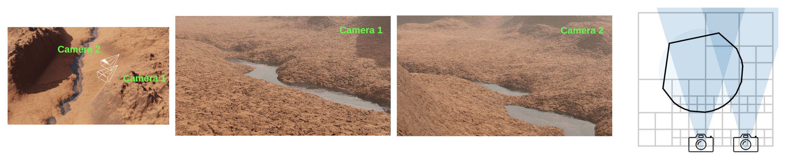

[TOC]

# Infinite Photorealistic Worlds using Procedural Generation

## 0. Source code

https://github.com/princeton-vl/infinigen

### Questions / TODO

- how to make a desert scene?
- read https://github.com/princeton-vl/infinigen/blob/main/docs/ConfiguringInfinigen.md
- analyze example codes more

### Steps

what makes placeholder are not rendered?

take a look at the geometry nodes created in the Blender files.

What does each step in `generate_nature.py` mean?

- coarse
- populate
- fine_terrain
- ground_truth
- render
- mesh_save
- export

### Configuration

https://github.com/princeton-vl/infinigen/blob/main/docs/ConfiguringInfinigen.md

TBD

`base_nature.gin`

### OcMesher

- https://github.com/princeton-vl/OcMesher
- 👉 [2023 View-Dependent Octree-based Mesh Extraction in Unbounded Scenes for Procedural Synthetic Data](https://arxiv.org/abs/2312.08364)

### Marching cubes

- used to make clouds in Infinigen
- voxelization
  - point cloud ➡️ binary voxels
- `scipy.ndimage.distance_transform_edt()`
  - binary voxels ➡️ an array of distances 
  - from non-zero to the closest zeros
- marching cubes
  - an array of distances ➡️ mesh

### Folders and files

#### infinigen/

- assets/
  - (assets inherit AssetFactory and decorated by `@gin.configurable`)
- core/constraints/
- core/nodes/
  - Blender의 shader/geometry 노드등 "노드" 관리
- core/placement/
- core/placement/density.py
- core/placement/factory.py
  - `AssetFactory` ⭐
    - spawn_placeholder()
    - spawn_asset()
  - make_asset_collection()
    - 
- core/rendering/
- core/util/blender.py
  - `GarbageCollect`
    - (clean up `bpy.data`)
- core/util/pipeline.py
  - `RandomStageExecutor`
    - (run with a seed and a Blender garbage collector)
- core/execute_tasks.py
- core/init.py
- core/generator.py
- core/surface.py
- core/tagging.py
- core/tags.py
- datagen/customgt/
  - (opengl과 blender에서 shader를 다루는 코드로 보임)
    - 동물 날개, 털등을 표현할때 사용하는 것으로 보임
- datagen/customgt/dependencies/
  - https://github.com/p-ranav/argparse
  - https://github.com/nlohmann/json
  - (npy in c)
    - https://github.com/rogersce/cnpy
  - (linear algebra)
    - https://gitlab.com/libeigen/eigen
  - (math for opengl)
    - https://github.com/g-truc/glm
  - (abstraction layer on opengel, vulkan, etc.)
    - https://github.com/glfw/glfw
  - (image utils)
    - https://github.com/nothings/stb
- infinigen_gpl/
- OcMesher/
- terrain/core.py
  - Terrain ⭐
    - coarse_terrain()
- tools/
- launch_blender.py ⭐
  - The entry point of the Blender python script mode

#### infinigen_example/

- 

#### scripts/

- install/
- launch/

- (just for the license issue)
  - https://github.com/princeton-vl/infinigen_gpl.git
- (configuration)
  - https://github.com/google/gin-config
- (c++)

## 1 Introduction

## 2 Related work

## 3 Method

## 4 Experiments

## 5 Discussion

## References

## A Proof of formula 1

## B Proof of formula 2
