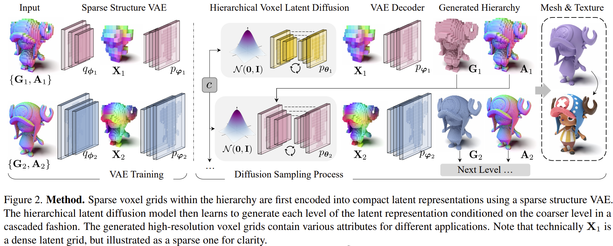
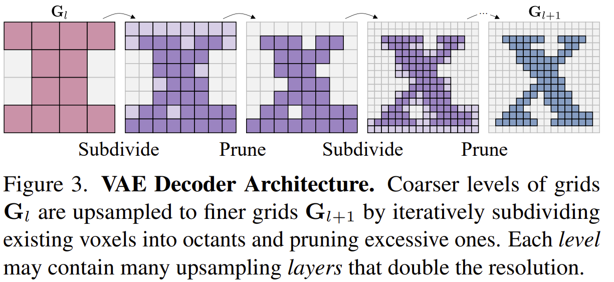

# XCube: Large-Scale 3D Generative Modeling using Sparse Voxel Hierarchies

- CVPR 2024 Highlight
- https://research.nvidia.com/labs/toronto-ai/xcube/
- https://github.com/nv-tlabs/XCube
- 3D VAE
- diffusers
- sparse conv
  - TorchSparse++

- $\mathbf{G}_1$
  - voxel grid at level 1
- $\mathbf{A}_1$
  - per-voxel attributes at level 1
- $\mathbf{X}_1$
  - latent feature at level 1
- $q_{\phi_1}$
  - 3D VAE encoder at level 1
- $p_{\varphi_1}$
  - 3D VAE decoder at level 1

## 1 Introduction

## 2 Related work

## 3 Method

## 4 Experiments

## 5 Discussion

## References

## A Proof of formula 1

## B Proof of formula 2
