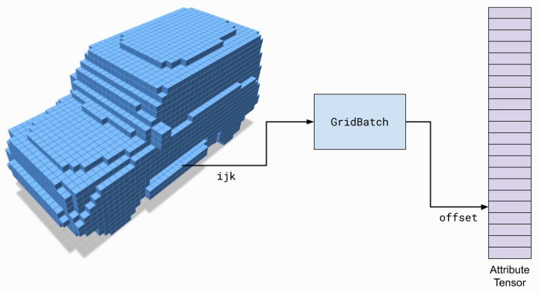
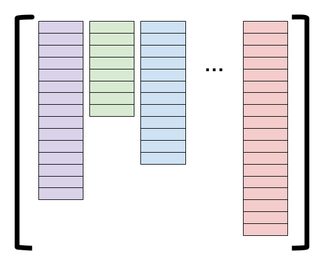
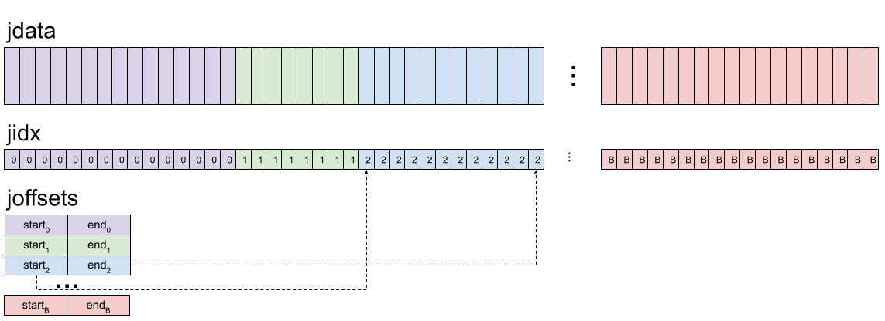

[TOC]

# fVDB: A Deep-Learning Framework for Sparse, Large-Scale, and High-Performance Spatial Intelligence

- https://arxiv.org/abs/2407.01781


## 1 Introduction

## 2 Related work

## 3 Method

## 4 Experiments

## 5 Discussion

## References

## A Proof of formula 1

## B Proof of formula 2

## Notes

### Tutorial

https://www.openvdb.org/documentation/fvdb/index.html

#### Basic Concepts

https://www.openvdb.org/documentation/fvdb/tutorials/basic_concepts.html

##### GridBatch

- an indexing structure
  - maps `ijk` coordinates to integer offsets
  - can be used to look up attributes in a tensor.



##### JaggedTensor

- support for (jagged) batches containing different numbers of elements
- `jdata`
- `jidx`
- `joffsets`





##### A simple example

```
import fvdb
from fvdb.utils.examples import load_car_1_mesh, load_car_2_mesh
import torch
import point_cloud_utils as pcu

# We're going to create a minibatch of two point clouds each of which
# has a different number of points
pts1, clrs1 = load_car_1_mesh(mode = "vn")
pts2, clrs2 = load_car_2_mesh(mode = "vn")

# Creating JaggedTensors: one for points and one for colors
points = fvdb.JaggedTensor([pts1, pts2])
colors = fvdb.JaggedTensor([clrs1, clrs2])

# Create a grid where the voxels each have unit sidelength
grid = fvdb.gridbatch_from_points(points, voxel_sizes=1.0)

# Indexing into a JaggedTensor returns a JaggedTensor
print(points[0].jdata.shape)
print(points[1].jdata.shape)

# Splat the colors into the grid with trilinear interpolation
# vox_colors is a JaggedTensor of per-voxel normas
vox_colors = grid.splat_trilinear(points, colors)

# Now let's generate some random points and sample the grid at those points
sample_points = fvdb.JaggedTensor([torch.rand(10_000, 3), torch.rand(11_000, 3)]).cuda()

# sampled_colors is a JaggedTensor with the same shape as sample_points with
# one color sampled from the grid at each point
sampled_colors = grid.sample_trilinear(sample_points, vox_colors)
```


#### Building Sparse Grids

https://www.openvdb.org/documentation/fvdb/tutorials/building_grids.html

TODO
