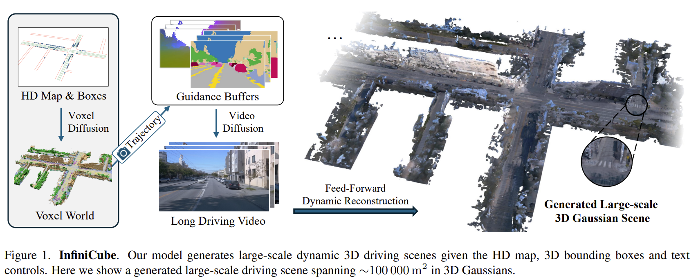
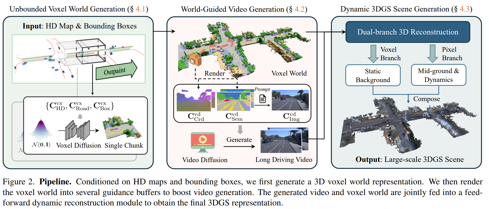

# InfiniCube: Unbounded and Controllable Dynamic 3D Driving Scene Generation with World-Guided Video Models

- NVIDIA
- https://arxiv.org/abs/2412.03934
- https://research.nvidia.com/labs/toronto-ai/infinicube/
- XCube
  - voxel world generation

- FLUX
  - initial image generation

- SVD
  - long video generation from the initial image

- SCube
  - large-scale 3d gaussian scene generation

## 1 Introduction

## 2 Related work

## 3 Method

## 4 Experiments

## 5 Discussion

## References

## A Proof of formula 1

## B Proof of formula 2
