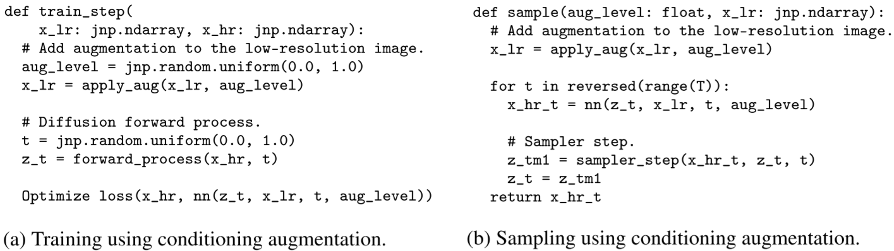

[TOC]

# Train diffusion models

## TODO

- Update details by referring to [Analyzing and Improving the Training Dynamics of Diffusion Models](https://arxiv.org/abs/2312.02696)
- Include details for [Rectified Flow](https://arxiv.org/abs/2209.03003) models
- Read and update taking account of the recent models e.g.
  - SD3.5 or Flux models (by 20250509)

## Target space

- latent vs pixel space
  - latent spaces are preferable
    - continuous space
      - VAE + GAN
        - where vector quantization is absorbed in the decoder
    - discrete space
      - VQGAN vector quantization and the diffusion model is going to be discrete as well
  - pixel space models are too expensive to train them
- notes
  - Gaussian noise makes the score function to be trained on the entire space
  - But in high dimensional spaces, the most samples are clustered around certain areas

## Data issues

### Small datasets

- overfitting
  - for small datasets, a large diffusion model may memorize the training samples
- augmentation regularization looks useful
  - augment data
  - and provide the augmentation parameters as conditions
  - Refer to these papers for more details.
    - [Distribution Augmentation for Generative Modeling (2020)](https://proceedings.mlr.press/v119/jun20a.html)
    - [Elucidating the Design Space of Diffusion-Based Generative Models (2022)](https://arxiv.org/abs/2206.00364)

### Videos

- Joint training on video and image modeling
  - concatenate frames of a video and independent images
  - mask temporal attention for those independent pairs

## Conditioning

types
- concatenate conditions as a part of input channels
- provide conditions as inputs for predicting layer normalization parameters
- provide conditions as inputs for KV values of cross attention module

### Noise conditioning augmentation

- Gaussian noise is applied to the conditional image and the SNR ratio is provided to the model
- It reduces the sensitivity to domain gap between the cascade stages. ⭐
- looks useful for super resolution tasks

- how?
  - at training time
    - use a randomly sampled SNR ratio
  - at sampling time
    - use a fixed SNR ratio such as 3 or 5
    - and the SNR ratio is provided to the model
  - Note that the neural net outputs are also conditioned on `aug_level`

- refer to the papers below for more details
  - [Photorealistic Text-to-Image Diffusion Models with Deep Language Understanding](https://arxiv.org/abs/2205.11487)
  - [Imagen Video: High Definition Video Generation with Diffusion Models](https://arxiv.org/abs/2210.02303)
  - [Cascaded Diffusion Models for High Fidelity Image Generation](https://arxiv.org/abs/2106.15282) 

### Classifier-free guidance

- Classifier-free guidance (CFG) looks useful and widely used 
  - Refer to [Guiding a Diffusion Model with a Bad Version of Itself](https://arxiv.org/abs/2406.02507) to see how it helps.

- $p_\text{uncond}=0.1$ looks widely used. (?)
- $w$
  - guidance strength or guidance weight
- large guidance weight $w$ would end up with generating artifacts
  - 👉 See dynamic thresholding and oscillating guidance.
- to have more diversity, we can increase the guidance weight during the sampling steps
  - Refer to [Muse: Text-To-Image Generation via Masked Generative Transformers](https://arxiv.org/abs/2301.00704) for more details

#### Dynamic thresholding

- `np.clip(x, -s, s)/s` is applied at every sampling step
- where `s` is a dynamically chosen threshold.

- See [Photorealistic Text-to-Image Diffusion Models with Deep Language Understanding](https://arxiv.org/abs/2205.11487).

#### Oscillating guidance

- apply large $w$ for a certain number of steps at the beginning
- oscillate $w$ between a large value (e.g. 15) and a small value (e.g. 1) later.

- See [Imagen Video: High Definition Video Generation with Diffusion Models](https://arxiv.org/abs/2210.02303).

## Architectures

- U-Net + self/cross-attention
  - mostly used
- Transformers
  - recently achieved SOTA

- multi staged models are known to be useful
  - taking account of capacity-efficiency trade-offs
- 

## Network blocks

- self-attention with relative positional encodings

## Code bases

- k-diffusion looks clean but still incomplete
- LDM uses DDPM + pytorch lightning
  - note that current pytorch lightning does not fit to calculating FID scores for which we don't need to iterate on validation set chunks

## Inference

- samplers
  - ancestral samplers
    - DDPM
  - k-diffusion
    - looks good but a bit heuristic
  - DDIM
    - can be set to be deterministic
- rejection sampling based methods
  - we can reject generated samples if the provided conditions can be estimated from the generated samples
- notes
  - practically using a good scheduler is important since calculating FID is quite expensive

## Training

- train until FID/KID converges
- check memorization when training with small datasets
  - find the closest training samples to each generated sample
  - increase of validation loss is a necessary condition for memorization
- hyperparameters
  - $T$
    - the larger the better
    - usually set to 1000 or 2000
    - consider going to the continuous time models introduced by the "Score SDE" paper
- minimize the loss variance depending on $t$
  - for continuous time
    - perform low-discrepancy sampling for $t$
    - or learn the noise schedule
    - refer to VDM for more details

  - for discrete time
    - perform importance sampling technique
      - refer to iDDPM for more details

## Evaluation

### (Images)

- metrics
  - fid
    - using 50000 training samples and 50000 generated samples is preferable.
    - but practically 2000 samples for each of them is used.
  - kid
    - known as good for smaller samples
  - training and validation loss values
    - also useful
- pretrained networks to be used
  - Inception V3
- notes
  - for conditional models we need to think about how to provided conditions
    - picking a fixed condition
    - random sampling from a well-known distribution
    - resampling

###  (Videos)

- metrics
  - FID
  - IS
  - FVD
- pretrained networks to be used
  - I3D
  - C3D

## Controllable generation

- conditional generation
  - methods
    - using a pretrained classifier
      - which is trained with noisy data and the class labels
    - CFG
- inverse problem
  - to recover un unknown signal from observed measurements
    - inpainting (or imputation)
    - super resolution
  - methods
    - projection-onto-convex-sets (POCS)
      - measurement consistency step
    - ILVR
      - POCS using lower resolution images
    - come-closer-diffuse-faster (CCDF)
      - POCS + starting the reverse diffusion steps from an estimated noisy sample
    - manifold constrained gradient (MCG)
      - POCS + MCG
    - reconstruction guided sampling
      - (original replacement method introduced in Score SDE) + (a correcting term)
      - [Video Diffusion Models](https://arxiv.org/abs/2204.03458)

## References

(non diffusion prerequisites)

- VQ-VAE

- VQGAN

(diffusion cores methods)

- non-equilibrium thermodynamics (NET)
- DDPM
- iDDPM
- DDIM
- Score SDE
- guided-diffusion
- k-diffusion
- Variational diffusion models (VDM)
- Latent diffusion models (LDM)
- CFG
- DiT
- Video diffusion models

(applications)

- ILVR
- CCDF
- MCG